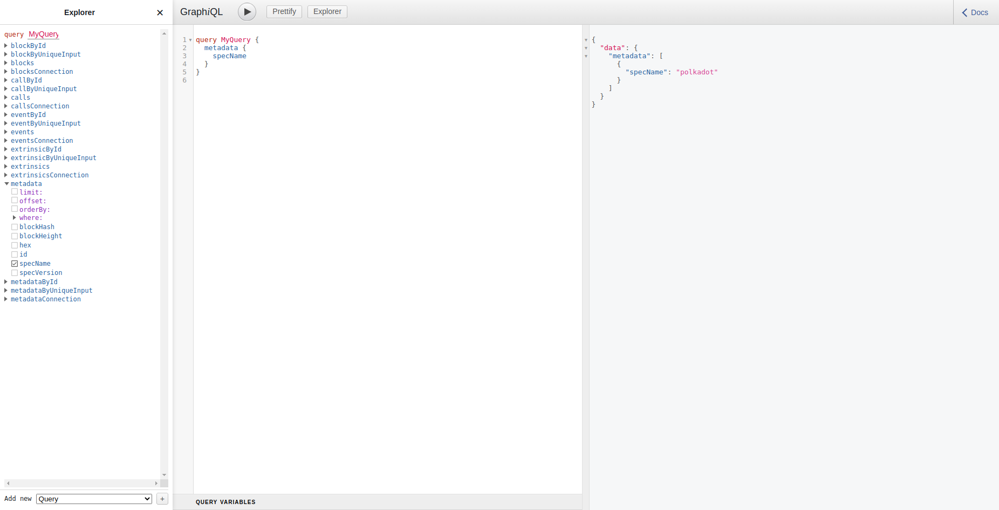

# Subsquid

[Subsquid](https://www.subsquid.io/) indexer is a piece of software that reads all the blocks from a Substrate based blockchain, decodes and stores them for processing in a later stage.

- Make sure you have a [wallet](./wallet_connector.md) 
- Click on the **Subsquid** tab

## Process

- Enter an instance name.

- Enter an endpoint for a supported substrate chain. You can find the list of endpoints of supported cahins [here](https://github.com/polkadot-js/apps/blob/master/packages/apps-config/src/endpoints/production.ts).

- Select a capacity package:
    - **Minimum**: {cpu: 1, memory: 1024 , diskSize: 50 }
    - **Standard**: {cpu: 2, memory: 1024 * 2, diskSize: 100 }
    - **Recommended**: {cpu: 4, memory: 1024 * 4, diskSize: 250 }
    - Or choose a **Custom** plan

- `Dedicated` flag to retrieve only dedeicated nodes 
- `Certified` flag to retrieve only certified nodes 
- Choose the location of the node
   - `Country`
   - `Farm Name`
- Choose the node to deploy on 
- `Custom Domain` flag lets the user to use a custom domain
- Choose a gateway node to deploy your Subsquid instance on.

After that is done you can see a list of all of your deployed instances

Click on ***Visit*** to go to the homepage of your Subsquid indexer instance!

