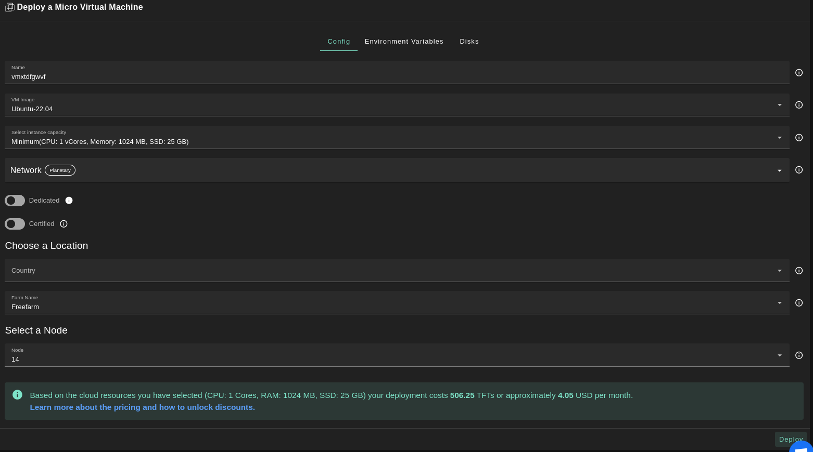
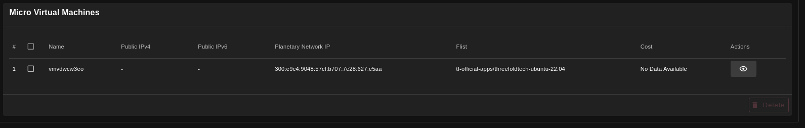
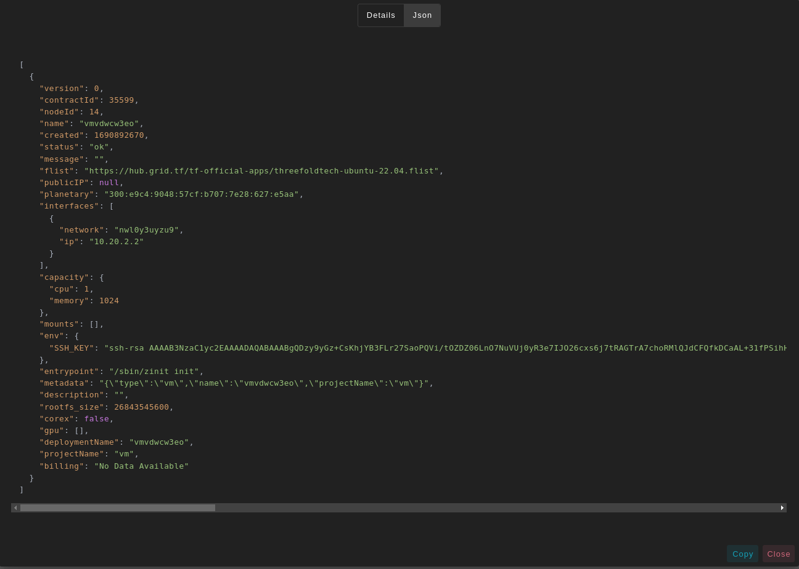

# Micro Virtual Machine

<iframe title="How to Deploy a Full VM on the ThreeFold Playground" width="560" height="315" src="https://www.youtube-nocookie.com/embed/MDSIBkcYdqg" frameborder="0" allowfullscreen="" sandbox="allow-same-origin allow-scripts allow-popups"></iframe>

Deploy a new virtual machine on the Threefold Grid

- Make sure you have an activated [profile](./wallet_connector.md) 
- Click on the **Micro Virtual Machine** tab

__Process__ : 

- Fill in the instance name: it's used to reference the VM in the future.
- Choose the image from the drop down (e.g Alpine, Ubuntu) or you can click on `Other` and manually specify the flist URL and the entrypoint.
- Select a capacity package:
    - **Minimum**: {cpu: 1, memory: 1024, diskSize: 25 }
    - **Standard**: {cpu: 2, memory: 4096, diskSize: 50 }
    - **Recommended**: {cpu: 4, memory: 4096, diskSize: 100}
    - Or choose a **Custom** plan
- Choose the network
   - `Public IPv4` flag gives the virtual machine a Public IPv4
   - `Public IPv6` flag gives the virtual machine a Public IPv6
   - `Planetary Network` to connect the Virtual Machine to Planetary network
   - `Wiregaurd Access` to add a wiregaurd acces to the Virtual Machine
- `GPU` flag to add GPU to the Virtual machine
- `Dedicated` flag to retrieve only dedeicated nodes 
- `Certified` flag to retrieve only certified nodes 
- Choose the location of the node
   - `Country`
   - `Farm Name`
- Choose the node to deploy the Virtual Machine on 

* In the section `Environment Variables`, you can add any environment variables that the machine might need

* In the section `Disks`, You can attach one or more disks to the Virtual Machine by clicking on the Disks tab and the plus `+` sign and specify the following parameters
   - Disk name 
   - Disk size

in the bottom of the page you can see a list of all of the virual machines you deployed. you can click on `Show details` for more details

You can also go to JSON tab for full details
