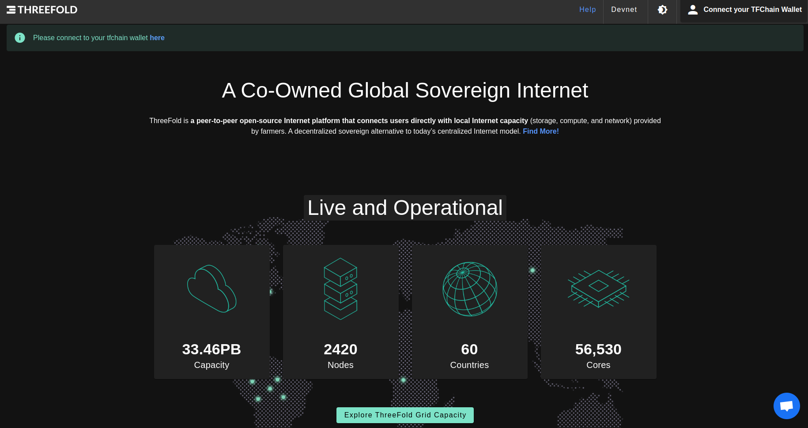
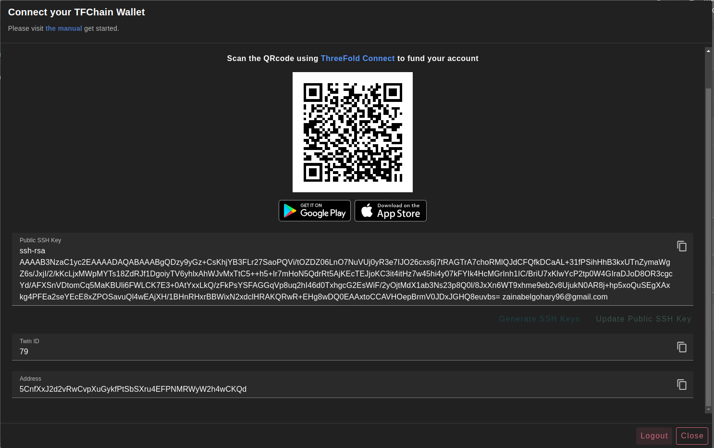

# Wallet Connector

Currently, we're supporting four different networks:

- Dev net, for development purposes
  - [https://playground.dev.grid.tf](https://playground.dev.grid.tf)
- QA net, for internal testing and verifications
  - [https://playground.qa.grid.tf](https://playground.qa.grid.tf)
- Test net, for testing purposes
  - [https://playground.test.grid.tf](https://playground.test.grid.tf)
- Main net, for production-ready purposes
  - [https://playground.grid.tf](https://playground.grid.tf)

### Process

Start entering the following information required to create your new profile.

- `Mnemonics` are the secret words of your Polkadot account. [Generate yours here](../getstarted/TF_Dashboard/TF_Dashboard.html#create-polkadot-extension-account) or use the **Generate Account** button.
- `Password` is used to access your account
- `Confirm Password` 

After you finish typing your credentials, click on **Connect**. Once your profile gets activated, you should find your **Twin ID** and **Address** generated under your **_Mnemonics_** for verification. Also, your **Account Balance** will be available at the top right corner under your profile name.

