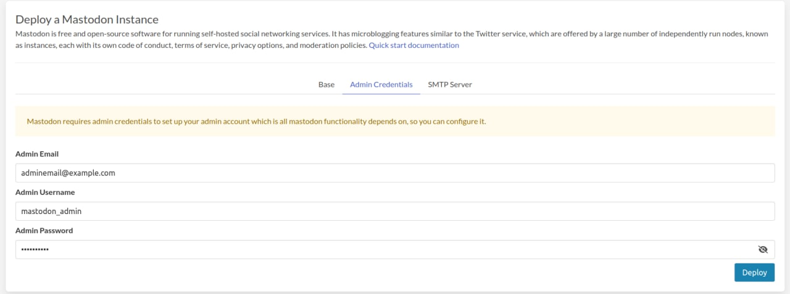
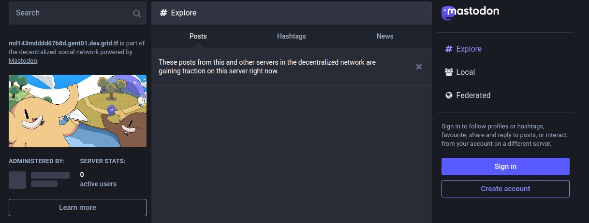

# Mastodon

[Mastodon](https://joinmastodon.org/) is free and `open-source` software for running self-hosted social networking services. It has microblogging features similar to the Twitter service, which are offered by a large number of independently run nodes, known as `instances`, each with its own code of conduct, terms of service, privacy options, and moderation policies.

Each user is a member of a specific `Mastodon` instance `also called a server`, which can interoperate as a federated social network, allowing users on different instance to interact with each other. This is intended to give users the flexibility to select a node whose policies they prefer, but keep access to a larger social network. `Mastodon` is also part of the Fediverse ensemble of server platforms, which use shared protocols allowing users to also interact with users on other compatible platforms,[9] such as [PeerTube](./weblets_peertube.md).
`Mastodon` is crowdfunded and does not contain ads.

## Prerequisites

- An active [deployment profile](./weblets_profile_manager)

## Get Started

- Click on the **Mastodon** tab

  

- Enter an Application Name. It's used in generating a unique subdomain on one of the gateways on the network alongside your twin ID. Ex. ***imastodon*.gent02.dev.grid.tf**

- Select a capacity package:
  - **Minimum**: {cpu: 1, memory: 1024 * 2, diskSize: 10 }
  - **Standard**: {cpu: 2, memory: 1024 * 4, diskSize: 50 }
  - **Recommended**: {cpu: 4, memory: 1024 * 4, diskSize: 100 }
  - Or choose a **Custom** plan
- Choose a gateway node to deploy your Mastodon instance on.

- Select a node to deploy your Mastodon instance on.

  - Either use the **Capacity Filter**. Which simply lets you pick a *Farm* and *Country*, after clicking on *Apply filters and suggest nodes* then it lists available nodes with these preferences and you pick.

  - Or use **Manual** and type a specific node number to deploy on.

- Then you have to configure your admin email in **Admin Credentials** to your instance server won't run without it.

   

- There's also an optional **Mail Server** tab if you'd like to have your Mastodon instance configured with an SMTP server.

   

After that is done you can see a list of all of your deployed instances


Click on ***Visit*** to go to the homepage of your Mastodon instance! You have to login to take full access.



## Have a server and want to migrate it into an instance deployed on [getmastodon.threefold.io](https://getmastodon.threefold.io/)?

### Copying your Mastodon installation to a new server without losing anything

Sometimes, for various reasons, you may want to migrate your Mastodon instance from one server to another. Fortunately this is not too difficult of a process, although it may result in some downtime.

- **This guide was written with Ubuntu Server in mind; also we using the docker image of mastodon so you have to execute all commands below inside the database-created container, try to follow the instruction and just replace the database name with your own in case you created it by yourself.**

- **I assume that you have your `backup.dump` file no? if not try to read more about [How to migrate to a new machine](https://docs.joinmastodon.org/admin/migrating/)**

### Detailed steps

- Log into the newly deployed machine to ensure that you have access to it.

```sh
ssh root@<machine_ip> # Don't forget to replace `<machine_ip>` with your instance IP.
```

- You have access and all works well?, so logout from it using `(Ctrl+D)`
- Copy the `backup.dump` to the machine,
`Copy the backup.dump file over, using rsync or scp. Then on the new system, create an empty database as the mastodon user:`

```sh
# Just make sure that you replaced the tags with a valid directory.
scp <Path/to/file/on/host/machine> root@[<machine_ip>]:<Path/to/file/on/remote/machine> 
```

- Now you have the file inside the new machine, we have to do one more copy to copy the file into the database container.

```sh
# To see all containers running, You should see a container name `docker_db_1` that's our aim :D.
docker ps

# Take the file that we copied and then paste it inside the DB container, by default the container name is `docker_db_1`.
docker cp <Path/to/file/on/remote/machine> <container_name_or_id>:<Path/to/file/on/docker/db/container>

# To log into the container.
docker exec -ti <container_name_or_id> bash 

# To delete the old database, by default we create the database with name, role = `postgres`.
dropdb -U postgres postgres 

# Create a new empty one.
createdb -U postgres -T template0 postgres 

# Then import it:
pg_restore -Fc -U postgres -n public --no-owner --role=postgres -d postgres backup.dump

# (Note that if the username is not postgres on the new server, you should change the -U AND --role values above. It's okay if the username is different between the two servers.)
```

- You should also copy over the .env.production file, which contains secrets, Just the same steps we did, but make sure to copy it before migrating the new DB

- Optionally, you may copy over the nginx, systemd, and pgbouncer config files, or rewrite them from scratch.

### During migration

You can edit the ~/<remote_machine>/public/500.html page on the old machine if you want to show a nice error message to let existing users know that a migration is in progress.

You'll probably also want to set the DNS TTL to something small (30-60 minutes) about a day in advance, so that DNS can propagate quickly once you point it to the new IP address.

### After migrating

You can check [whatsmydns.net](https://whatsmydns.net/) to see the progress of DNS propagation. To jumpstart the process, you can always edit your own /etc/hosts file to point to your new server so you can start playing around with it early.
