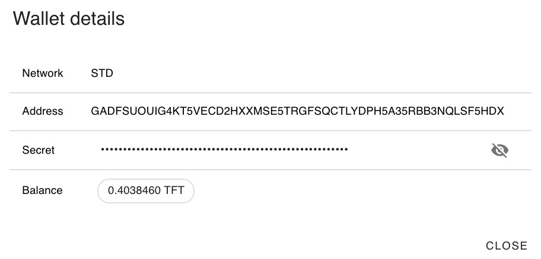

# Wallet on Stellar Network

### Prepaid Wallets

The VDC has a built-in __prepaid wallet__, which is the wallet used for paying the capacity requested in the VDC. This wallet expresses in TFT the remaining balance available for ensuring the operational continuity of the reserved capacity. 

This wallet is registered on the Stellar network, and is exclusively used for capacity reservation aligned with the chosen VDC size. 
Both the TFGrid testnet and mainnet are connected to the Stellar mainnet, so TFTs used are the same. Testnet prices are substantially lower than mainnet prices, though there's no guarantee about continuity of operation: testnet is reset at regular times, and available capacity is also lower than on mainnet. 

### A public key and a shared private key

The wallet is characterized by 2 strings:
- A public address, starting with a 'G', is the address that can be shared with anyone, as it the address to be mentioned when transferring tokens TO the wallet. 
- A private key, starting with an 'S', is the secret that gives control over the wallet, and which is needed to generate outgoing transfers. 

### Payment for Capacity Process

The Prepaid Wallet which is setup within your VDC is exclusively used for this purpose. The private key of this wallet is shared between you and the VDC provider :
- The VDC provider needs the private key to pay the farmer on a rolling basis : every hour an amount is transferred to the farmer(s) that owns the reserved hardware capacity, so it stays reserved for the next 2 weeks. These 2 weeks are meant as a 'grace period' : when the balance of the prepaid wallet becomes zero, you have 2 weeks to top up the wallet. You will get notified for this, while the workload remains operational. 
In case after these 2 weeks grace period the wallet hasn't been topped up again, the workload will be removed and the capacity will be made available again for new reservations. 

## Top-up a Wallet 

Please read the [Top-up](evdc_wallet_topup) page for instructions. 

## Viewing Your Balance

Simply click on one of your existing wallet see the details of the wallet.

## Withdraw TFTs from the wallet

The private key is available to transfer tokens from the prepaid wallet to your personal TFT wallet. Evidently, transferring tokens has a direct impact on the expiration date of your VDC. 

### Your VDC Wallet Details

- The Network is the Stellar mainnet network (indicated with `STD` on the wallet information) 
- [Trustlines](https://www.stellar.org/developers/guides/concepts/assets.html) are specific to the Stellar network to indicate that a user is 'trusting' the asset / crypto issuer, in our case trusting  ThreeFold Dubai as issuer of TFT. 
Trustlines are specific to the network, so it needs to be established both on testnet and mainnet and for all the tokens that someone intends to hold. Without a trustline, a wallet address can't be fed with tokens. 
In order to make it easier for the user, trustlines are being established automatically when creating a wallet for TFT in the admin panel as well as in ThreeFold Connect app. However, if you use a third party Stellar wallet for your tokens, you need to create the trustlines yourself. 