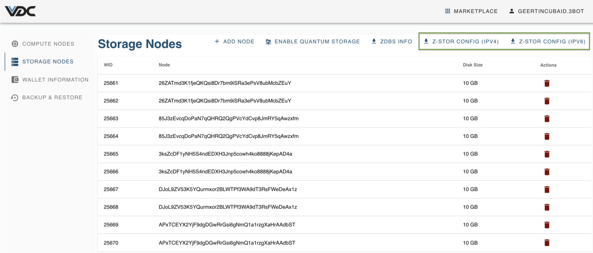
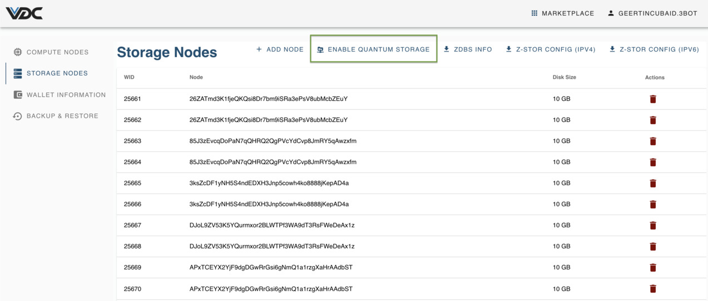
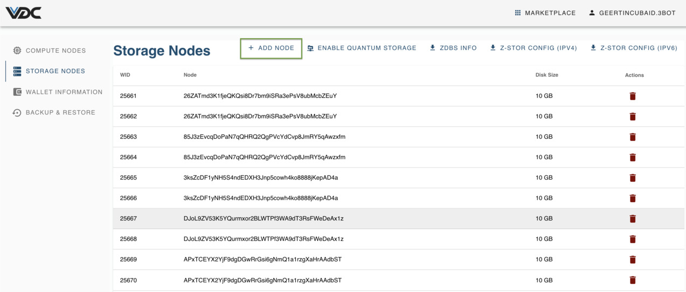

## Getting started

Any Quantum-Safe File System has 4 storage layers : 
- An etcd metadata storage layer
- Local storage
- ZDB-FS fuse layer
- ZSTOR for the dispersed storage

Now, there are 2 ways to run the zstor filesystem: 
- In self-management mode for the metadata;
- A 'Quantum Storage Enabled' mode.

The first mode combines the local storage, ZDB-FS and ZSTOR, but requires an etcd metadata layer to be manually run and managed. 
The second mode is enabled by the `ENABLE QUANTUM STORAGE` button and provisions etcd to manage the metadata. Here the 4 layers are available (hence it will consume slightly more storage from your VDC).

### Manually Managed Metadata Mode

This Planetary Secure File System uses a ThreeFold VDC's storage nodes to back data up to the ThreeFold Grid. Below you'll find instructions for using an executable bootstrap file that runs on Linux or in a Linux Docker container to set up the complete environment necessary to use the file system. 

Please note that this solution is currently for testing only, and some important features are still under development.

#### VDC and Z-Stor Config

If you haven't already, go ahead and [deploy a VDC](evdc_deploy). Then download the Z-Stor config file, found in the upper right corner of the `VDC Storage Nodes` screen. Unless you know that IPv6 works on your machine and within Docker, choose the IPv4 version of the file.

As described in [Manage Storage Nodes](evdc_storage), this file contains the necessary information to connect with the 0-DBs running on the storage nodes in your VDC. It also includes an encryption key used to encrypt data that's uploaded and a field to specify your etcd endpoints. Using the defaults here is fine.

#### Bootstrap Executable

Download now the zstor filesystem bootstrap, available [here](https://github.com/threefoldtech/quantum-storage/releases/download/v0.0.1/planetaryfs-bootstrap-linux-amd64).

> __Remark__: 
For now, the bootstrap executable is only available for Linux. We'll cover how to use it within an Ubuntu container in Docker, which will also work on MacOS.
First, we'll start an Ubuntu container with Docker, enabling fuse file system capabilities. In a terminal window, 

`docker run -it --name zdbfs --cap-add SYS_ADMIN --device /dev/fuse ubuntu:20.04`

Next, we'll copy the Z-Stor config file and the bootstrap executable into the running container. In a separate terminal window, navigate to where you downloaded the files and run:

`docker cp planetaryfs-bootstrap-linux-amd64 zdbfs:/root/`
`docker cp <yourzstorconfig.toml> zdbfs:/root/`

Back in the container's terminal window, `cd /root` and confirm that the two files are there with `ls`. Then run the bootstrap executable, specifying your config file:

`chmod u+x planetaryfs-bootstrap-linux-amd64`
`./planetaryfs-bootstrap-linux-amd64 <yourzstorconfig.toml>`

This bootstrap's execution will start up all necessary components and show you that the back-end is ready for dispersing the data.

After that, your Planetary Secure File System will be mounted at `/root/.threefold/mnt/zdbfs`. Files copied there will automatically be stored on the grid incrementally as fragments of a certain size are filled, by default 32Mb. In a future release, this will no longer be a limitation.

### Provisioned Metadata Mode

Users that intend to have also the metadata out-of-the-box available, and have it used in the Kubernetes cluster, need to push the `ENABLE QUANTUM STORAGE` button. This will allow to use etcd key-value stores in the VDC, and can be used within a Kubernetes cluster.  

Once Quantum Storage mode is enabled, you get an etcd for free. 

**Remark**: this action can't be undone in your VDC : the etcd stores can be filled immediately, and deletion of them could result in data loss. This is why the 'Disable Quantum Storage' is considered as too risky and is not available. 

### Add node

Adding storage nodes manually is simple: press the `+ ADD NODE` button. 

You'll be asked to deploy this storage node either on the same farm or on another one. The choice is a balance between security (have the data in multiple locations makes it more resilient against disaster). 

If you choose `Yes`, select the farm of your choice, and then pay for the extra capacity. 

