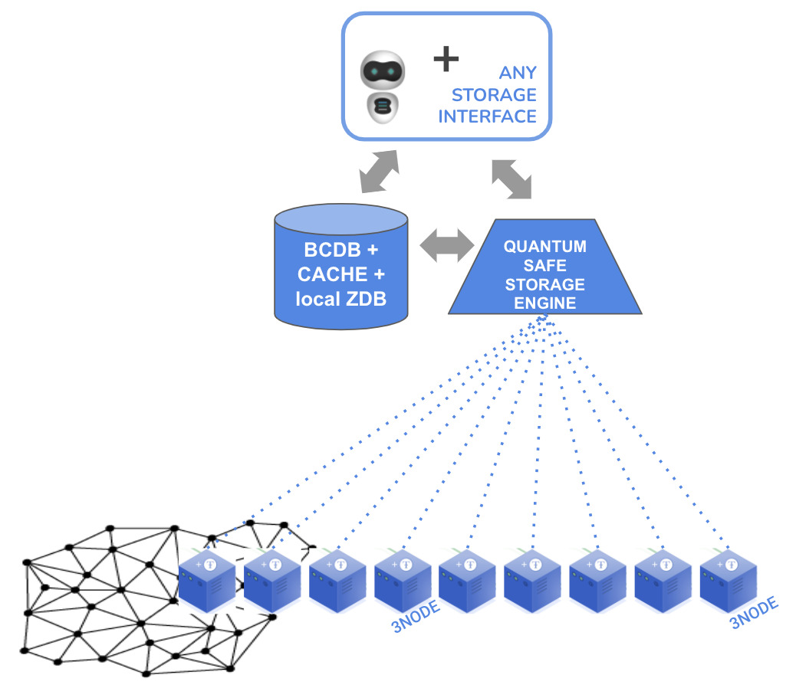
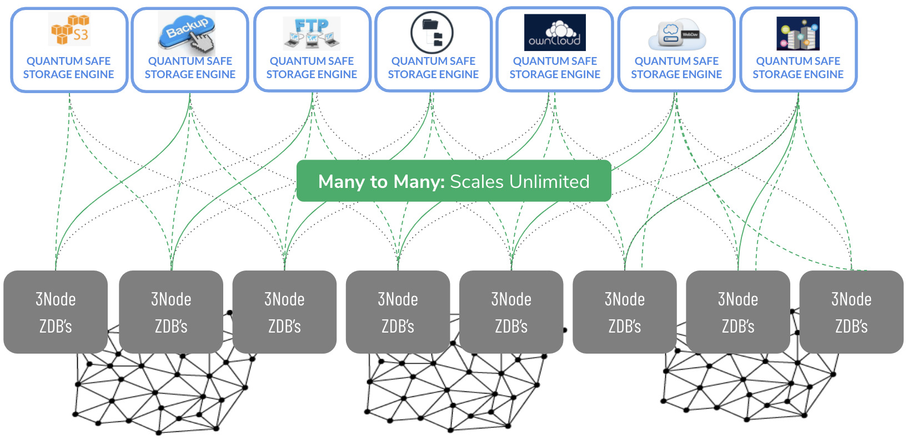

# ThreeFold zstor filesystem (zstor)

Part of the eVDC is a set of Storage Nodes, which can be used as a storage infrastructure for files in any format. 

## Mount Any Files in your Storage Infrastructure

The QSFS is a mechanism to mount any file system (in any format) on the grid, in a quantum-secure way. 

This storage layer relies on relies on 3 primitives of the ThreeFold technology : 

- [0-db](https://github.com/threefoldtech/0-db) is the storage engine.
It is an always append database, which stores objects in an immutable format. It allows keeping the history out-of-the-box, good performance on disk, low overhead, easy data structure and easy backup (linear copy and immutable files).

- [0-stor-v2](https://github.com/threefoldtech/0-stor_v2) is used to disperse the data into chunks by performing 'forward-looking error-correcting code' (FLECC) on it and send the fragments to safe locations.
It takes files in any format as input, encrypts this file with AES based on a user-defined key, then FLECC-encodes the file and spreads out the result
to multiple 0-DBs. The number of generated chunks is configurable to make it more or less robust against data loss through unavailable fragments. Even if some 0-DBs are unreachable, you can still retrieve the original data, and missing 0-DBs can even be rebuilt to have full consistency. It's an essential element of the operational backup. 

- [0-db-fs](https://github.com/threefoldtech/0-db-fs) is the filesystem driver which uses 0-DB as a primary storage engine. It manages the storage of directories and metadata in a dedicated namespace and file payloads in another dedicated namespace.

Together they form a storage layer that is quantum secure: even the most powerful computer can't hack the system because no single node contains all of the information needed to reconstruct the data.

This concept scales forever, and you can bring any file system on top of it: 
- S3 storage 
- any backup system
- an ftp-server
- IPFS and Hypercore distributed file sharing protocols 
- ...

