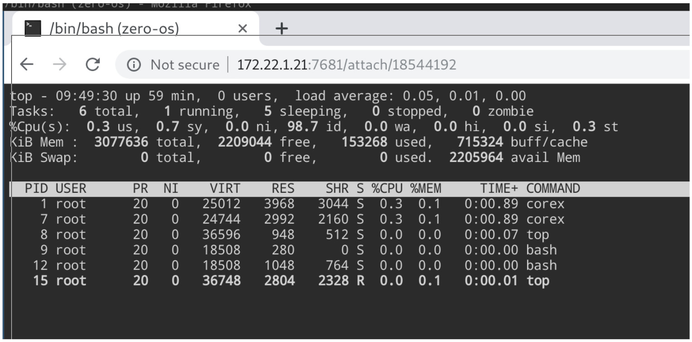

<h1> CoreX </h1>

<h2>Table of Contents </h2>

- [Introduction](#introduction)
- [ZMachine Process Manager](#zmachine-process-manager)

***

## Introduction

CoreX allows you to manage your ZMachine over web remotely.

## ZMachine Process Manager

- Provide a web interface and a REST API to control your processes.
- Allow to watch the logs of your processes.
- Or use it as a web terminal (access over https to your terminal)!

