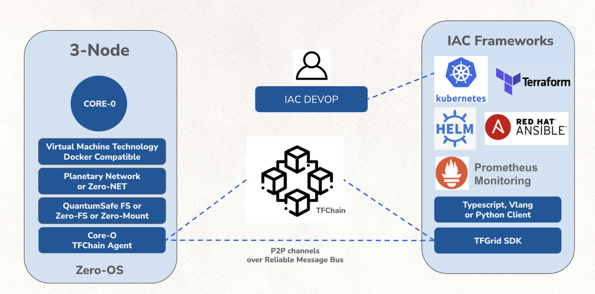

## TFGrid Compute Layer

We are more than just Container or VM technology, see [our Beyond Container Document](beyond_containers).

A 3Node is a Zero-OS enabled computer which is hosted with any of the TF_Farmers.

There are 4 storage mechanisms which can be used to store your data:

- ZOS_FS is our dedupe unique filesystem, replaces docker images. 
- ZOS_Mount is a mounted disk location on SSD, this can be used as faster storage location. 
- QSFS, this is a super unique storage system, data can never be lost or corrupted. Please be reminded that this storage layer is only meant to be used for secondary storage applications.
- ZOS_Disk, a virtual disk technology, only for TFTech OEM partners.

There are 4 ways how networks can be connected to a Z-Machine.

- Planetary_network : is a planetary scalable network, we have clients for windows, osx, android and iphone.
- zos_net : is a fast end2end encrypted network technology, keep your traffic between your z_machines 100% private.
- zos_bridge: connection to a public ipaddress
- web_gw: web gateway, a secure way to allow internet traffic reach your secure Z-Machine.

