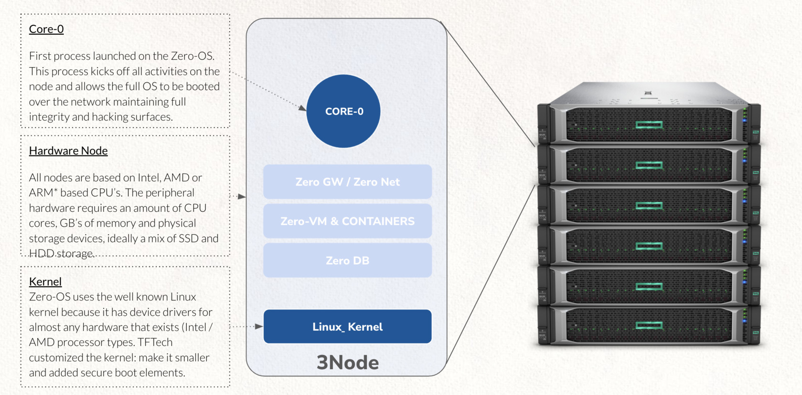

# ZMachine

!!!include:tfgrid_compute

### Features

*   import from docker (market std for containers)
*   can be easily deployed at the edge (edge cloud)
*   single-tenant, fully decentralized!
*   can deploy unlimited amounts of storage using our qsfs.
*   [ZOS Protect](zos_protect): no hacking surface to the Zero-Nodes, integrate silicon route of trust
*   [ZOS Filesystem](qsfs): dedupe, zero-install, hacker-proof
*   [WebGateway](webgw): intelligent connection between web (internet) and container services
*   integration with [ZNet](znet) (efficient, secure encrypted network between the zmachines)
*   [Planetary Net](planetary_network): a true global single backplane network connecting us all

### Architecture

A ZMachine is running as a virtual machine on top of Zero-OS.

!!!include:zos_toc

!!!def