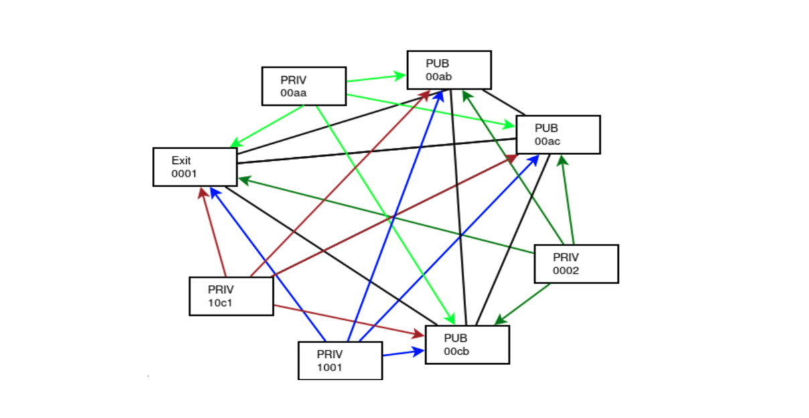

# Planetary Network

The planetary network is an overlay network which lives on top of the existing internet or other peer2peer networks created. In this network, everyone is connected to everyone. End-to-end encryption between users of an app and the app running behind the network wall.

Each user end network point is strongly authenticated and uniquely identified, independent of the network carrier used. There is no need for a centralized firewall or VPN solutions, as there is a circle based networking security in place.

Benefits :
- It finds shortest possible paths between peers
- There's full security through end-to-end encrypted messaging
- It allows for peer2peer links like meshed wireless
- It can survive broken internet links and re-route when needed
- It resolves the shortage of IPV4 addresses

Whereas current computer networks depend heavily on very centralized design and configuration, this networking concept breaks this mould by making use of a global spanning tree to form a scalable IPv6 encrypted mesh network.  This is a peer2peer implementation of a networking protocol.

The following table illustrates high-level differences between traditional networks like the internet, and the planetary threefold network:

| Characteristic                                                  | Traditional | Planetary Network |
| --------------------------------------------------------------- | ----------- | ----------------- |
| End-to-end encryption for all traffic across the network        | No          | Yes               |
| Decentralized routing information shared using a DHT            | No          | Yes               |
| Cryptographically-bound IPv6 addresses                          | No          | Yes               |
| Node is aware of its relative location to other nodes           | No          | Yes               |
| IPv6 address remains with the device even if moved              | No          | Yes               |
| Topology extends gracefully across different mediums, i.e. mesh | No          | Yes               |

## What are the problems solved here?

The internet as we know it today doesn’t conform to a well-defined topology. This has largely happened over time - as the internet has grown, more and more networks have been “bolted together”. The lack of defined topology gives us some unavoidable problems:

- The routing tables that hold a “map” of the internet are huge and inefficient
- There isn’t really any way for a computer to know where it is located on the internet relative to anything else
- It’s difficult to examine where a packet will go on its journey from source to destination without actually sending it
- It’s very difficult to install reliable networks into locations that change often or are non-static, i.e. wireless mesh networks

These problems have been partially mitigated (but not really solved) through centralization - rather than your computers at home holding a copy of the global routing table, your ISP does it for you. Your computers and network devices are configured just to “send it upstream” and to let your ISP decide where it goes from there, but this does leave you entirely at the mercy of your ISP who can redirect your traffic anywhere they like and to inspect, manipulate or intercept it.

In addition, wireless meshing requires you to know a lot about the network around you, which would not typically be the case when you have outsourced this knowledge to your ISP. Many existing wireless mesh routing schemes are not scalable or efficient, and do not bridge well with existing networks.

The planetary network is a continuation & implementation of the [Yggdrasil](https://yggdrasil-network.github.io/about.html) network initiative. This technology is in beta but has been proven to work already quite well.

!!!def alias:planet_net,planetary_net,planetary_network,pan

!!!include:zos_toc

> Click [here](manual:planetary_network_connector) to read more about Planetary Network Connector Installation. Click [here](manual:yggdrasil_client) to read more about Planetary Network Installation (advanced). 