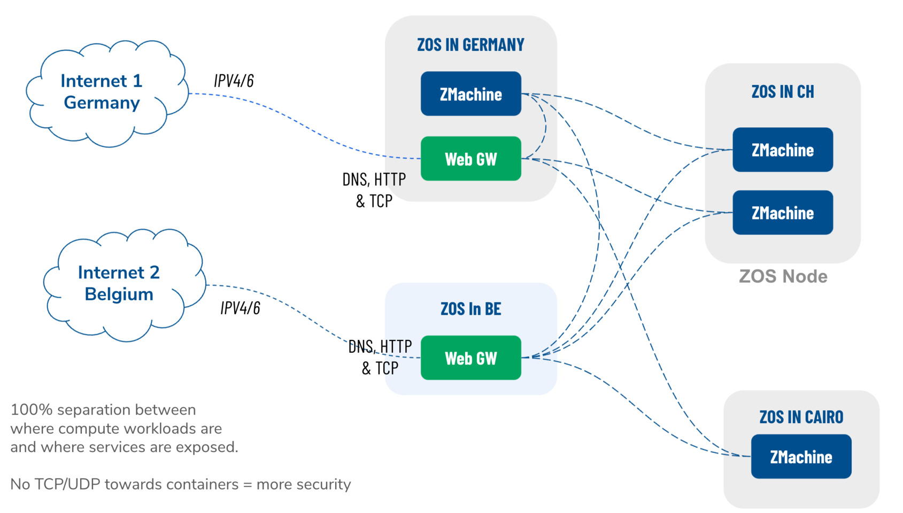
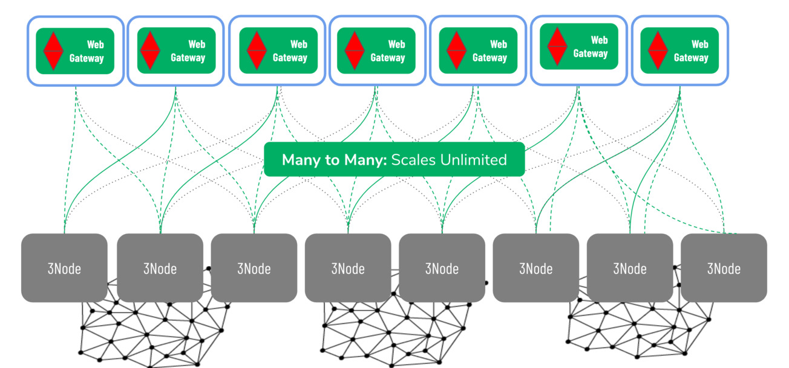

# WebGW 2.0

The Web Gateway is a mechanism to connect the private networks to the open Internet, in such a way that there is no direct connection between internet and the secure workloads running in the ZMachines.

- Separation between where compute workloads are and where services are exposed.
- Better Security
- Redundant
    - Each app can be exposed on multiple webgateways at once.
- Support for many interfaces...
- Helps resolve shortage of IPv4 addresses

If (parts of) this private overlay network need to be reachable from the Internet, the zmachines initiate a secure connection *to* the web Gateway. 

### Implementation

It is important to mention that this connection is not a standard network connection, it is a [network socket](https://en.wikipedia.org/wiki/Network_socket) initiated by the container or VM to the web gateway. The container calls out to one or more web gateways and sets up a secure & private socket connection to the web gateway. The type of connection required is defined on the smart contract for IT layer and as such is very secure. There is no IP (TCP/UDP) coming from the internet towards the containers providing more security. 

Up to the Web Gateway Internet traffic follows the same route as for any other network end point: A DNS entry tells the consumers client to what IP address to send traffic to.  This endpoint is the public interface of the Web Gateway.  That interface accepts the HTTP(s) (or any other TCP) packets and forward the packet payload  over the secure socket connection (initiated by the container) to the container.  

No open pipe (NAT plus port forwarding) from the public internet to specific containers in the private (overlay) network exists.

Web Gateways are created by so called network farmers.  Network farmers are people and companies that have access to good connectivity and have a large number of public IP routable IP networks.  They provide the facilities (hardware) for Web Gateways to run and terminate a lot of the public inbound and output traffic for the TF Grid.  Examples of network farmers are ISP's and (regional, national and international Telcos, internet exchanges etc.

### Security

Buy not providing an open and direct path in to the private network a lot of malicious phishing and hacking attempts are stopped at the Web Gateway.  By design any private network is meant to have multiple webgateways and by design these Web Gateways exist on different infrastructure in a different location.  Sniffing around and finding  out what can be done with a Web Gateway might (and will happen) but it will not compromise the containers in your private network.

### Redundant Network Connection

### Unlimited Scale

The network architecture is a pure scale-out network system, it can scale to unlimited size, there is simply no bottleneck. Network "supply" is created by network farmers, and network "demand" is done by TF Grid users.  Supply and demand scale independently, for supply there can be unlimited network farmers providing the web gateways on their own 3nodes and unlimited compute farmers providing 3nodes for compute and storage. The demand side is driven by developers creating software that runs on the grid, system integrators creating solutions for enterprise and this demand side is exponentially growing for data processing and storage use cases.

### Network Wall (future)

see [Network Wall](network_wall)
    
## Roadmap 

Above described Web Gateway is for 2.0.

For 3.0 we start with a HTTP(S) proxy over Planetary network connection. Not all features from WebGW 2.0 have been ported.

Further future, we envisage support for many other protocols: sql, redis, udp,  ...

!!!def alias:web_gw,zos_web_gateway

!!!include:zos_toc

