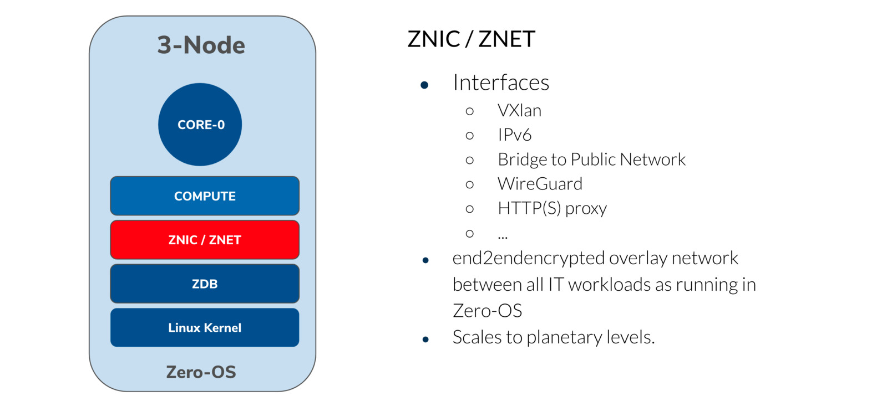

# ZNIC

ZNIC is the network interface which is connected to Z_Machine.

Can be implemented as interface to

- planetary_network.
- public ip address on a Zero-OS.

## See also

- [WebGW](webgw)
- [Znet](znet)
- 
!!!def alias:zos_nic,z_nic,znic,zbridge,zos_bridge

!!!include:zos_toc