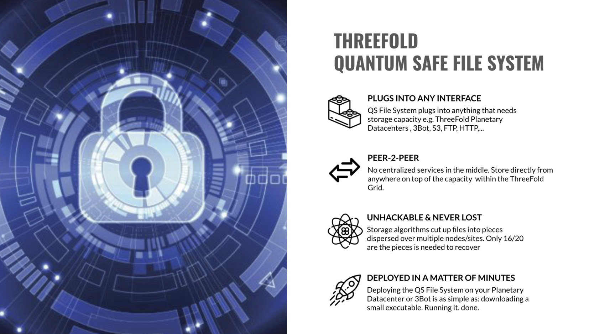

<!--  -->

# Quantum Safe Filesystem

A redundant filesystem, can store PB's (millions of gigabytes) of information.

Unique features:

- Unlimited scalable (many petabytes) filesystem
- Quantum Safe:
  - On the TFGrid, no farmer knows what the data is about
  - Even a quantum computer cannot decrypt
- Data can't be lost
  - Protection for [datarot](datarot), data will autorepair
- Data is kept for ever
- Data is dispersed over multiple sites
- Sites can go down, data not lost
- Up to 10x more efficient than storing on classic storage cloud systems
- Can be mounted as filesystem on any OS or any deployment system (OSX, Linux, Windows, Docker, Kubernetes, TFGrid, ...)
- Compatible with +- all data workloads (not high performance data driven workloads like a database)
- Self-healing: when a node or disk lost, storage system can get back to original redundancy level
- Helps with compliance to regulations like GDPR (as the hosting facility has no view on what is stored, information is encrypted and incomplete)
- Hybrid: can be installed onsite, public, private, ...
- Read-write caching on encoding node (the front end)

## Architecture

By using our filesystem inside a Virtual Machine or Kubernetes the TFGrid user can deploy any storage application on top e.g. Minio for S3 storage, OwnCloud as online fileserver.

Any storage workload can be deployed on top of the zstor.

!!!def alias:quantumsafe_filesystem,planetary_fs,planet_fs,quantumsafe_file_system,zstor,qsfs

!!!include:qsss_toc