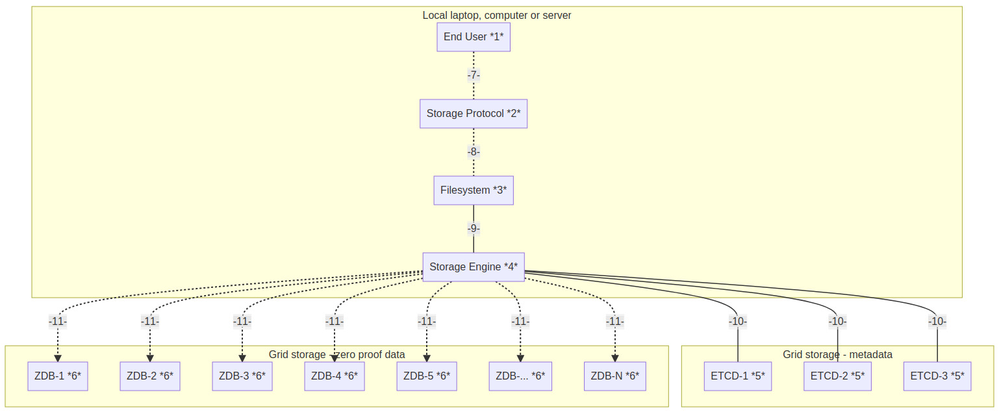

## Quantum Safe Storage Testplan

### Prerequisites
The quantum safe storage system runs on the following platforms
- bare metal linux installation.
- kubernetes cluster with Helm installation scripts.

### Installation
For instructions in installing the QSFS please see the manual [here](../manual/README.md).

#### Bare metal Linux
The software comes as a single binary which will install all the necessary components (local) to run the quantum safe file system.  The server in the storage front end and the TF Grid is the storage backend. The storage backend configuration can be provided in two different ways:
- the user has access to the eVDC facility of Threefold and is able to download the kubernetes configuration file.
- the binary has built in options to ask for backend storage components to be provisioned an delivered.

### Architecture and failure modes

Quantum Safe Storage is built from a number of components.  Components are connected and interacting and therefore there are a number of failure modes that need to be considered for the test plan.

Failure modes which we have testplans and cases for:

  - [Enduser](#enduser)
  - [Storage protocol](#storage-protocol)
  - [Filesystem](#filesystem)
  - [Storage engine](#storage-engine)
  - [Metadata store](#metadata-store)
  - [Physical storage devices](#physical-storage-devices)
  - [Interaction Enduser - Storage Protocol](#enduser-to-storage-protocol)
  - [Interaction Storage Protocol - Filesystem](#storage-protocol---filesystem)
  - [Interaction Filesystem - Storage Engine](#filesystem-to-storage-engine)
  - [Interaction Storage Engine - Physical Storage Device](#storage-engine-to-physical-storage-device)
  - [Interaction Storage Engine - Metadata Store](#storage-engine-to-metadata-store)

#### Enduser

Failure scanerio's
- End user enters weird / wrong data at during QSS install
- End user deletes / changes things on the QSS engine host
    - End user stops / deletes the storage protocol application of any of its configuration / temp storage facilities
    - End user deletes the quantum safe file system and / or it configuration files
    - End user deletes the storage enginer and / or its configuration and temp storage files.

Tests to conduct
#### Storage protocol

Failure scanerio's

Storage protocol can be anything from IPFS, minio, sFTP and all the other protocols available.  The possible failure modes for these are endless to test.  For a couple of well knownm protocols we will do some basic testing
- **minio**
- **sFTP**
- **syncthing**
- **scp**

For all these protocols a number of simple tests can he done:
  - stop the protocol binary while data is being pushed in. restart the binary and see if normal operation commences (data loss eg. data in transfer when failure happened is accaptable).
  - make changes to the config file (policy, parameters, etc) and see if normal operation commences.

Tests to conduct
#### Filesystem

Direct access to the filesystem and eliminates the dependency of the interface protocol.  The filesystem provides a well knmow interface to browse, create, store and retrieve data in an easy and structured way.  

Tests to conduct. Testing is required to see if the filesystem  can deal with:
  - create a large number of nested directories and see if all this is causing problems
  - create a large number fo small files and see if this is creating problems
  - create a number of very large files (1GB+) and see if this is causing any problems.
  - delete a (large) number of files
  - delete a (large) number of derectories
  - move a (large) number of files
  - move a (large) number of directories

#### Storage engine

The storage engine takes files (data) and runs a "forward error correcting algorithm" on the data.  The algorithm requires a "storage" policy to specify how to treat the inbound data and where to store the resuling data descriptions.  This engine is non-redundant at this point in time and we should test how it behaves with certain failure modes.

Tests to conduct:
  - storage policy is change during operation of the storage engine
    - physical storage devices are added
    - physical storage devices are deleted
    - storage policy (example - 16:4) is changed during operation
    - other configuration components are changed
      - physical storage access passwords
      - encryption key

#### Metadata store

The metadatastore stores the information needed to retrieve the part of descriptions that make up an original piece of data.  These metadata stores are redundant (3x?) and store all data required.

Testing needs to be done on:
  - corruption / deleting one out of the three metadata stores
  - corruption / deleting two out of three metadata stores
  - rebuilding failed metadata stores
  - create high workloads of adding new data and retrieving stored data - no longer available in a local cache.

#### Physical storage devices

Physical storage devices are ZDB's on one the the TF Grid networks (Mainnet, Testnet, Devnet).  ZDB's manage slices of physical disk space on HDD's and SSD's.  They have a very simple operational model and API interface.  ZDB's are operating in "append only" mode by default.

Testing needs to be done:
  - create a high workload writing and reading a the same time
  - get 

#### Enduser to Storage Protocol

Failure scanerio's

Tests to conduct
#### Storage Protocol to Filesystem

Failure scanerio's

Tests to conduct
#### Filesystem to Storage Engine

Failure scanerio's

Tests to conduct
#### Storage Engine to Physical Storage Device

Failure scanerio's

Tests to conduct
#### Storage Engine to Metadata Store

Failure scanerio's

Tests to conduct
