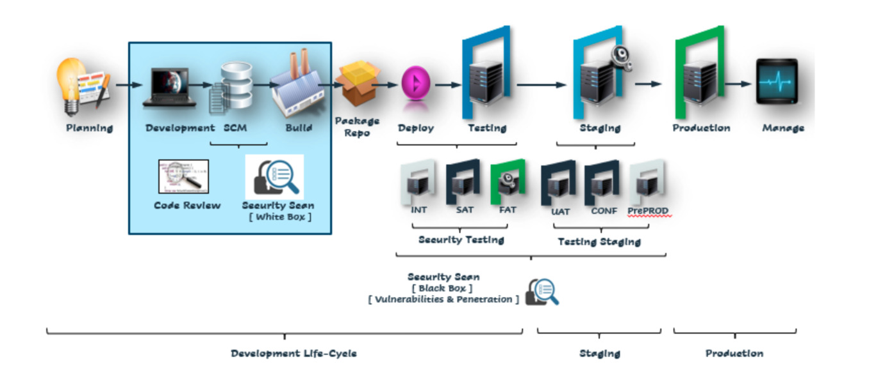

<h1> Infrastructure As Code </h1>

<h2>Table of Contents</h2>

- [Introduction](#introduction)
- [Overview](#overview)
- [Smart Contract](#smart-contract)

***

## Introduction

IAC = DevOps is a process framework that ensures collaboration between Development and Operations Team to deploy code to production environment faster in a repeatable and automated way. ... In simple terms, DevOps can be defined as an alignment between development and IT operations with better communication and collaboration.

## Overview

## Smart Contract

