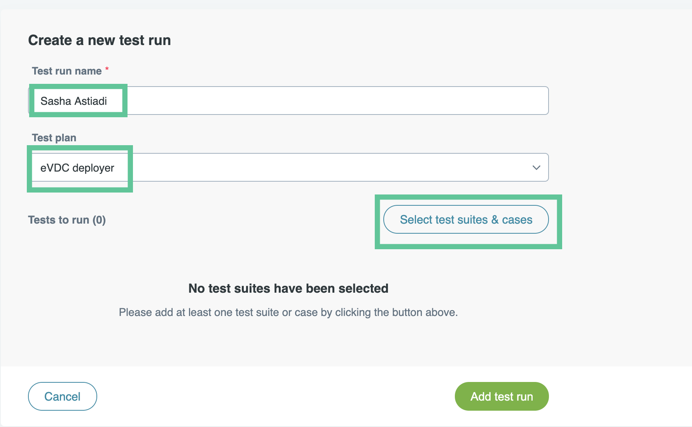
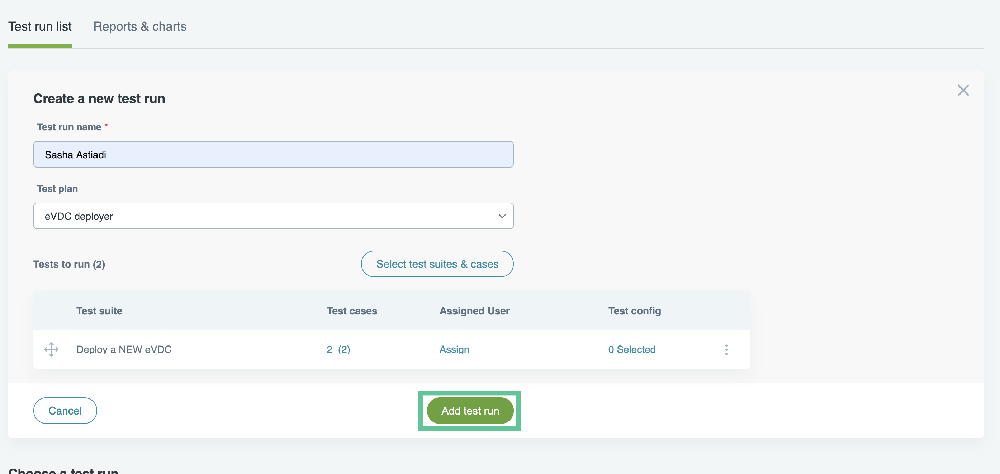
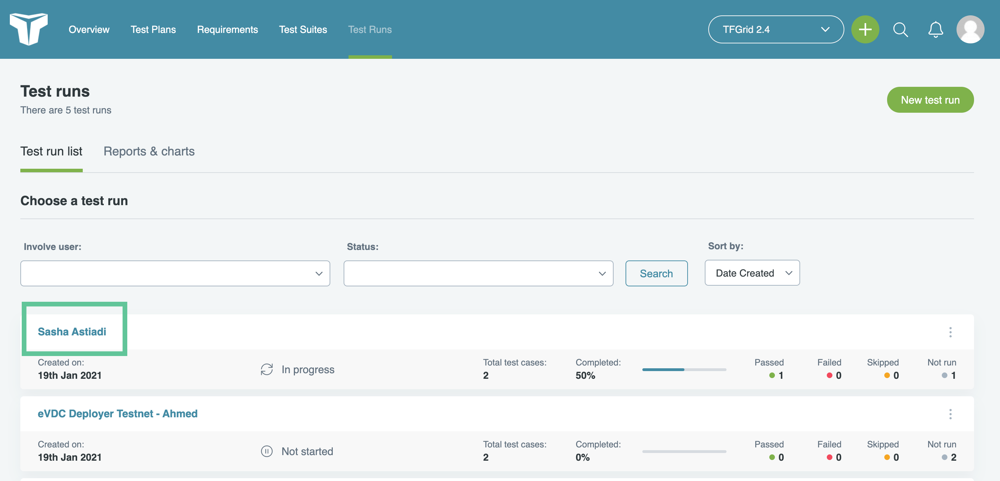
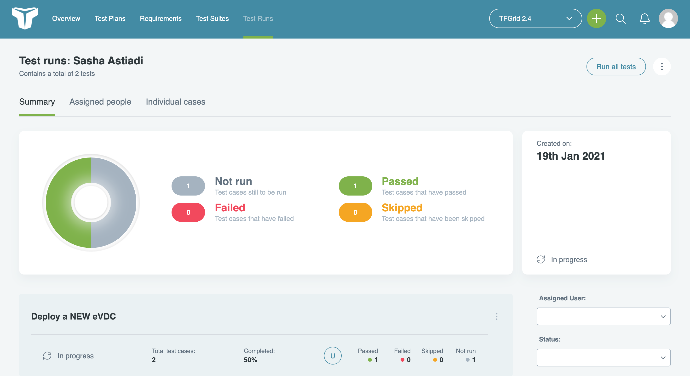
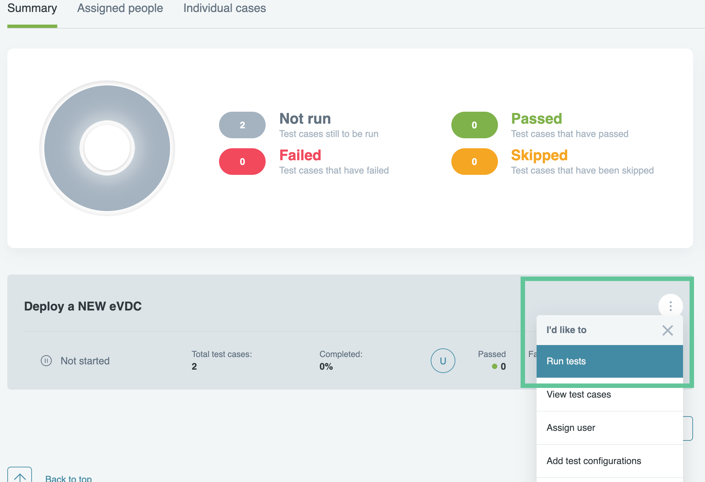
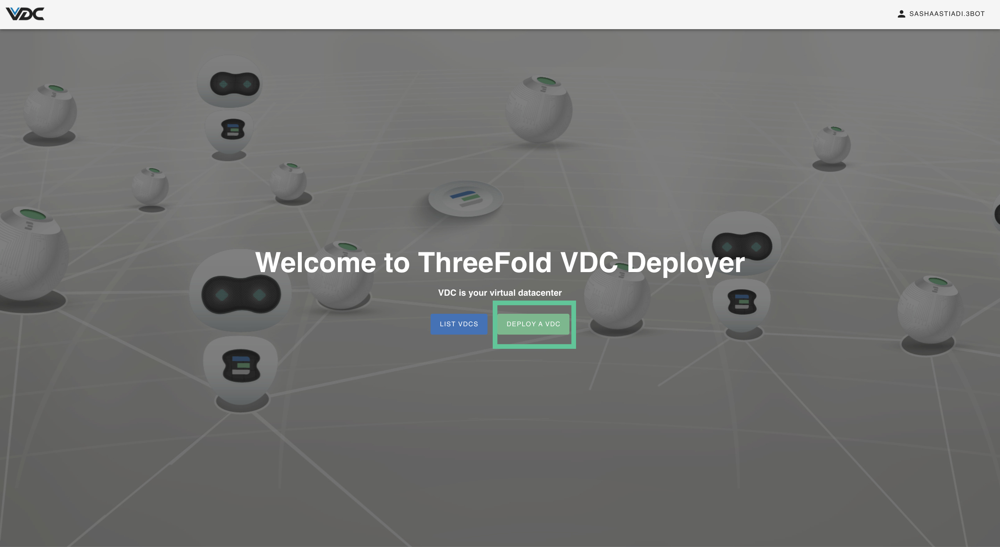
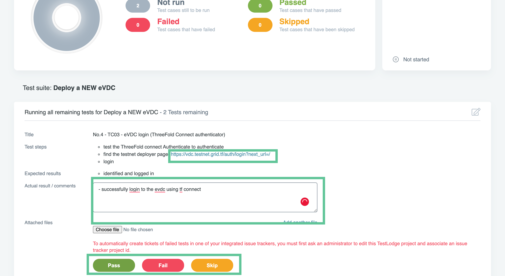
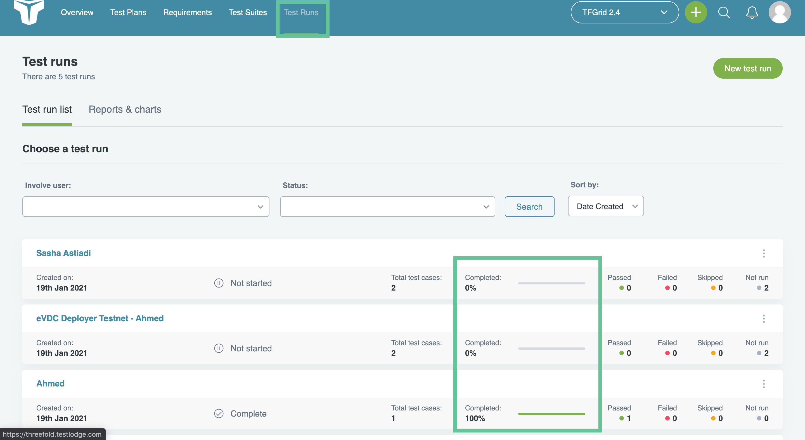

<h1>How to Use TestLodge for Testing the ThreeFold Grid</h1>

<h2>Table of Contents</h2>

- [Introduction](#introduction)
- [Getting Started on TestLodge](#getting-started-on-testlodge)
  - [Joining the TF GRID Project on TestLodge by Invitation](#joining-the-tf-grid-project-on-testlodge-by-invitation)
- [Accessing the TF GRID 3.x Projects](#accessing-the-tf-grid-3x-projects)
  - [Project Overview](#project-overview)
  - [Creating Your Own Personal Test Run](#creating-your-own-personal-test-run)

***

## Introduction

After each release of a newer version of the ThreeFold Grid, we encourage the ThreeFold Community to participate in testing the grid's product components and provide valuable feedback to our engineering team. To facilitate this process, we have adopted TestLodge as our QA and testing platform. TestLodge allows us to efficiently manage test plans, test cases, and test runs for our products. By joining TestLodge as a user, you can assist us in running test cases and reporting any issues encountered during our product deployment processes.

## Getting Started on TestLodge

### Joining the TF GRID Project on TestLodge by Invitation

To become one of our testers on TestLodge, please request an invitation by joining our official [TF Grid Tester 
Telegram Group](https://t.me/joinchat/R75FxI_6J6tgn1jK) and sending a personal message to the group's moderator, providing your email address.

Once you receive an invitation, check your email for further instructions and create an account on TestLodge. This will grant you access to the TF GRID Project on TestLodge.

## Accessing the TF GRID 3.x Projects

After successfully creating your account, you can access the TF GRID 3.x Project from your Testlodge dashboard. Simply click on the project to begin the testing process.

### Project Overview

Inside the project, you will find an overview that displays the project's testing environment. Here's a brief description of the project's content:

- Total Test Plans: 
Indicates the number of test plans or products being tested in this project.

- Total Requirement Docs: 
Represents the amount of testing documentation provided for each test within the project.

- Total Test Suites: 
Displays the number of individual test use cases for each product being tested. These test suites are the procedures you will follow as a user/tester.

- Total Test Runs: 
Reflects the total number of testing rounds conducted by users within the project. Each tester has their own Test Run, which serves as a testing dashboard for reporting test results. To get started with testing the TF Grid Test Suites, you need to create your own Test Run by using your name as the title.

### Creating Your Own Personal Test Run
To create your personal Test Run, follow these steps:

1. Click on the "Test Runs" tab in the top navigation bar and select "New Test Run."

2. Provide your name as the test name and select "eVDC Deployer" as your test suite since it is a test run for eVDC Deployer. Click on "Select Test Suites and Cases" to view the details of the use cases you want to test.

3. On the "Select Test Suites and Cases" page, choose the "Deploy a new eVDC" test suite as your Test Suite. This suite includes the different use cases required to deploy an eVDC.

4. Click "Add Test Run" to complete the registration of your new test run.

5. You will see a list of all created test runs, including your own. Click on the test run you just created to access your test run profile.

6. In your test run profile, you will find a summary and a list of the test suites you need to run.

7. Click on the "Deploy eVDC" test suite from the list and select "Run Test" to begin testing.

8. Proceed to the eVDC Deployer and commence your test.

9. Provide your remarks in the provided comment box and click "Pass," "Fail," or "Skip" based on the result of your test run to provide feedback to the ThreeFold QA Team.

10. Repeat the previous step to complete all

11. Go back to the ‘test runs’ page to see the overview of all test runs, and make sure that you completed your own test runs as shown below.

12. Thank you for completing test runs for ThreeFold Grid Project! You can now create an issue on [ThreeFold's Test Feedback repository](https://github.com/threefoldtech/test_feedback/issues) on Github, and report to our development teams about your test findings and feedback.