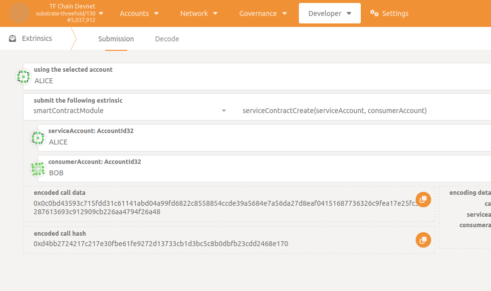
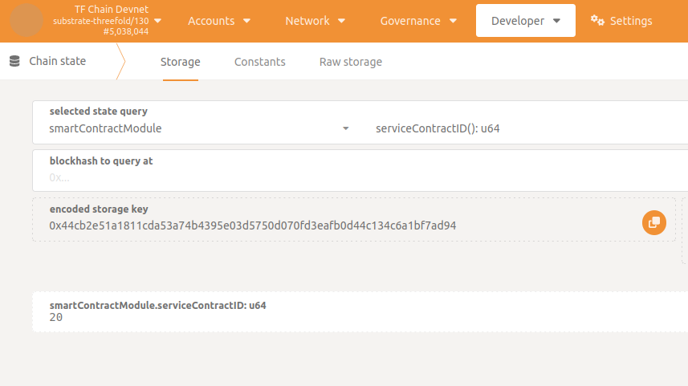
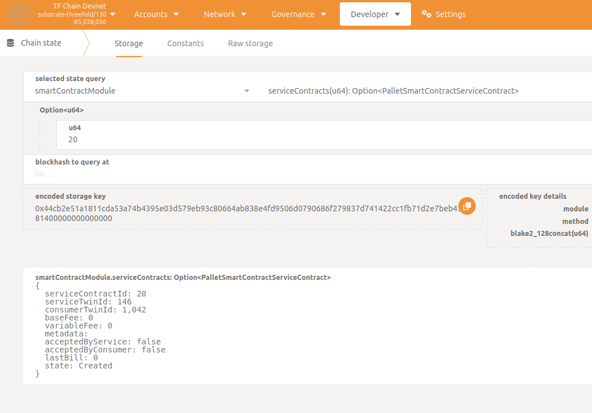
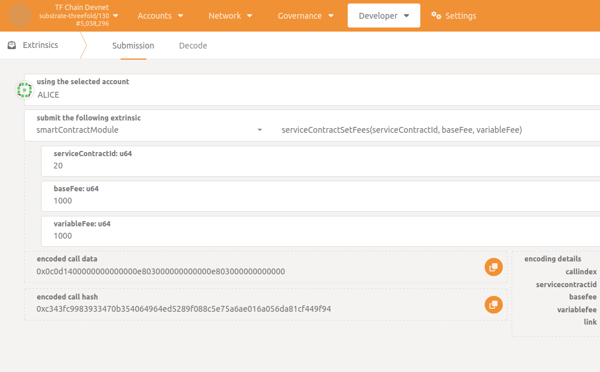
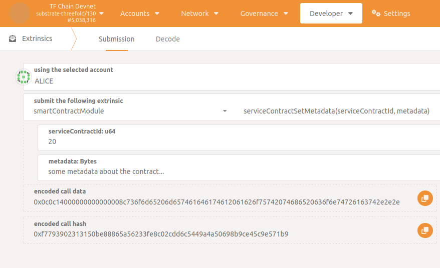
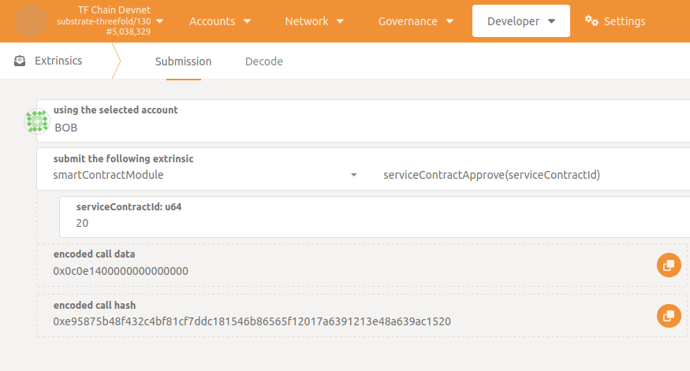
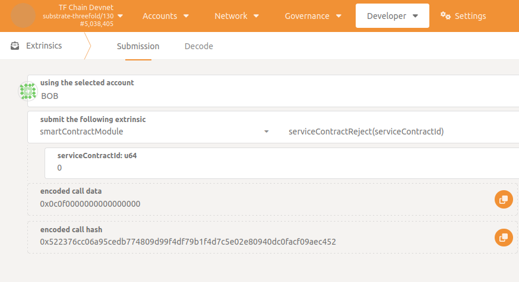
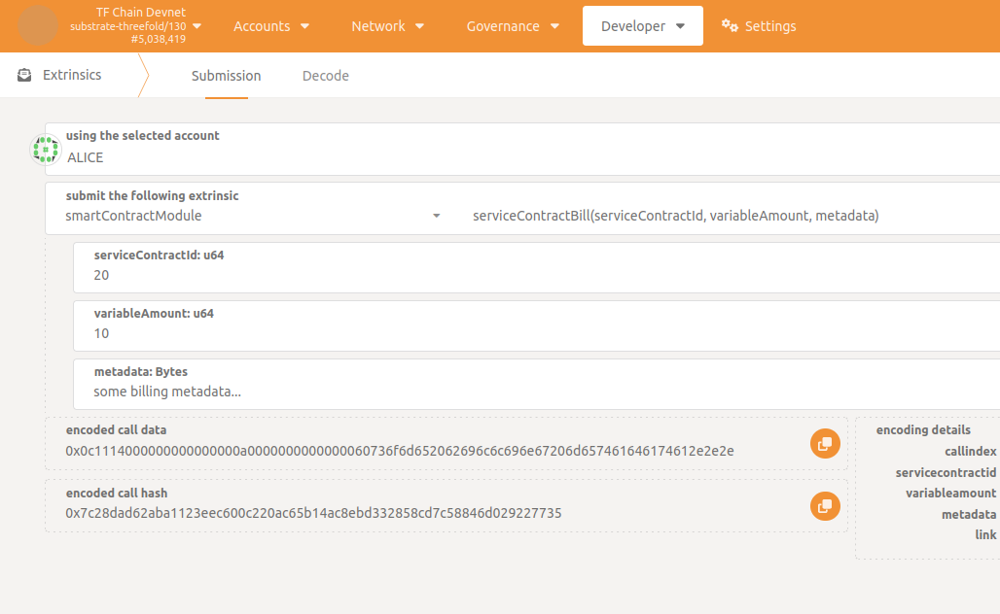
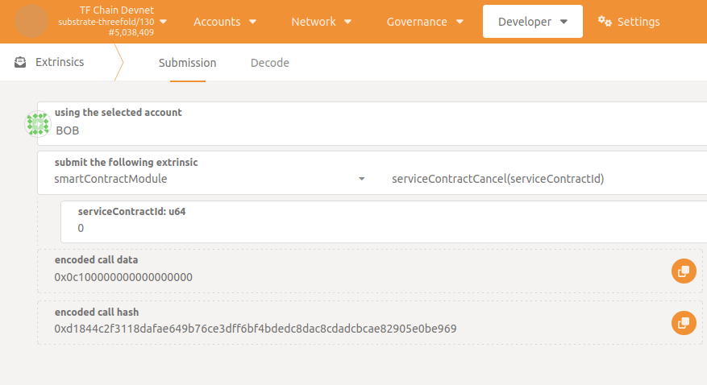

<h1>External Service Contract: How to set and execute</h1>
<h2>Table of Contents</h2>

- [Introduction](#introduction)
- [Step 1: Create the contract and get its unique ID](#step-1-create-contract--get-unique-id)
- [Step 2: Fill contract](#step-2-fill-contract)
- [Step 3: Both parties approve contract](#step-3-both-parties-approve-contract)
- [Step 4: Bill for the service](#step-4-bill-for-the-service)
- [Step 5: Cancel the contract](#step-5-cancel-the-contract)

***

# Introduction

It is now possible to create a generic contract between two TFChain users (without restriction of account type) for some external service and bill for it.

The initial scenario is when two parties, a service provider and a consumer of the service, want to use TFChain to automatically handle the billing/payment process for an agreement (in TFT) they want to make for a service which is external from the grid.
This is actually a more direct and generic feature if we compare to the initial rewarding model where a service provider (or solution provider) is receiving TFT from a rewards distribution process, linked to a node contract and based on a cloud capacity consumption, which follows specific billing rules.

The initial requirements are:
- Both service and consumer need to have their respective twin created on TFChain (if not, see [here](tfchain.md#create-a-tfchain-twin) how to do it)
- Consumer account needs to be funded (lack of funds will simply result in the contract cancelation while billed)

In the following steps we detail the sequence of extrinsics that need to be called in TFChain Polkadot portal for setting up and executing such contract.
<!-- We also show how to check if everything is going the right way via the TFChain GraphQL interface. -->
Make sure to use right [links](tfchain.md#deployed-instances) depending on the targeted network.

# Step 1: Create contract / Get unique ID

## Create service contract

The contract creation can be initiated by both service or consumer.
In TFChain Polkadot portal, the one who iniciates the contract should go to `Developer` -> `Extrinsics` -> `smartContractModule` -> `serviceContractCreate()`, using the account he pretends to use in the contract, and select the corresponding service and consumer accounts before submiting the transaction.

 

Once executed the service contract is `Created` between the two parties and a unique ID is generated.

## Last service contract ID

To get the last generated service contract ID go to `Developer` -> `Chain state` -> `smartContractModule` -> `serviceContractID()`.

## Parse service contract

To get the corresponding contract details, go to `Developer` -> `Chain state` -> `smartContractModule` -> `serviceContracts()` and provide the contract ID.
You should see the following details:

Check if the contract fields are correct, especially the twin ID of both service and consumer, to be sure you get the right contract ID, referenced as `serviceContractId`.

## Wrong contract ID ?

If twin IDs are wrong ([how to get my twin ID?](tfchain.md#get-your-twin-id)) on service contract fields it means the contract does not correspond to the last created contract.
In this case parse the last contracts on stack by decreasing `serviceContractId` and try to identify the right one; or the contract was simply not created so you should repeat the creation process and evaluate the error log.

# Step 2: Fill contract

Once created, the service contract must be filled with its relative `per hour` fees:
- `baseFee` is the constant "per hour" price (in TFT) for the service.
- `variableFee` is the maximum "per hour" amount (in TFT) that can be billed extra.

To provide these values (only service can set fees), go to `Developer` -> `Extrinsics` -> `smartContractModule` -> `serviceContractSetFees()` specifying `serviceContractId`.

Some metadata (the description of the service for example) must be filled in a similar way (`Developer` -> `Extrinsics` -> `smartContractModule` -> `serviceContractSetMetadata()`).
In this case service or consumer can set metadata.

The agreement will be automatically considered `Ready` when both metadata and fees are set (`metadata` not empty and `baseFee` greater than zero).
Note that whenever this condition is not reached both extrinsics can still be called to modify agreement.
You can check the contract status at each step of flow by parsing it as shown [here](#parse-service-contract).

# Step 3: Both parties approve contract

Now having the agreement ready the contract can be submited for approval.
To approve the agreement, go to `Developer` -> `Extrinsics` -> `smartContractModule` -> `serviceContractApprove()` specifying `serviceContractId`.

To reject the agreement, go to `Developer` -> `Extrinsics` -> `smartContractModule` -> `serviceContractReject()` specifying `serviceContractId`.

The contract needs to be explicitly `Approved` by both service and consumer to be ready for billing.
Before reaching this state, if one of the parties decides to call the rejection extrinsic, it will instantly lead to the cancelation of the contract (and its permanent removal).

# Step 4: Bill for the service

Once the contract is accepted by both it can be billed.

## Send bill to consumer 

Only the service can bill the consumer going to `Developer` -> `Extrinsics` -> `smartContractModule` -> `serviceContractBill()` specifying `serviceContractId` and billing informations such as `variableAmount` and some `metadata`.

## Billing frequency 

⚠️ Important: because a service should not charge the user if it doesn't work, it is required that bills be send in less than 1 hour intervals.
Any bigger interval will result in a bounded 1 hour bill (in other words, extra time will not be billed).
It is the service responsability to bill on right frequency!

## Amount due calculation 

When the bill is received, the chain calculates the bill amount based on the agreement values as follows: 

~~~
amount = baseFee * T / 3600 + variableAmount 
~~~

where `T` is the elapsed time, in seconds and bounded by 3600 (see [above](#billing-frequency)), since last effective billing operation occured.

## Protection against draining

Note that if `variableAmount` is too high (i.e `variableAmount >  variableFee * T / 3600`) the billing extrinsic will fail.
The `variableFee` value in the contract is interpreted as being "per hour" and acts as a protection mechanism to avoid consumer draining.
Indeed, as it is technically possible for the service to send a bill every second, there would be no gain for that (unless overloading the chain uselessly).
So it is also the service responsability to set a suitable `variableAmount` according to the billing frequency!

## Billing considerations

Then, if all goes well and no error is dispatched after submitting the transaction, the consumer pays for the due amount calculated from the bill (see calculation detail [above](#amount-due-calculation)).
In practice the amount is transferred from the consumer twin account to the service twin account.
Be aware that if the consumer is out of funds the billing will fail AND the contract will automatically be canceled.

# Step 5: Cancel the contract

At every moment of the flow since the contract is created it can be canceled (and definitively removed).
Only the service or the consumer can do it going to `Developer` -> `Extrinsics` -> `smartContractModule` -> `serviceContractCancel()` specifying `serviceContractId`.

