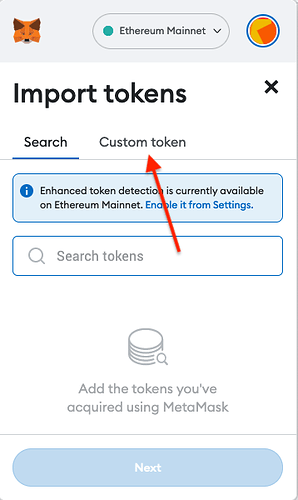
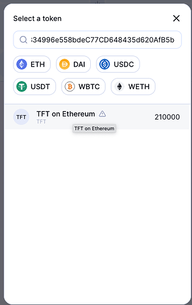

<h1>Get TFT on MetaMask</h2>

<h2>Table of Contents</h2>

- [Introduction](#introduction)
- [Add TFT to Metamask](#add-tft-to-metamask)
- [Buy TFT on Metamask](#buy-tft-on-metamask)
- [Questions and Feedback](#questions-and-feedback)

***

## Introduction

The ThreeFold Token (TFT) is available on Ethereum.
It is implemented as a wrapped asset with the following token address:

```
0x395E925834996e558bdeC77CD648435d620AfB5b
```

We present here the basic steps to add TFT to Metamask. We also show how to buy TFT Metamask. Finally, we present the simple steps to use the [TFT Ethereum Bridge](https://bridge.eth.threefold.io/).


***

## Add TFT to Metamask

Open Metamask and import the ThreeFold Token. First click on `import tokens`:

 

Then, choose `Custom Token`:

 

To add the ThreeFold Token, paste its Ethereum address in the field `Token contract address field`. The address is the following:

```
0x395E925834996e558bdeC77CD648435d620AfB5b
```

Once you paste the TFT contract address, the parameter `Token symbol` should automatically be filled with `TFT`. 

Click on the button `Add Custom Token`.

 

To confirm, click on the button `Import tokens`:

 

TFT is now added to Metamask.

***

## Buy TFT on Metamask

Liquidity is present on Ethereum  so you can use the "Swap" functionality from Metamask directly or go to [Uniswap](https://app.uniswap.org/#/swap) to swap Ethereum, or any other token, to TFT.

When using Uniswap, paste the TFT token address in the field `Select a token` to select TFT on Ethereum. The TFT token address is the following:

```
0x395E925834996e558bdeC77CD648435d620AfB5b
```

 

***

## Questions and Feedback

If you have any question, feel free to write a post on the [Threefold Forum](https://forum.threefold.io/).