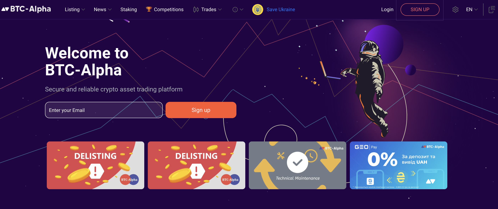
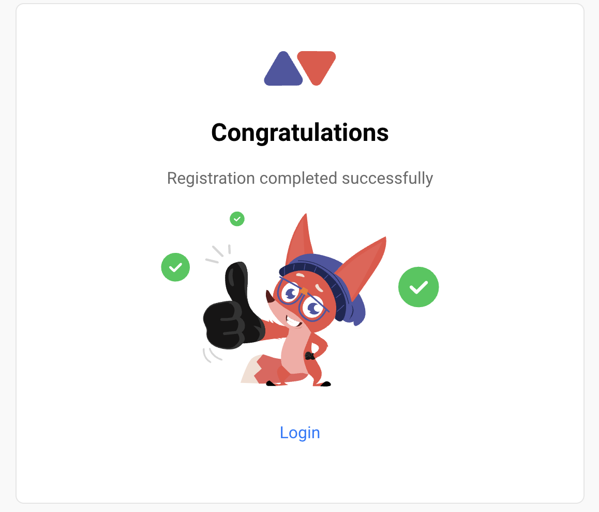
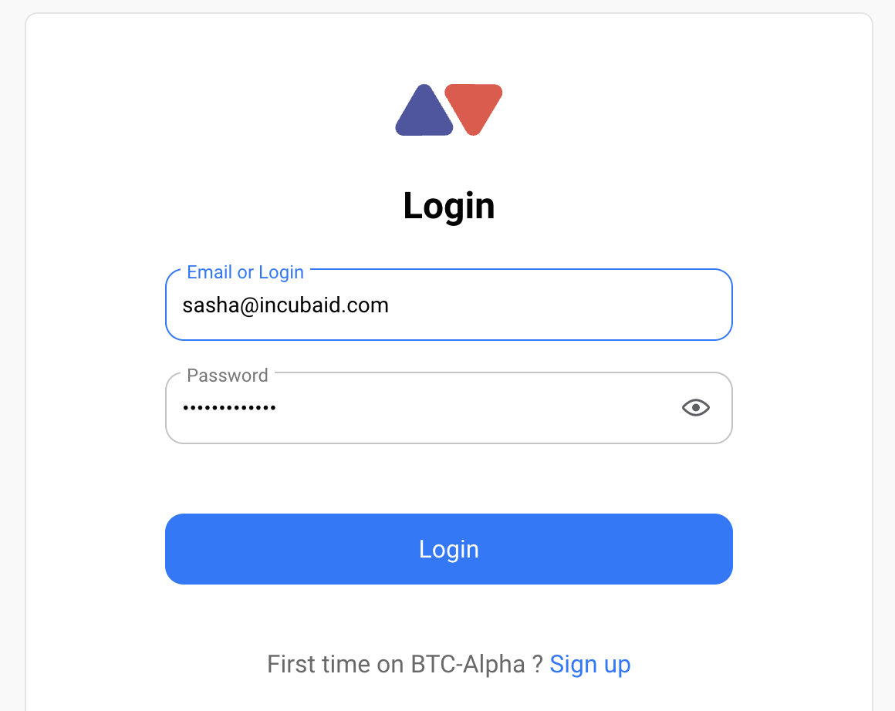
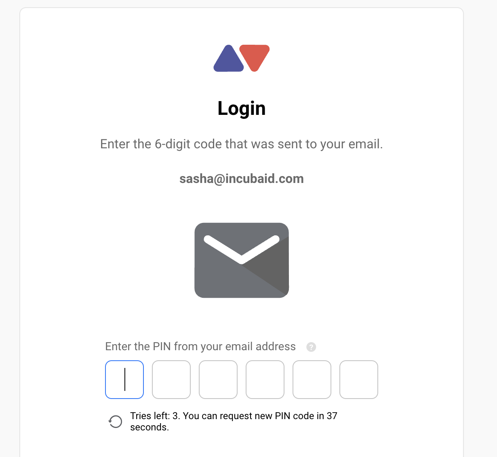
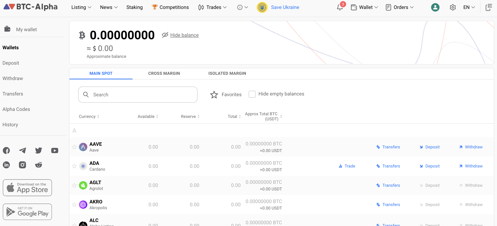
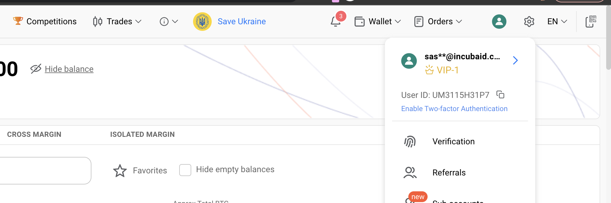
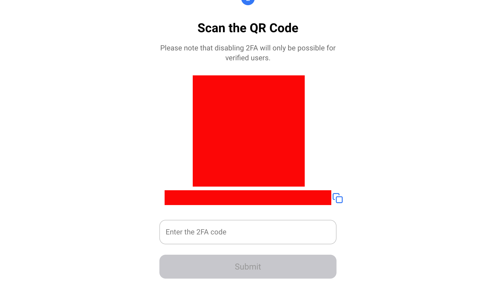
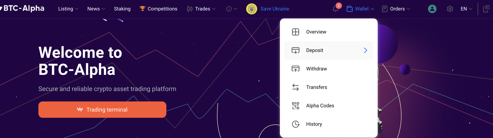
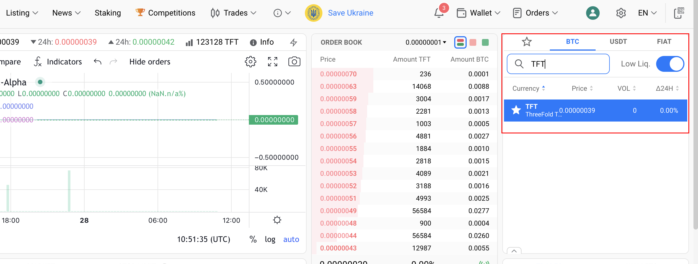

<h1> Store TFT on BTC-Alpha Exchange </h1>

<h2> Table of Contents </h2>

- [Introduction](#introduction)
- [Prerequisites](#prerequisites)
- [Get Started](#get-started)
  - [Sign up for an Account](#sign-up-for-an-account)
  - [Secure Your Account](#secure-your-account)
- [Deposit TFT(Stellar) to Account](#deposit-tftstellar-to-account)
  - [Important Notice](#important-notice)
- [Disclaimer](#disclaimer)
***
## Introduction

Welcome to our tutorial on how to get TFT (Stellar) using [**BTC-Alpha**](https://btc-alpha.com/en)! 

BTC-Alpha is a cryptocurrency exchange platform that provides a secure and user-friendly environment for trading various digital assets, including TFT (Stellar). With its robust features and intuitive interface, BTC-Alpha offers a convenient way to buy and sell cryptocurrencies. 

In this guide, we will walk you through the process of storing TFT on the BTC-Alpha exchange by depositing TFT from your external wallet to your BTC-Alpha Exchange.

> If you are looking for ways to get / purchase TFT (Stellar) on BTC-Alpha by trading, you will find the according information [here](../buy_sell_tft/btc_alpha.md).
***
## Prerequisites

- **ID for verification:** To get TFT (Stellar) on the BTC-Alpha exchange, you will need to have your identification (ID) ready for the verification process. This is a standard requirement to ensure compliance with regulatory guidelines and maintain a secure trading environment. Your ID may include documents such as a valid passport or government-issued identification card. 
  
- **BTC-Alpha Account**: You must have an active account on the BTC-Alpha exchange. If you don't have one, you can sign up on their website and complete the registration process. Make sure to secure your account with strong passwords and two-factor authentication for enhanced security.
***
## Get Started

### Sign up for an Account

**Sign up for a BTC-Alpha Account:** Visit the BTC-Alpha website [https://btc-alpha.com/](https://btc-alpha.com/) and click on the "**Sign up**" button. Fill in the required information, including your email address, a secure password, and any additional details requested for the account creation process. 

**Login to your account**: You will then receive a notification that allow you to login to your new account. 

Now, you can proceed to log in to your account and start exploring the platform. Follow these steps to log in:

Visit the BTC-Alpha website (https://btc-alpha.com/) on your web browser. Click on the "Login" button located on the top-right corner of the website.

Enter the email address and password you used during the registration process in the respective fields.

**Verify Your Account:** After completing the registration, you may need to verify your account by providing some personal identification information. This is a standard procedure for most cryptocurrency exchanges to ensure compliance with regulations and security measures. Follow the instructions provided by BTC-Alpha to complete the verification process.

Congratulations on completing the registration process for your BTC-Alpha account and are logged in to your account successfully! 

### Secure Your Account

**Secure Your Account**: Set up two-factor authentication (2FA) to add an extra layer of security to your BTC-Alpha account. This typically involves linking your account to a 2FA app, such as Google Authenticator or Authy, and enabling it for login and transaction verification.

To enable two-factor authentication (2FA) on your BTC-Alpha account, follow these steps:

Install either the [2FA Alp Authenticator](https://play.google.com/store/apps/details?id=com.alp.two_fa) or [Google Authenticator](https://play.google.com/store/apps/details?id=com.google.android.apps.authenticator2&hl=en&gl=US) app on your mobile phone. You can find Authy on the App Store or Google Play, and Google Authenticator on the Google Play Store or Apple App Store.

Once you have installed the app, log in to your BTC-Alpha account.

Right-Click on your name or profile icon located at the top-right corner of the website to access the account settings, and look for the option "**Enable Two-factor Authentication**" and click on it.

Follow the instructions provided to link your BTC-Alpha account with the Authy or Google Authenticator app. This usually involves scanning a QR code or manually entering a code provided by the app.

Once the link is established, the app will start generating unique codes that you will need to enter during the login process for additional security.

By enabling two-factor authentication, you add an extra layer of security to your BTC-Alpha account, helping to protect your funds and personal information. Make sure to keep your mobile device with the authenticator app secure, as it will be required each time you log in to your BTC-Alpha account.
***
## Deposit TFT(Stellar) to Account

To begin storing **TFT** on the BTC-Alpha exchange, you will need to deposit some TFT funds into your account. 

To deposit TFT into your BTC-Alpha account, follow these steps:

Log in to your BTC-Alpha account and Click on the "Wallets" tab located in the top menu.

Search for "**TFT**" in the list of available cryptocurrencies.

You will be provided with a TFT deposit address.
Make sure you choose **ThreeFold Token (Stellar)** as your deposit method.

To deposit, Copy this address or scan the QR code associated with it. As well as the Memo.

Use your personal external TFT wallet or the wallet of another exchange to initiate a withdrawal to the provided deposit address.

Ensure that you specify the correct deposit address and Memo. Double-check it before confirming the transaction.

**IMPORTANT**: It is crucial to always include the correct memo when sending TFT (Stellar) tokens to ensure the transaction is processed accurately. Failing to include the memo or entering an incorrect memo can lead to the loss of TFT tokens.

Wait for the transaction to be confirmed on the Stellar network. This may take some time depending on network congestion.
Once the transaction is confirmed, the TFT will be credited to your BTC-Alpha account balance.

You can check your account balance by clicking on the "**Wallets**" tab or by navigating to the "**Balances**" section.

Please note that the exact steps for depositing TFT may vary depending on the specific wallet or exchange you are using to send the funds. It is essential to double-check the deposit address and follow the instructions provided by your wallet or exchange to ensure a successful deposit.

### Important Notice

While it is possible to keep your TFT in your exchange wallet on BTC-Alpha, it is generally not recommended to store your funds there for an extended period. Public exchanges are more susceptible to security breaches and hacking attempts compared to personal wallets.

To ensure the safety and security of your TFT holdings, it is advisable to transfer them to a dedicated TFT wallet. There are several options available for creating a TFT wallet, each with its own unique features and benefits.

To explore different TFT wallet options and choose the one that best suits your needs, you can refer to our comprehensive [**TFT Wallet guide**](../storing_tft/tf_connect_app.md#create-a-wallet) that provides a list of recommended TFT wallets. This guide will help you understand the features, security measures, and compatibility of each wallet, enabling you to make an informed decision on where to store your TFT securely.

Remember, maintaining control over your private keys and taking precautions to protect your wallet information are essential for safeguarding your TFT investments.

If you are looking for ways to get / purchase TFT (Stellar) on BTC-Alpha by trading, you will find the according information [here](../buy_sell_tft/btc_alpha.md).
***
## Disclaimer

The information provided in this tutorial or any related discussion is not intended as investment advice. The purpose is to provide educational and informational content only. Investing in cryptocurrencies or any other assets carries inherent risks, and it is crucial to conduct your own research and exercise caution before making any investment decisions. 

**The ThreeFold Token (TFT)** is not to be considered as a traditional investment instrument. The value of cryptocurrencies can be volatile, and there are no guarantees of profits or returns. Always be aware of the risks involved and make informed choices based on your own assessment and understanding. We strongly encourage you to read our [full disclaimer](https://library.threefold.me/info/legal/#/legal__disclaimer) and seek advice from a qualified financial professional if needed.

