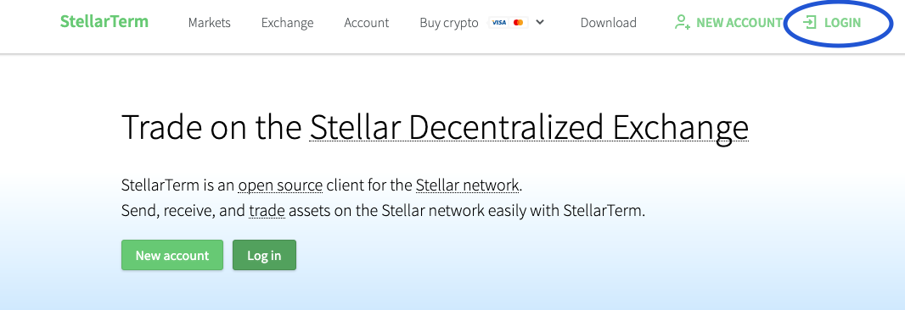
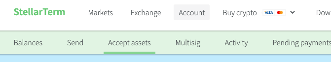

<h1> Store TFT in a Hardware Wallet </h1>

<h1> Table of Contents </h2>

- [Introduction](#introduction)
- [Setting up a TFT Trustline on Stellar Blockchain](#setting-up-a-tft-trustline-on-stellar-blockchain)
- [Conclusion](#conclusion)

***

## Introduction

Instead of using the ThreeFold Connect app to receive your farming rewards (TFTs), you can also have your farming rewards sent to a hardware wallet. In this case, you will need to enable a TFT trustline to receive TFT. 

You can use any hardware wallet that supports the Stellar Blockchain, such as a [Ledger](https://www.ledger.com/).

***

## Setting up a TFT Trustline on Stellar Blockchain

Setting up a trustline is simple.

We will show an example with a Ledger hardware wallet. The process is similar with other hardware wallets. Just make sure that your hardware wallet is compatible with the Stellar blockchain, as the TFT from farming rewards will be sent on the Stellar Blockchain.

***

* First, [download Ledger Live](https://www.ledger.com/ledger-live/download) and download the Stellar application in **Manager**.
* Go on an official Stellar website such as [Stellarterm](https://stellarterm.com/) or [StellarX](https://www.stellarx.com/). For this example, we will be using Stellarterm.com.

* Unlock your Ledger by entering your password.

* Select the Stellar App.
  * In our case, we do not need to create an account on Stellerterm, since we are using a hardware wallet.

* On Stellarterm.com, click on the button **LOGIN**.

* At the bottom of the page, select the option **Ledger** or another option if you are using a different hardware wallet.

* Click **Connect with Ledger**.

* Read and accept the Terms of Use.

* On the main page, click on **Assets**.

* Scroll down and write **Threefold.io** in the Text box. Select **TFT Threefold.io**. Click **Accept**. Then follow the steps presented on your hardware wallet to confirm the trust line.

***

## Conclusion

You now have a TFT trust line on the Stellar Blockchain. You can now receive TFT on this wallet. This is a perfect setup to farm TFT safely.

When it comes to choosing where to send your farming rewards, you simply need to enter the address associated with your hardware wallet.