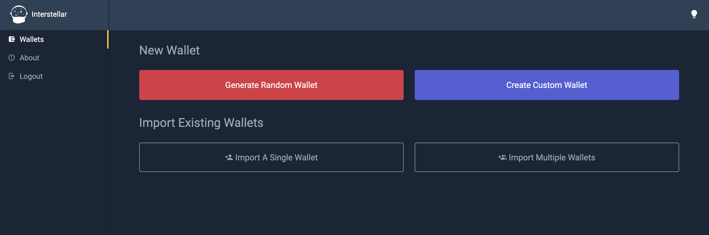
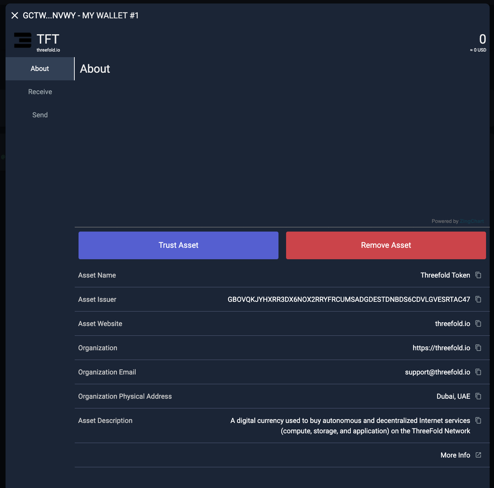
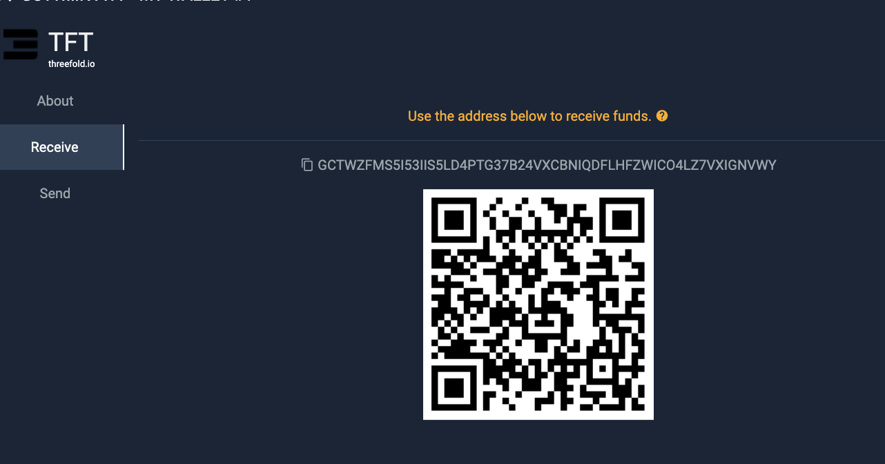

<h1> Interstellar (TFT-Stellar) </h1>

<h2>Table of Contents</h2>

- [Introduction](#introduction)
- [Prerequisites](#prerequisites)
- [Get Started](#get-started)
  - [Create a New Interstellar account](#create-a-new-interstellar-account)
  - [Create a New Wallet](#create-a-new-wallet)
  - [Adding TFT as an Asset](#adding-tft-as-an-asset)
- [Purchase TFT on Interstellar](#purchase-tft-on-interstellar)
- [Disclaimer](#disclaimer)

***

## Introduction

Welcome to our guide on how to store TFT tokens (Stellar) via the [**Interstellar**](https://interstellar.exchange/)! 

Interstellar is a decentralized exchange built on the Stellar network that enables users to trade various assets, including TFT (Stellar). As an intuitive and user-friendly platform, Interstellar provides a seamless trading experience for Stellar users. With its focus on security and privacy, Interstellar ensures that users maintain control over their funds and private keys. 

In this guide, we will walk you through the process of buying TFT on the Interstellar exchange, allowing you to participate in the vibrant Stellar ecosystem.

> If you are looking for ways to get / purchase TFT (Stellar) on Interstellar by trading, you will find the according information [here](../buy_sell_tft/interstellar.md).

## Prerequisites

- **XLM**: To get TFT tokens using Interstellar, a certain amount of XLM funding is required to facilitate the sending and receiving of assets on the Stellar network. 

If you already have some XLMs stored in another Stellar wallet or exchange, you could simply withdraw them to your new Interstellar account after you complete the signup process (we will explain how to do it later on). If not, there are multiple ways to acquire XLM and send it to your wallet. One option is to utilize XLM-supported exchanges, which provide a convenient platform for purchasing XLM. Click [**here**](https://www.coinlore.com/coin/stellar/exchanges) to access a comprehensive list of exchanges that support XLM.

As an example, we have created a tutorial specifically focusing on how to buy XLM on Coinbase, one of the popular cryptocurrency exchanges. This tutorial provides step-by-step instructions on the process of purchasing XLM on **Coinbase Exchange**. You can find the tutorial [**here**](../buy_sell_tft/coinbase_xlm.md).

## Get Started

### Create a New Interstellar account

For this guide, we will focus on creating the desktop version of Interstellar account. Go to [https://interstellar.exchange/](https://interstellar.exchange/) from your desktop and click the '**Login/signup**' button.

after selecting the preferred language and theme (dark/light) by following the login dialogue, you will be redirected to Interstellar homepage. Click '**Enter Account**' to start the signup process.

Create a new password for your new Interstellar account,  and click '**Login**'

### Create a New Wallet

You are now redirected to your new Interstellar wallet homepage. You can either generate a new wallet randomly, or creating a new custom wallet. On this case, we will generate a new wallet randomly by clicking '**Generate Random Wallet**' button.

Write down your Secret Key, which is needed to recover access to your account in case of a password loss or if your phone is lost or stolen. The word order is very important.  

Note: It is essential to save your secret key securely during the process of creating a new account or importing an existing one. The secret key is a critical component that grants access to your wallet and funds. Make sure to store it in a safe and offline location, such as a password manager or a physical backup, to prevent unauthorized access. Do not share your secret key with anyone and exercise caution to protect your assets.

Tick all the boxes and click '**Go to Account**' to proceed.

Congratulations! You have successfully created a new Interstellar wallet.

you will have to send funds (digital currencies that run on the Stellar Blockchain only) to one of the wallets attached to your account.

We have funded our wallet with $408 or 10.000 XLMs for this manual as you can see these are now shown in the account overview.

This step is obligatory because you will need to pay some XLM in order to start adding TFT asset to your wallet in the following tutorial below.

### Adding TFT as an Asset

To store and trade TFT in your Interstellar wallet, we will need to have a TFT wallet added into our account. This is done by  adding TFT Asset. This will allow you to view your TFT balance, send and receive TFT tokens, and engage in trading activities involving TFT within the Solar wallet.

To add the TFT (ThreeFold Token) asset to your Solar Wallet account, follow these steps:

Click on '**Add Token**' button on your wallet homepage.

At the pop-up 'Select Asset; window,  and click on All (unverified) option. From there you can search for **TFT** and it will show TFT and Click on the TFT icon. 

**IMPORTANT**: It is important to ensure that you also see the name "**threefold.io**" next to the logo , as this verifies that you are selecting the genuine TFT asset associated with ThreeFold. **Beware of imposters or fraudulent assets that may attempt to mimic TFT.** ThreeFold cannot assume responsibility for any errors or mistakes made during the trustline creation process done by users. If you have any uncertainties or doubts, it is always recommended to seek assistance from official support channels or trusted sources to ensure the accuracy of the trustline configuration.

Click '**Trust Asset**' once you have confirmed that the TFT asset you're adding is the official one from https://threefold.io. Remember that you have to firstly fund your wallet with some XLM, otherwise, this step won't be done successfully.

Congratulations! TFT asset has been successfully added to your account.

You can now store TFT into your Interstellar account by clicking on the TFT Asset icon, and clicking 'Receive' to deposit some TFT from another wallet to your TFT Asset wallet.

## Purchase TFT on Interstellar

If you are looking for ways to get / purchase TFT (Stellar) on Interstellar by trading, you will find the according information [here](../buy_sell_tft/interstellar.md).

## Disclaimer

The information provided in this tutorial or any related discussion is not intended as investment advice. The purpose is to provide educational and informational content only. Investing in cryptocurrencies or any other assets carries inherent risks, and it is crucial to conduct your own research and exercise caution before making any investment decisions. 

**The ThreeFold Token (TFT)** is not to be considered as a traditional investment instrument. The value of cryptocurrencies can be volatile, and there are no guarantees of profits or returns. Always be aware of the risks involved and make informed choices based on your own assessment and understanding. We strongly encourage you to read our [full disclaimer](https://library.threefold.me/info/legal/#/legal__disclaimer) and seek advice from a qualified financial professional if needed.

