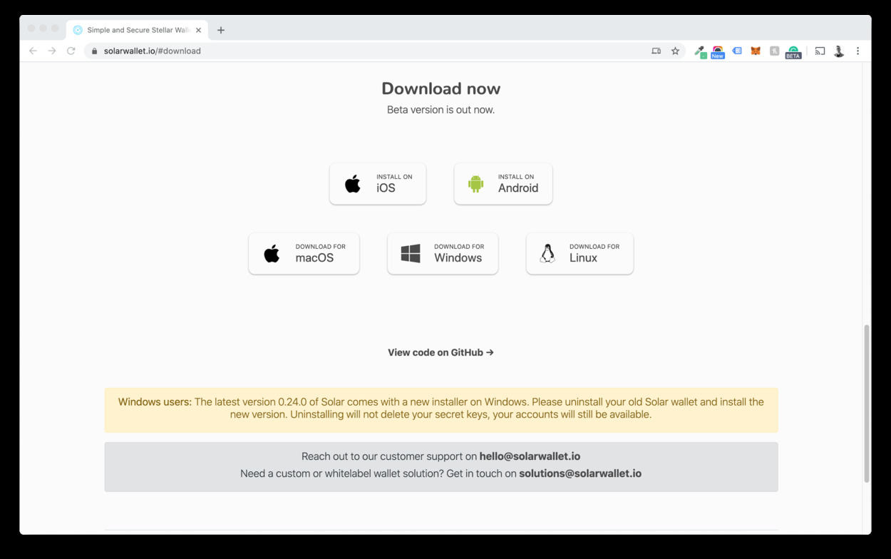

<h1> Solar Wallet (TFT-Stellar) </h1>

<h2>Table of Contents</h2>

- [Introduction](#introduction)
- [Prerequisites](#prerequisites)
- [Get Started](#get-started)
  - [Create a New Solar Wallet](#create-a-new-solar-wallet)
  - [Fund XLM to New Wallet](#fund-xlm-to-new-wallet)
  - [Adding TFT Asset to Solar Wallet](#adding-tft-asset-to-solar-wallet)
- [Storing / Receiving and Sending TFT](#storing--receiving-and-sending-tft)
- [Important Notice](#important-notice)
- [Disclaimer](#disclaimer)
***
## Introduction

Welcome to our guide on how to store TFT tokens (Stellar) via the [**Solar Wallet**](https://solarwallet.io/)!

**Solar Wallet** is a user-friendly wallet designed for storing and managing Stellar-based assets like the ThreeFold Token (TFT). It provides a secure way to store your TFT tokens and access them conveniently. With Solar Wallet, you have full control over your assets and can interact with various Stellar services and decentralized applications.  Solar Wallet is available as a web-based wallet and also offers mobile versions for iOS and Android devices. This guide will explain how to store TFT (Stellar) on Solar Wallet, including setup, adding tokens, and important security tips.
***
## Prerequisites

- **XLM**: When storing TFT tokens using the Solar wallet, a certain amount of XLM funding is required to facilitate the sending and receiving of assets on the Stellar network.

There are multiple ways to acquire XLM and send it to your wallet. One option is to utilize XLM-supported exchanges, which provide a convenient platform for purchasing XLM. Click [**here**](https://www.coinlore.com/coin/stellar/exchanges) to access a comprehensive list of exchanges that support XLM.

As an example, we have created a tutorial specifically focusing on how to buy XLM on Coinbase, one of the popular cryptocurrency exchanges. This tutorial provides step-by-step instructions on the process of purchasing XLM on **Coinbase Exchange**. You can find the tutorial [**here**](../buy_sell_tft/coinbase_xlm.md).
***
## Get Started

### Create a New Solar Wallet

For this guide, we will focus on using the desktop wallet version of Solar Wallet for MacOS. You can download the appropriate version for your operating system by visiting the official website at [https://solarwallet.io/](https://solarwallet.io/) and clicking '**Get Wallet Now**'.

Note: It is essential to save your secret key securely during the process of creating a new account or importing an existing one. The secret key is a critical component that grants access to your wallet and funds. Make sure to store it in a safe and offline location, such as a password manager or a physical backup, to prevent unauthorized access. Do not share your secret key with anyone and exercise caution to protect your assets.

After the download is finished, locate the downloaded file on your computer and double-click on it to initiate the installation process. Follow the on-screen instructions to install Solar Wallet on your macOS device. This may involve dragging the application to your Applications folder or following prompts from the installation wizard.

Once downloaded, open your Solar wallet and congratulations! You just created a new Solar wallet account.

### Fund XLM to New Wallet

To initiate the process of storing TFT in Solar, the first step is to fund your wallet with XLM (Stellar Lumens). By funding your wallet with XLM, you will have the necessary cryptocurrency to cover future transaction fees and engage in token transaction activities on Solar Wallet. Follow these steps:

On the Solar Wallet homepage, click on the '**Receive**' button. This will provide you with a wallet address to receive XLM.

Copy the generated wallet address or use the provided QR code to receive XLM from your preferred source. You can use an external exchange, another wallet, or any platform that supports XLM transfers.

Send the desired amount of XLM to the generated wallet address. Ensure that you are sending XLM from a compatible source, and double-check the address to prevent any errors. Wait for the XLM transaction to be confirmed on the Stellar network. This typically takes a few moments, but it may vary depending on network congestion.

Once XLM is successfuly sent, it will appear on your Solar homepage.

### Adding TFT Asset to Solar Wallet

To store TFT in our Solar Wallet, we will need to have a TFT wallet added into our account. This is done by  adding TFT Asset. This will allow you to view your TFT balance, send and receive TFT tokens, and engage in trading activities involving TFT within the Solar wallet.

To add the TFT (ThreeFold Token) asset to your Solar Wallet account, follow these steps:

Click on the top-right menu icon in your Solar Wallet interface. This will open a dropdown menu with various options. From the dropdown menu, select "**Assets & Balances.**" This will navigate you to the Assets & Balances section of your wallet.

In the Assets & Balances section, click on the "**+ Add Asset To Your Account" button**. This will allow you to add a new asset to your wallet.

A search box will appear. Type "**TFT**" in the search box to find the ThreeFold Token asset. Click on the search result as shown below. 

**IMPORTANT**: It is important to ensure that you also see the name "**threefold.io**" next to the logo , as this verifies that you are selecting the genuine TFT asset associated with ThreeFold. **Beware of imposters or fraudulent assets that may attempt to mimic TFT.** ThreeFold cannot assume responsibility for any errors or mistakes made during the trustline creation process done by users. If you have any uncertainties or doubts, it is always recommended to seek assistance from official support channels or trusted sources to ensure the accuracy of the trustline configuration.

Once you see the TFT asset, click on the "**Add Asset To Account**" button. Please note that adding the asset will require a small amount of XLM to set up a trustline for the TFT asset.

Confirm Adding TFT Asset to your wallet.

After confirming the transaction, wait until the process is successful. 

the TFT icon will now be displayed in your wallet overview. 

Congratulations! TFT asset has been successfully added to your Solar Wallet account.
***
## Storing / Receiving and Sending TFT

You can now store TFT by depositing it from another wallet by clicking '**Receive**' on your TFT Asset page, and copying your public TFT Solar wallet address and sending it to the withdrawer.

You can also transfer TFT to another stellar wallet by clicking the '**Send**' icon on your wallet navbar and following further instructions.
***
## Important Notice

If you are looking for ways to get / purchase TFT (Stellar) on Solar Wallet, you will find the according information [here](../buy_sell_tft/solar_buy.md).
***
## Disclaimer

The information provided in this tutorial or any related discussion is not intended as investment advice. The purpose is to provide educational and informational content only. Investing in cryptocurrencies or any other assets carries inherent risks, and it is crucial to conduct your own research and exercise caution before making any investment decisions. 

**The ThreeFold Token (TFT)** is not to be considered as a traditional investment instrument. The value of cryptocurrencies can be volatile, and there are no guarantees of profits or returns. Always be aware of the risks involved and make informed choices based on your own assessment and understanding. We strongly encourage you to read our [full disclaimer](https://library.threefold.me/info/legal/#/legal__disclaimer) and seek advice from a qualified financial professional if needed.

