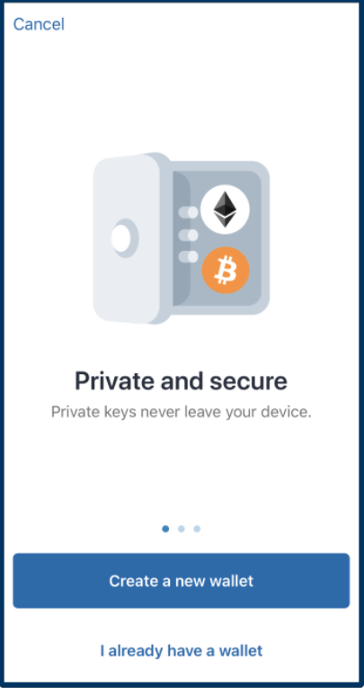
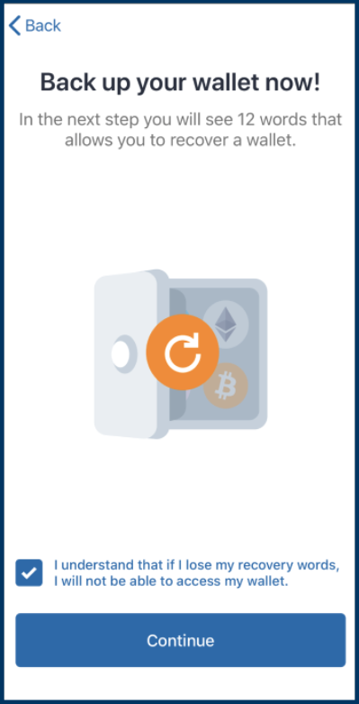
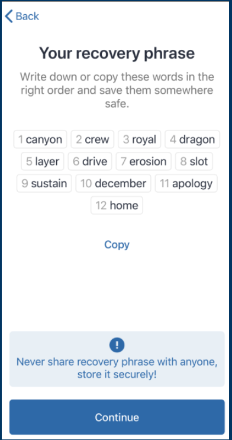
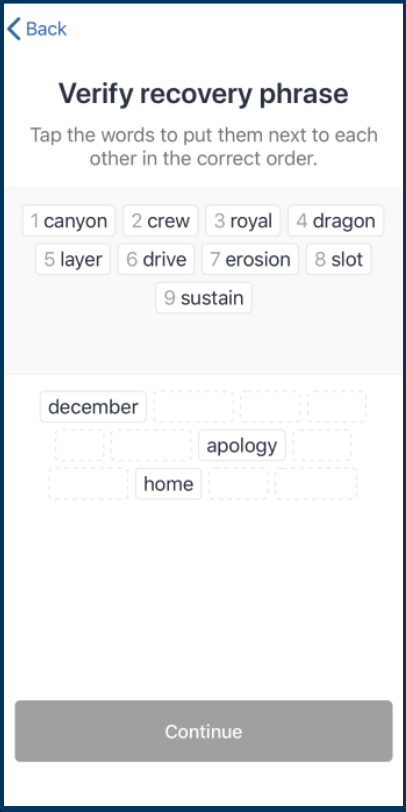
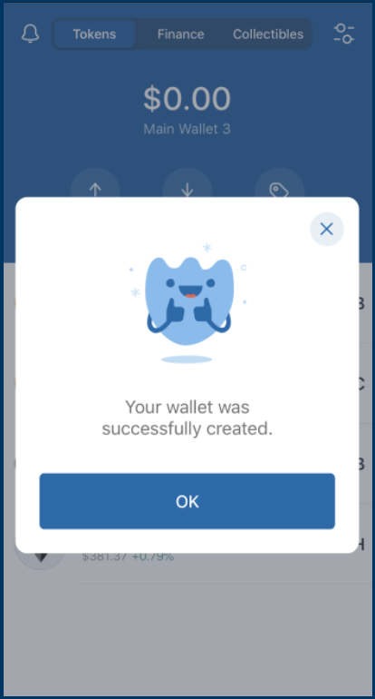
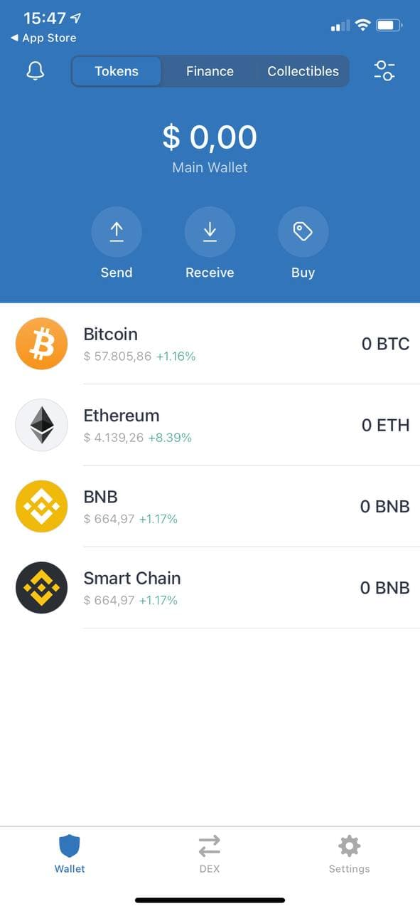
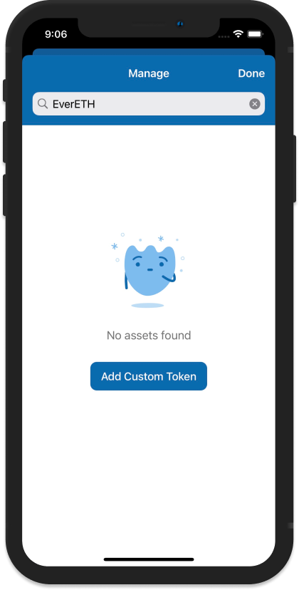
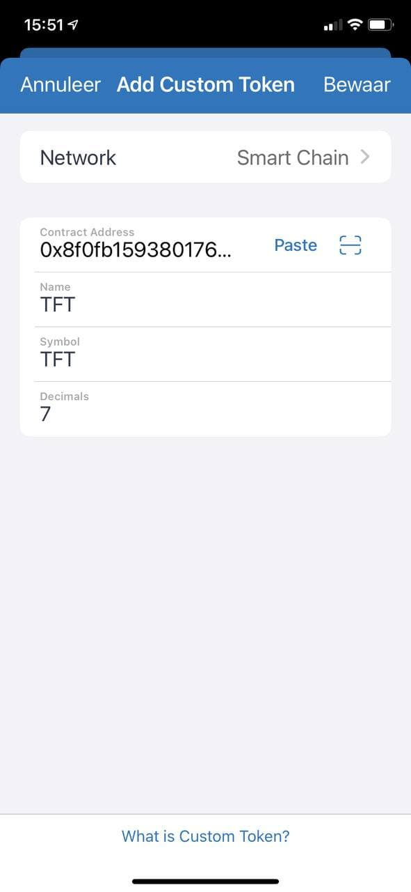
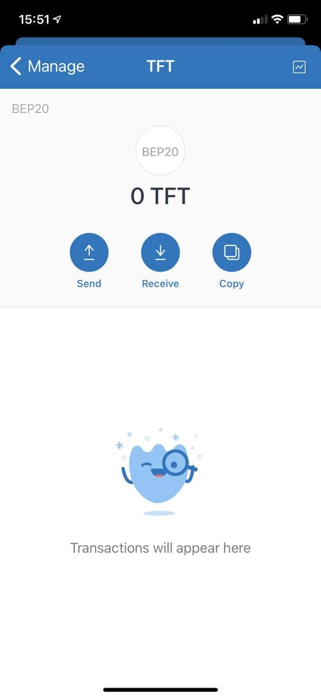

<h1> Store TFT-BSC on Trust Wallet (BSC) </h1>

<H2>Table of Contents</h2>

- [Introduction](#introduction)
- [How to Store TFT on Trust Wallet (BSC)](#how-to-store-tft-on-trust-wallet-bsc)
  - [Download and Create a Trust Wallet Account](#download-and-create-a-trust-wallet-account)
  - [Add TFT to Trust Wallet](#add-tft-to-trust-wallet)
- [Important Notice](#important-notice)
- [Disclaimer](#disclaimer)
***
## Introduction

[Trust Wallet](https://trustwallet.com/) is a widely used, free, and non-custodial mobile wallet designed for storing cryptocurrencies and non-fungible tokens (NFTs). It operates as a hot wallet, meaning it is connected directly to the internet, and is available on both iOS and Android devices. Since its acquisition by Binance in 2018, Trust Wallet has become Binance's official decentralized wallet. It supports a vast array of digital assets, with over 4.5 million supported, and is compatible with more than 65 blockchains. Trusted by millions of users, Trust Wallet stands out for its seamless integration with platforms on the Binance Smart Chain (BEP-20), including popular ones like PancakeSwap.
***
## How to Store TFT on Trust Wallet (BSC)

### Download and Create a Trust Wallet Account

Once you have downloaded the app (iOS / Android) via [https://trustwallet.com/](https://trustwallet.com/), Select “Create a new wallet” and press “Continue” to accept the terms. Get a pencil and paper ready because the warning Trust Wallet gives you is real: If you lose your recovery words (sometimes also known as a seed phrase or recovery phrase) you may lose access to your wallet and the crypto within it forever.

A new screen will appear, prompting you to write down your recovery phrase. It is important you manually write it down and keep it in a safe, private place. Keeping the words in digital form is less secure and not recommended.

The recovery phase for Trust Wallet consists of 12 words. These words will be used in case you lose access to your wallet – and they are the only way to regain access to the wallet. So we’ll say it again: Keep them in a safe, private place.

To verify that you backed up your recovery phrases, Trust Wallet will prompt you to write them in sequential order as you’ve received them.

You will get a screen stating, “Your wallet was successfully created.”

### Add TFT to Trust Wallet
 
To add TFT to your Trust Wallet, you need to configure it manually as a 'custom token'. In Trust Wallet, a custom token refers to a token that is not natively supported or pre-listed on the wallet's default token list. 

In the 'Tokens' page, click on the 'settings' icon on the upper right corner to start adding a custom token.

Search for TFT, and you will see a “No Asset Found” message with a Add Custom Token button. Click on the 'Add Custom Token' button. You will be directed to the Custom Token page.

On the Custom Token page, configure TFT in the wallet by completing following info :

Network: Smart Chain
**Contract Address: 0x8f0FB159380176D324542b3a7933F0C2Fd0c2bbf**
Name: TFT
Symbol: TFT
Decimals: 7

Once this configuration is done, your TFT wallet is ready.

***
## Important Notice

To deposit TFT tokens to your Trust BSC wallet, **you can only initiate a transfer or swap from any other wallet or exchange platform that operates on the Binance Smart Chain (BSC) network.** Ensure that the platform you are using is on BSC to avoid the risk of losing tokens.

For example, you cannot transfer TFT tokens directly from the TFConnect app to MetaMask, because TFT on TFT Connect Wallet operate on the Stellar network, while TFT on MetaMask lives on Binance Smart Chain (BSC) Network. 

But don't worry! You can still swap your Stellar TFT into BSC TFT and vice versa by bridging them using our [Stellar-BSC Bridge](https://bridge.bsc.threefold.io/). See tutorial [here](../tft_bridges/bsc_stellar_bridge.md).

You can also buy and swap TFTs on BSC-supported exchangers by connecting your Trust Wallet to platforms like [Pancake Swap](https://pancakeswap.finance/). See the tutorial [here](../buy_sell_tft/pancakeswap.md)
***
## Disclaimer

The information provided in this tutorial or any related discussion is not intended as investment advice. The purpose is to provide educational and informational content only. Investing in cryptocurrencies or any other assets carries inherent risks, and it is crucial to conduct your own research and exercise caution before making any investment decisions. 

**The ThreeFold Token (TFT)** is not to be considered as a traditional investment instrument. The value of cryptocurrencies can be volatile, and there are no guarantees of profits or returns. Always be aware of the risks involved and make informed choices based on your own assessment and understanding. We strongly encourage you to read our [full disclaimer](https://library.threefold.me/info/legal/#/legal__disclaimer) and seek advice from a qualified financial professional if needed.

