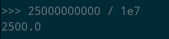

<h1>BSC-Stellar Bridge Verification</h1>

<h2>Table of Contents</h2>

- [Introduction](#introduction)
- [Stellar to BSC](#stellar-to-bsc)
- [From BSC to Stellar](#from-bsc-to-stellar)

***

## Introduction

In this guide, we will show how to verify transactions on the BSC-Stellar bridge.

When using the TFT bridge to Binance Chain (BSC), it's not simple to verify that tokens arrived at the destination wallet. The core reason is that it's not a regular token transfer, and so it doesn't show up that way in blockchain explorers.

Instead, the result of using the bridge is a contract call that actually mints wrapped TFT on Binance Chain. The corresponding tokens are vaulted on Stellar, and when the bridge is used in the opposite direction, TFT on Binance Chain are burnt then released on Stellar. So the total number of TFT in circulation is constant throughout these operations.

What we can do instead of looking at token transfers, is to look for the mint events themselves. By parsing together data from a few different sources, we can verify that tokens sent to the bridge address on Stellar indeed arrived at their destination on Binance Chain.

## Stellar to BSC

For this tutorial, we'll use an example transaction found by looking at the transaction history from the [bridge wallet](https://stellar.expert/explorer/public/account/GBFFWXWBZDILJJAMSINHPJEUJKB3H4UYXRWNB4COYQAF7UUQSWSBUXW5). This wallet is used both directions of bridging, so we want to look for an inbound transaction. Here's an example:

 

The first thing to do is decode the destination wallet address on Binance Chain, which is contained in the memo we see here on Stellar. It's encoded in base 64 and we can convert back to the original hex using a tool like [this one](https://base64.guru/converter/decode/hex):

The output is the destination address on Binance chain. Since we usually write hex values with a leading `0x`, the full address in the normal format is `0x64df465bbcee5db45131e9406662818e8ba34fc0`.

The other thing to note is the date and time of the original Stellar transaction. There are sometimes delays on the bridge, but we know that the outbound transaction on Binance chain will always happen after the inbound transaction on Stellar. In this case, we are looking at the most recent transaction on the Stellar side of the bridge, so we can just look for the most recent transaction on the Binance side too.

To do that, we'll go to the Bitquery [explorer](https://explorer.bitquery.io/bsc) for BSC. We're looking for the token contract for TFT on Binance Chain, which you can find in our documentation: `0x8f0fb159380176d324542b3a7933f0c2fd0c2bbf`. On the contract [page](https://explorer.bitquery.io/bsc/token/0x8f0fb159380176d324542b3a7933f0c2fd0c2bbf), click *Events*:

Then select *Mint* events (click on the icon under the *Event Count* column):

And finally arrive at [this page](https://explorer.bitquery.io/bsc/txs/events?contract=0x8f0fb159380176d324542b3a7933f0c2fd0c2bbf&event=85a66b9141978db9980f7e0ce3b468cebf4f7999f32b23091c5c03e798b1ba7a):

You can use the date range selector here to look for events in the past. In this case, we'll just look for the latest one, since that's what we're using for our example. Click the transaction link and the copy the transaction hash from the next page:

To get a look into the contract call, we'll switch over to [BscScan](https://bscscan.com/) at this point for a better view. Search for the transaction hash and then select the event log. We'll then see the output address and the amount of TFT minted in the data below:

We can see that the address matches the one we decoded from the Stellar memo. As for the *tokens* amount, we need to account fo the fact that TFT uses 7 decimal places, and move the decimal place by dividing by 1e7 (1x10⁷):

The original transaction on Stellar was for 2600 TFT, and the output after subtracting the 100 TFT bridge fee is 2500 TFT.

Alright, wasn't that fun? In the world of public blockchains, all data is recorded and accessible, but sometimes it takes a little investigation to find what we're looking for :face_with_monocle:

## From BSC to Stellar

So, what if you bridged from BSC to Stellar? As it turns out, we can trace transactions in that direction too.

Let's start at the BscScan explorer this time. Here's an example bridge transaction, as seen from the account transactions view, which is the default view if you search for a wallet address:

We can identify it because it's using the `Withdraw` method in a transaction to the TFT contract address on BSC.

If we open the [transaction details page](https://bscscan.com/tx/0xae2a9b5cdad652ecb1e6252ee44a7f0e3c5fc9cdf1df9fddff3b0c100c4b3cb5) by clicking on the transaction hash and switch to the *Logs* view, we can see more details:

In particular, this shows us the destination address on Stellar and the amount (again, divide by 1e7 to get the decimal form).

Back on StellarExpert, we can find a transaction on the same date just shortly after the transaction on BSC, for the same amount of TFT (minus 1 TFT bridge fee). It originates from the bridge address on Stellar and the destination is the address we see in the contract call above:

As a final step, let's double check that the transaction we see on Stellar is actually the result of the bridge interaction we saw on BSC. It's possible, after all, that the user has sent multiple transactions with the same amount.

To do this, we look at the memo on the Stellar transaction. Like above, we need to convert from base 64 to hex again (using [this tool](https://base64.guru/converter/decode/hex), for example):

 

If the output hex doesn't already look familiar, compare it to the transaction hash from above, remembering that `0x` is just a formatting convention indicating that hex data follows. Indeed, we can even search it on BscScan, to come full circle back to transaction details page from before. 

And now we've made a direct link between use of the bridge contract on BSC and the resulting payment from the bridge on Stellar :white_check_mark: