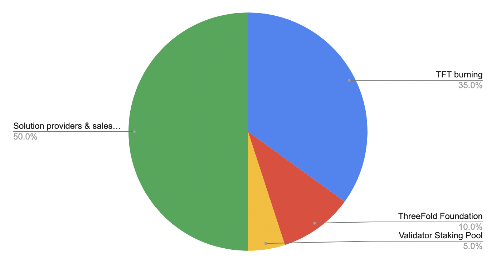

<h1> ThreeFold Token Overview </h1>

<h2>Table of Contents </h2>

- [Introduction to TFT](#introduction-to-tft)
- [Maximum Supply](#maximum-supply)
- [Proof-of-Capacity](#proof-of-capacity)
- [Proof-of-Utilization](#proof-of-utilization)
  - [Proof-of-Utility Distribution Flow](#proof-of-utility-distribution-flow)
- [TFT Marketcap](#tft-marketcap)
- [Current Distribution Values](#current-distribution-values)
- [Complemetary Information](#complemetary-information)
- [Disclaimer](#disclaimer)

***

## Introduction to TFT

ThreeFold tokens, or TFTs, are exclusively generated when new capacity is added to the TF Grid. There are no centralized issuers. Tokens have not been created out of thin air. 

While the ThreeFold Grid can expand, a maximum of 4 Billion TFTs can ever be in circulation. This limit ensures stability of value and incentivization for all stakeholders. 

TFT lives on the Stellar Blockchain. TFT holders benefit from a big ecosystem of proven wallets and mediums of exchange. 

By employing Stellar technology, TFT transactions and smart contracts are powered by one of the most energy-efficient blockchains available. Furthermore, TFT is the medium of exchange on the greenest internet network in the world. The market for farming, cultivating and trading TFT is open to all. 

Anyone with internet connection, power supply and necessary hardware can become a Farmer or trade ThreeFold tokens (TFT). 

By farming, buying, holding, and utilizing ThreeFold Tokens, you are actively supporting the expansion of the ThreeFold Grid and its use cases — creating a more sustainable, fair, and equally accessible Internet.

## Maximum Supply

The maximum amount of tokens is 4 billion, but its very unlikely we ever get there because of our burning process and recent decision to stop minting TFT. [Read more about this here](https://forum.threefold.io/t/december-22-2023-update-from-the-team/4170).

## Proof-of-Capacity

ThreeFold uses proof-of-capacity to mint tokens. Since the genenis pool, all tokens that are being minted are the result of farming. 

> For more details, see [Proof of Capacity](../../wiki/tfgrid/farming/proof_of_capacity.md)

## Proof-of-Utilization

TFT is used on the TFGrid to purchase network, compute and storage resources through the proof-of-utilization protocol.

### Proof-of-Utility Distribution Flow

> For more details, see [Proof-of-Utilization](../../wiki/tfgrid/farming/proof_of_utilization.md)

## TFT Marketcap

| **Description**           | **Value**     |
| ------------------------- | ------------- |
| Total Liquid Tokens       | {{#include ../../values/tft_liquidity.md}}     |
| TFT Marketcap at {{#include ../../values/tft_value.md}} USD | {{#include ../../values/tft_marketcap.md}}  USD |

## Current Distribution Values

| **Tokens**                                  | **Distribution** | **Done**  |
| ------------------------------------------- | ---------------- | --------- |
| Farming rewards after April 19 2018         | 75%              | 224 M     |
| Ecosystem Grants                            | 3%               | 22 M      |
| Promotion & Marketing Effort                | 5%               | 100 M     |
| Ecosystem Contribution, Liquidity Exchanges | 4%               | 40 M      |
| Technology Acquisition + Starting Team      | 7%               | 290 M     |
| Advisors, Founders & Team                   | 6%               | 241 M     |
| **Total**                                   | **100%**         | **919 M** |

## Complemetary Information

- [ThreeFold History](../../wiki/threefold_history.md)
- [Token History](../../wiki/token_history.md)
- [Special Wallets](./special_wallets/stats_special_wallets.md)

## Disclaimer

> Important Note: The ThreeFold Token (TFT) is not an investment instrument.
TFTs represent IT capacity on the ThreeFold Grid, farmers create TFT, developers use TFT.