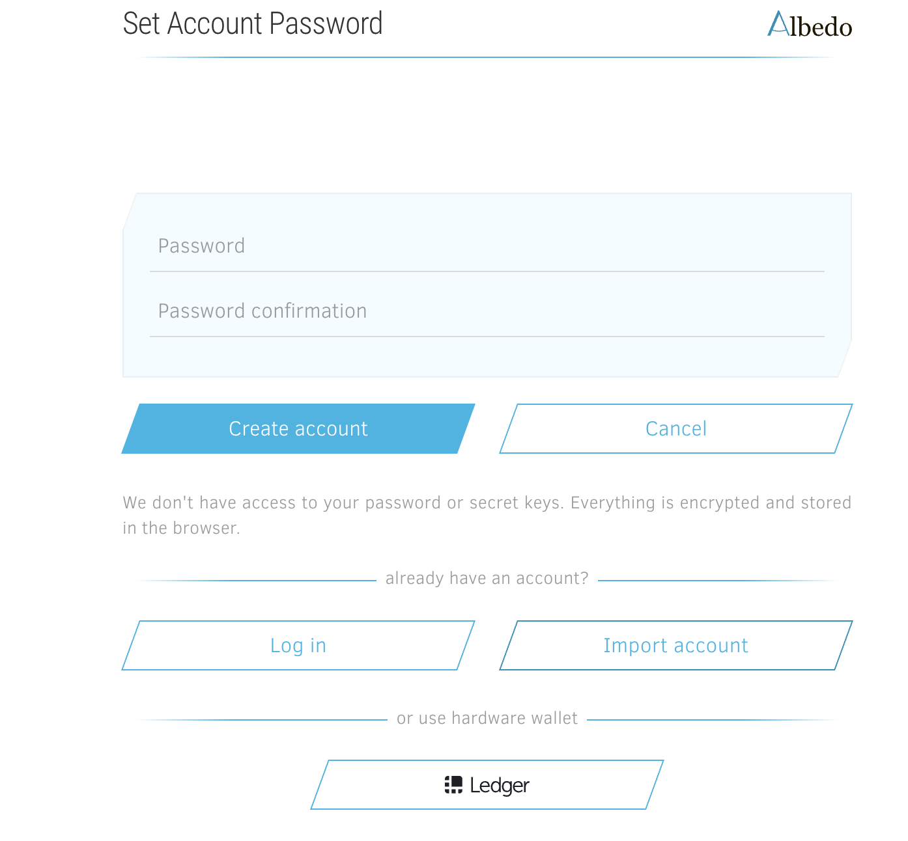
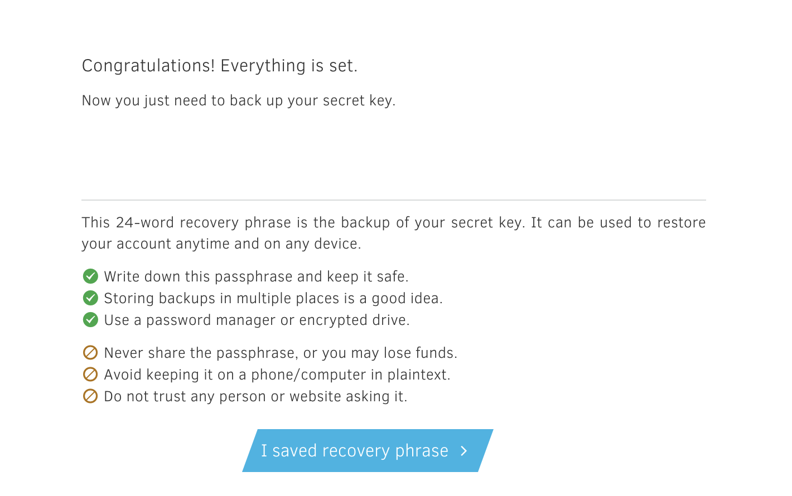
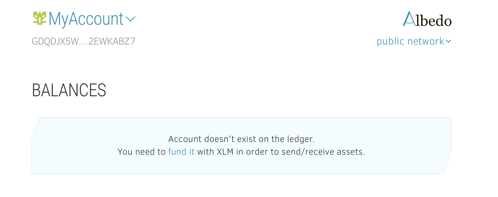
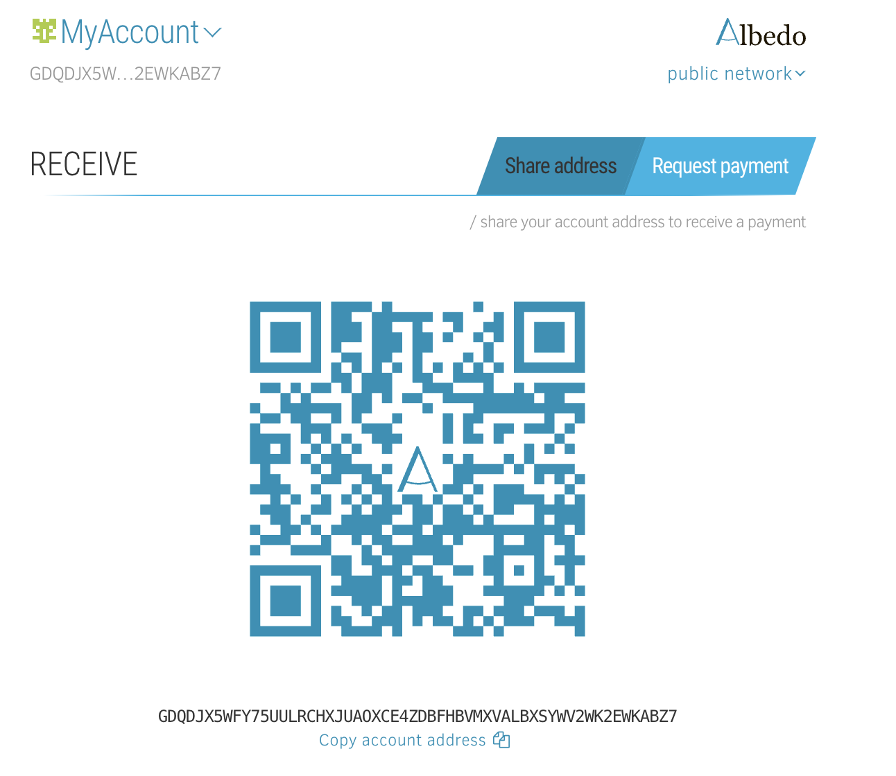
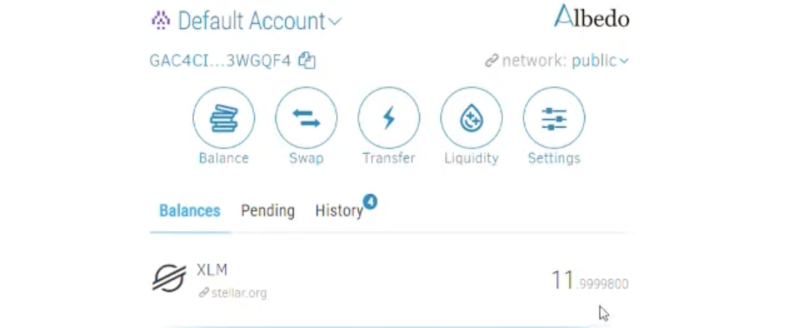
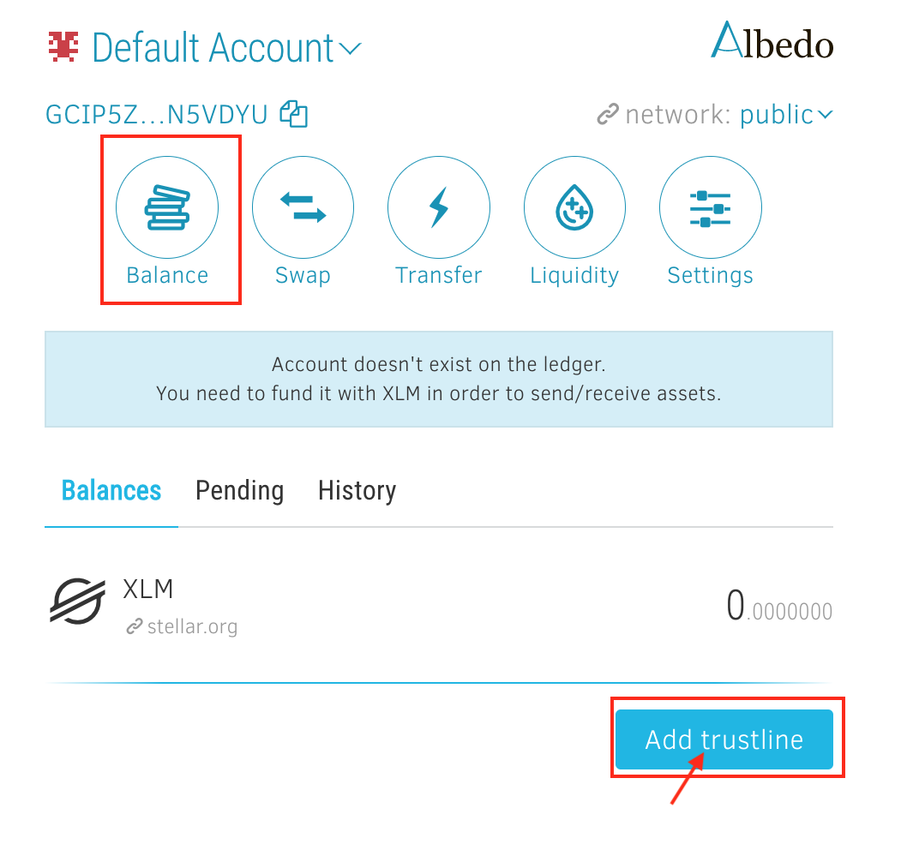
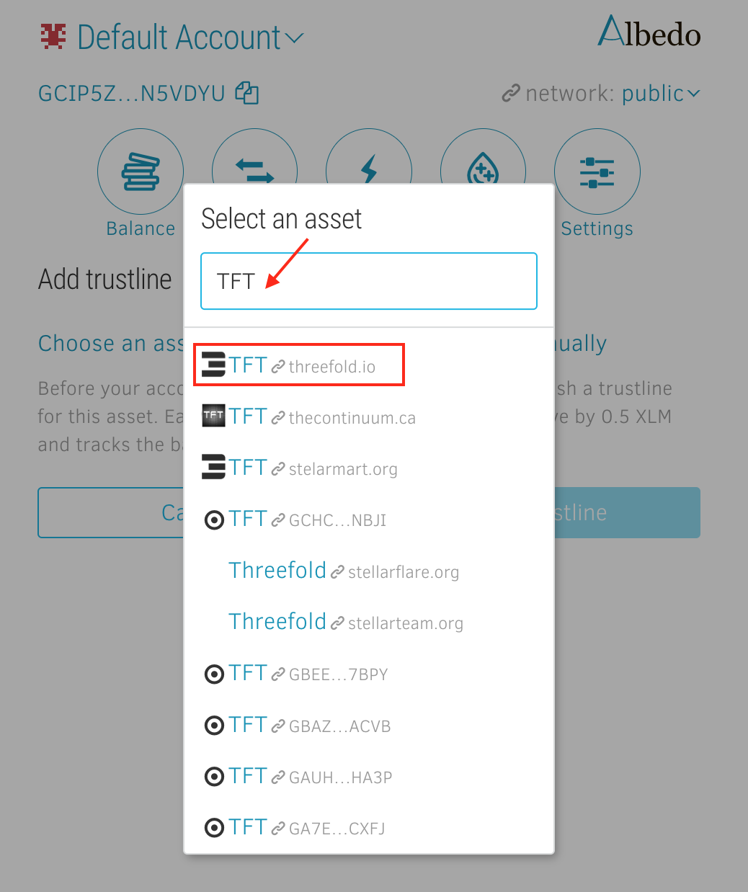
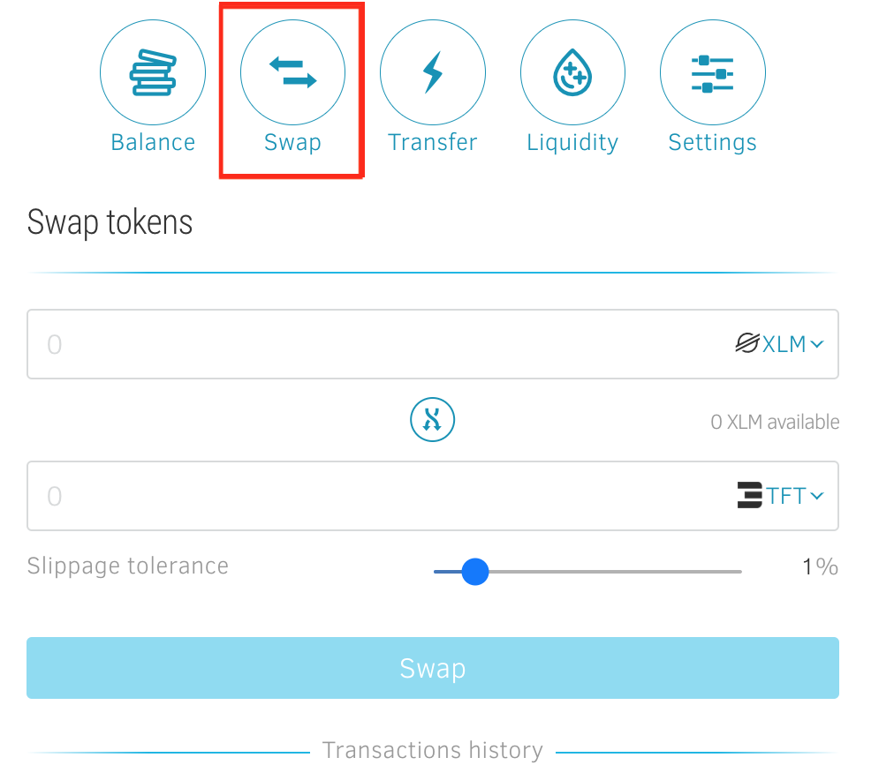
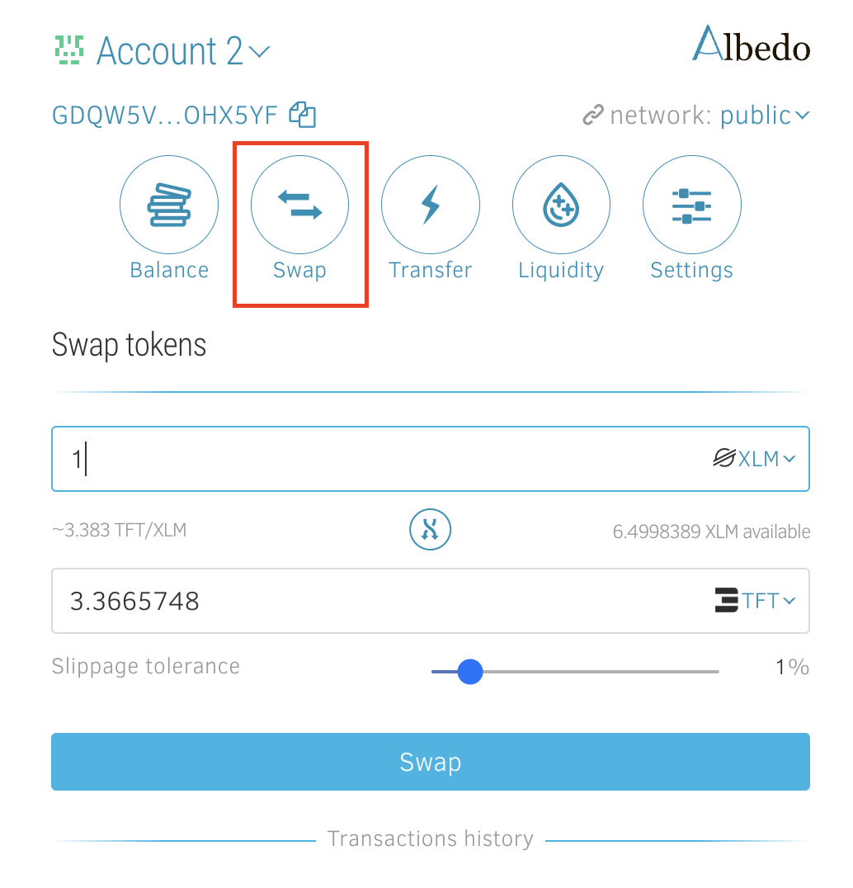

<h1> Get TFT (Stellar) on Albedo Wallet </h1>

<h2>Table of Contents</h2>

- [Intro](#intro)
  - [Prerequisites](#prerequisites)
  - [Get Started](#get-started)
    - [Create and Fund Albedo Wallet](#create-and-fund-albedo-wallet)
    - [Add TFT asset to Albedo Wallet](#add-tft-asset-to-albedo-wallet)
    - [Get TFT By Token Swapping](#get-tft-by-token-swapping)
  - [Important Notice](#important-notice)

# Intro

Welcome to our guide on how to buy TFT tokens (Stellar) via the [Albedo wallet](https://albedo.link/i)! Albedo is a secure and trustworthy keystore web app and browser extension designed for Stellar token accounts. With Albedo, you can safely manage and transact with your Stellar account without having to share your secret key with any third parties.

Developed by the creators of stellar.expert explorer, Albedo offers a range of features, including storage, swaps, and participation in liquidity pools. It is an open-source solution that can be accessed directly from your browser or installed as a browser add-on, currently available for Chrome and Firefox.

In this tutorial, we will walk you through the process of buying Stellar TFT tokens using the Albedo wallet. Whether you're a seasoned Stellar user or new to the ecosystem, Albedo provides a convenient and secure way to engage with the Stellar network. Let's dive in and explore how to purchase TFT tokens (Stellar) using the Albedo wallet.

## Prerequisites

- **XLM**: When buying TFT tokens using the Albedo wallet, the process involves swapping XLM (Stellar Lumens) or other Stellar tokens into TFT. Please note that a certain amount of XLM funding is required to facilitate the sending and receiving of assets on the Stellar network.

## Get Started

### Create and Fund Albedo Wallet

Go to [https://albedo.link/signup](https://albedo.link/signup) to start your sign up process.

Ensure you save your 24-word recovery passphrase. This is very important!
Click “**I saved recovery phrase**” (Again, it is critical that you save this recovery phrase somewhere, and do so securely). This key is the only way you could recover your account if you ever lose access to it.

Congrats! You just created an Albedo wallet. To get started swapping tokens into TFT, firstly we would need to fund your wallet with XLM by clicking 'f**und it**' on the homepage.

Send some XLM for a third party wallets or stellar exchanger of your choice to your Albedo XLM wallet. 

Once you sent the XLM, you will see the balance added to the homepage. now we are ready to do some token transactions!

### Add TFT asset to Albedo Wallet

We buy TFT in Albedo by swapping other stellar tokens to TFT. To do so, we will need to have a TFT wallet added into our account. This is done by  creating a trustline for TFT. Creating a trustline means granting permission for your Albedo wallet to recognize and interact with TFT tokens on the Stellar network. It allows you to view your TFT balance, send and receive TFT tokens, and engage in swapping or trading activities involving TFT within the Albedo wallet.

To add a trustline, go to the “**Balance**” section, and click “**Add trustline**” button.

A popup window will appear presenting Albedo's asset list. In the search field that appears, type in '**TFT**' as the asset you want to add.

**It is important to ensure that you also see the name "threefold.io" next to the logo** , as this verifies that you are selecting the genuine TFT asset associated with ThreeFold. **Beware of imposters or fraudulent assets that may attempt to mimic TFT.** ThreeFold cannot assume responsibility for any errors or mistakes made during the trustline creation process done by users. If you have any uncertainties or doubts, it is always recommended to seek assistance from official support channels or trusted sources to ensure the accuracy of the trustline configuration.

Confirm the selected asset by pressing “**Add trustline**”.

Congrats! You have now successfully added TFT as an asset to your Albedo wallet.

### Get TFT By Token Swapping

You can get TFT on Albedo by clicking 'Swap' and swapping your existing tokens to TFT, for example, XLM or USDC.

 Insert the amount of TFT you'd like to buy or the amount of XLM you'd like to swap for TFT. Click 'Swap' to confirm the transaction.

 

 Congratulations. You just swapped some XLM to TFT. Go to 'Balance' page to see your recently purchased TFT tokens.

 ## Important Notice

If you are looking for ways to provide liquidity for TFT (Stellar) on Albedo, you will find the according information [here](../liquidity/liquidity_albedo.md).

