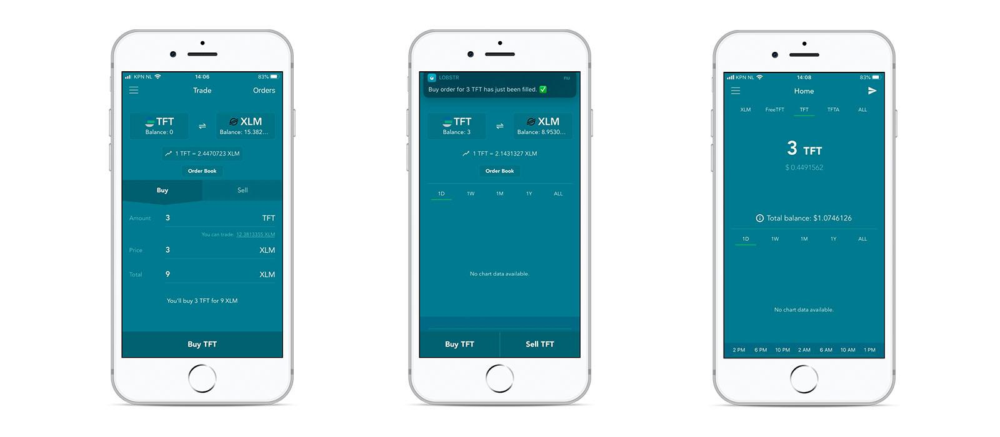

# Get TFT(Stellar) on Lobstr Wallet

<h2>Table of Contents</h2>

## Intro

Welcome to our guide on how to buy TFT tokens (Stellar) via the [Lobstr wallet](https://lobstr.co/)! 

Lobstr Wallet is a secure and user-friendly wallet designed specifically for the Stellar blockchain. It allows you to store, manage, and transact with your Stellar-based assets, including TFT (ThreeFold Token). In this tutorial, we will guide you through the process of getting TFT on Lobstr Wallet.

## Prerequisites

- **XLM**: When getting TFT tokens using the Lobstr wallet, the process involves swapping XLM (Stellar Lumens) or other Stellar tokens into TFT. Please note that a certain amount of XLM funding is required to facilitate the sending and receiving of assets on the Stellar network.

- **Create a Wallet and Add TFT Asset**: Create an Lobstr Wallet Account via the mobile app or desktop, and add TFT as an asset. Read [**here**](../storetft/lobstr_wallet.md) for the complete manual of how to create an Albedo Wallet.

## Get Started

### Get TFT By Swapping

On this tutorial, we will be using the mobile app to guide you through the process of buying TFT via Lobstr.

Once you have completed the prerequisites, you can get TFT on Lobstr by clicking the menu bar and clicking '**Swap**' to start swapping your existing tokens to TFT, for example, XLM or USDC.

Insert the amount of TFT you'd like to buy or the amount of XLM you'd like to swap for TFT. Click '**Swap XLM to TFT**' to confirm the transaction.

 Congratulations. You just swapped some XLM to TFT. Go to 'Assets' page from the menu bar to see your recently purchased TFT tokens.

 ### Get TFT by Trading

 For advanced traders, Lobstr provides access to the full orderbook trading functionality in the Trade section. 

 you can start trading TFT on Lobstr by clicking the menu bar and clicking '**Trade**' to start trading your existing tokens to TFT, for example, XLM or USDC.

 

You can choose to fullfill sell orders, or create your own buy order. Once the buy order or trade has been fulfilled your TFT will show up in your wallet.

> Read the full details about Lobstr trading feature on [Lobstr's knowledge base](https://lobstr.freshdesk.com/support/solutions/articles/151000001080-trading-in-lobstr-wallet).

## Disclaimer

The information provided in this tutorial or any related discussion is not intended as investment advice. The purpose is to provide educational and informational content only. Investing in cryptocurrencies or any other assets carries inherent risks, and it is crucial to conduct your own research and exercise caution before making any investment decisions. 

**The ThreeFold Token (TFT)** is not to be considered as a traditional investment instrument. The value of cryptocurrencies can be volatile, and there are no guarantees of profits or returns. Always be aware of the risks involved and make informed choices based on your own assessment and understanding. We strongly encourage you to read our [full disclaimer](https://library.threefold.me/info/legal/#/legal__disclaimer) and seek advice from a qualified financial professional if needed.