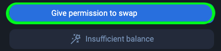

<h1>How to buy TFT on 1inch.io (BSC)</h1>

## Intro

Welcome to our tutorial on how to buy TFT on Binance Smart Chain (BSC) using [1inch.io](https://1inch.io/)! 

[**1inch.io**](https://1inch.io/) is a decentralized exchange (DEX) aggregator that aims to provide the best possible trading rates for users by sourcing liquidity from various DEX platforms. It combines smart contract technology with an intuitive user interface to enable users to swap tokens at the most favorable rates with minimal slippage and fees. 1inch.io scans multiple liquidity sources, including popular DEXs like Uniswap and SushiSwap, to ensure users get the most competitive prices for their trades. For more details about 1inch you can find a review of the 1inch exchange [here](https://www.coinbureau.com/review/1inch-exchange/)

By following the steps outlined in this guide, you'll be able to purchase TFT tokens on 1inch.io seamlessly and take advantage of the benefits offered by the Binance Smart Chain network.

## Prerequisites

Before you can buy TFT on 1inch.io, there are a few prerequisites you need to fulfill. Here's what you'll need:

- **BSC Wallet**: To interact with the Binance Smart Chain and 1inch.io, you'll need a BSC-compatible wallet. [Trust Wallet](https://trustwallet.com/) and [MetaMask](https://metamask.io/) are popular options that support BSC. Make sure to set up and secure your wallet before proceeding. On this tutorial, we will use Metamask as our connecting wallet.

> [Set up a Metamask Wallet](../storetft/metamask.md)
> [Set up a Trust Wallet](../storetft/trustwallet.md)

- **Get BNB Tokens**: As the native cryptocurrency of Binance Smart Chain, BNB is required to pay for transaction fees on the network. You will need to have Ensure you have some BNB tokens in your BSC wallet to cover these fees when buying TFT on 1inch.io. Read [this tutorial](https://fortunly.com/articles/how-to-buy-bnb/) to know where you can buy BNB and transfer them to your BSC Wallet.

> [Get BNB Tokens](https://docs.pancakeswap.finance/readme/get-started/bep20-guide)

## Connect a BSC Wallet to 1inch.io

To get started, head to 1inch.io and click on '**Launch dApp**' icon on the homepage as shown below

Click on '**Connect Wallet**' account to connect your BSC Wallet. 

A pop up window will appear, and you will be asked to select the network and wallet you would like to use connect to your 1inch.io account. In this case, since we would like to trade TFT on BSC , we would choose the '**BNB Chain**' icon (other name for BSC), for the network, and **Metamask** for the wallet. You can also connect other BSC supported wallet of your preference, such as Trust Wallet, etc.

You will now be redirected to your Metamask wallet page, or you can click on the 'Metamask' icon on your browser manually to accept the 1inch.io connection request. Select the BSC Wallet you'd like to connect to your 1inch.io account, and click '**Next**'. On the next step, Click '**Connect**' to finalize the connection.

Once your wallet is connected, you will see that you have your wallet connected on 1inch.io homepage shown as Metamask icon on the top right corner of the 1inch.io homepage. To start swapping tokens to TFT, make sure that BNB Chain icon is shown as selected network on the top right corner of your page, usually it's automatically shown as BNB if you previously connected your Metamask's BNB Wallet. If not, you can change it by clicking on the icon and selecting BNB Chain from the list.

## Swapping tokens to TFT

To start swapping tokens to TFT, click on the 'Select Token' button on the Swap page. Depending which existing BSC-supported tokens that you have in your Metamask wallet, you can swap them to to TFT as long as they're listed on 1inch.io. On this tutorial we will try to swap some BUSD tokens to TFT.

Type 'TFT on BSC' on the listing page, and clicked on the result shown as below

Once selected, define the amount of BNB you'd like to swap to TFT and click 'Confirm Swap' button.

Wait for the banner in the upper-right corner informing you about the success of your transaction. You will be notified once the swap is successful, and Congrats! You have just swapped some BUSD to TFT.

## Important Notice

If you are looking for ways to provide liquidity for TFT on Binance Smart Chain on 1inch.io, you will find the according information [here](../liquidity/liquidity_1inch.md).