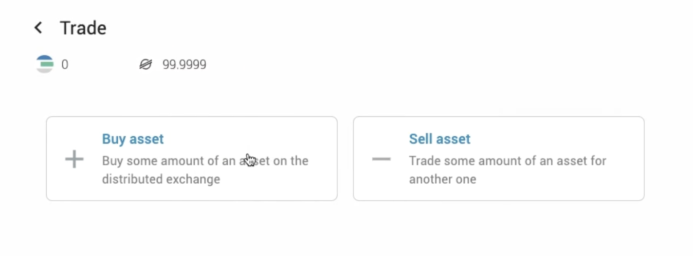

# Get TFT(Stellar) on Solar Wallet

<h2>Table of Contents</h2>

## Intro

Welcome to our guide on how to buy TFT tokens (Stellar) via the [**Solar Wallet**](https://solarwallet.io/)! 

**Solar Wallet** is a user-friendly wallet designed for storing and managing Stellar-based assets like the ThreeFold Token (TFT). It provides a secure way to store your TFT tokens and access them conveniently. With Solar Wallet, you have full control over your assets and can interact with various Stellar services and decentralized applications.  Solar Wallet is available as a web-based wallet and also offers mobile versions for iOS and Android devices. This guide will explain how to store TFT (Stellar) on Solar Wallet, including setup, adding tokens, and important security tips.

## Prerequisites

- **XLM**: When getting TFT tokens using the Solar wallet, the process involves swapping XLM (Stellar Lumens) or other Stellar tokens into TFT. Please note that a certain amount of XLM funding is required to facilitate the sending and receiving of assets on the Stellar network.

- **Create a Wallet and Add TFT Asset**: Create a Solar Wallet Account via the mobile app or desktop, and add TFT as an asset. Read [**here**](../storetft/solar_wallet.md) for the complete manual of how to create an Albedo Wallet.

## Get Started

 ### Get TFT by Trading 

 you can start trading TFT on Solar by clicking the menu bar and clicking '**TFT**' icon or 'My Account' on your wallet homepage to start trading your existing tokens to TFT, for example, XLM or USDC.

 

You will now be redirected to your Asset List. Click on the **TFT asset** to start trading.

 

 You will now be redirected to TFT asser info page. Start trading TFT by clicking '**Trade**'.

To start buying TFT, click '**Buy**' on the asset trading page.

Choose the trading pair token that you want to trade with, in this tutorial we will be trading XLM to TFT. Specify the amount of XLM you would like to sell, and click '**Place order**' to start trading.

Confirm your trade on the pop up box shown.

Wait until your order is successfully made. You will then be redirected to the wallet homepage, and Congratulations! the new TFT asset has been successfully added to your Solar Wallet account.

> Read the full details about Solar trading feature on [Lobstr's knowledge base](https://docs.solarwallet.io/guide/08-dex.html#trade-view).

## Disclaimer

The information provided in this tutorial or any related discussion is not intended as investment advice. The purpose is to provide educational and informational content only. Investing in cryptocurrencies or any other assets carries inherent risks, and it is crucial to conduct your own research and exercise caution before making any investment decisions. 

**The ThreeFold Token (TFT)** is not to be considered as a traditional investment instrument. The value of cryptocurrencies can be volatile, and there are no guarantees of profits or returns. Always be aware of the risks involved and make informed choices based on your own assessment and understanding. We strongly encourage you to read our [full disclaimer](https://library.threefold.me/info/legal/#/legal__disclaimer) and seek advice from a qualified financial professional if needed.