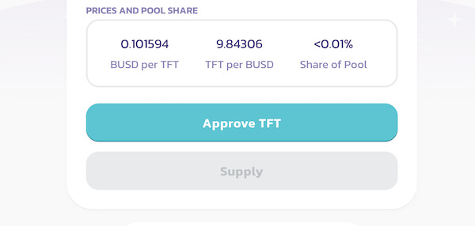
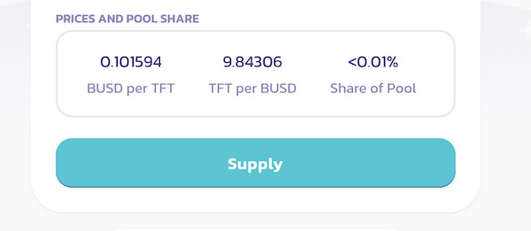

<h1> Provide TFT Liquidity on Pancake Swap </h1>

<h2>Table of Contents</h2>

## Intro

In the case of TFT on Binance Smart Chain (BSC) and PancakeSwap, becoming a liquidity provider involves providing TFT and another token (such as BNB) to the TFT-BNB liquidity pool on PancakeSwap. 

By adding liquidity to this pool, the LP helps to ensure that there is a consistent and sufficient supply of TFT available for trading on the BSC network. This contributes to the overall liquidity of the TFT token on PancakeSwap, making it easier for users to buy and sell TFT without experiencing significant price slippage.

Becoming a liquidity provider for TFT on PancakeSwap can have several benefits. Firstly, as an LP, you earn trading fees proportional to the amount of liquidity you have provided. **Anyone interested in providing Liquidity to the ThreeFold pools on PancakeSwap will be incentivized and rewarded with trading fees. 0.17% of all trading fees of all transactions go to Liquidity providers.** These fees are distributed to LPs based on their share of the total liquidity pool. 

Additionally, by participating in the liquidity provision process, you actively contribute to the growth and adoption of the TFT token. As more users trade TFT on PancakeSwap, the liquidity and trading volume increase, which can attract more traders and investors to the token. This increased activity can lead to a broader awareness of TFT and potentially drive its value and market presence.

## Prerequisites

Before you can become a TFT LP on Pancake Swap, there are a few prerequisites you need to fulfill. Here's what you'll need:

- **BSC Wallet**: To interact with the Binance Smart Chain and Pancake Swap, you'll need a BSC-compatible wallet. [Trust Wallet](https://trustwallet.com/) and [MetaMask](https://metamask.io/) are popular options that support BSC. Make sure to set up and secure your wallet before proceeding.

> [Set up a Metamask Wallet](../storetft/metamask.md)
> [Set up a Trust Wallet](../storetft/trustwallet.md)

- **Connect BSC Wallet TO Pancake Swap**: Visit the Pancake Swap website and connect your BSC wallet to your Pancake Swap account.

> [Connect Wallet to Pancake Swap](https://docs.pancakeswap.finance/readme/get-started/connection-guide)

- **Get BNB Tokens**: As the native cryptocurrency of Binance Smart Chain, BNB is required to pay for transaction fees on the network. Ensure you have some BNB tokens in your BSC wallet to cover these fees when buying TFT on Pancake Swap. Read [this tutorial](https://fortunly.com/articles/how-to-buy-bnb/) to know where you can buy BNB and transfer them to your BSC Wallet.

> [Get BNB Tokens](https://docs.pancakeswap.finance/readme/get-started/bep20-guide)

## Become a TFT LP

Now that you're all set, you can become an LP by going to go to your [PancakeSwap homepage](https://pancakeswap.finance/) and click on **Trade > Liquidityp** button on the navbar as shown. Please Make sure you're on **BNB Smart Chain** network.

You will now be directed to the Liquidity page. When providing liquidity for TFT on PancakeSwap, we recommend you to pair it with BUSD (Binance USD), which already has significant liquidity. The ratio between TFT and BUSD in the existing pool is fixed by market prices. Simply choose the amount of liquidity you want to provide for both currencies. Consider the potential risks associated with impermanent loss. Join the TFT-BUSD pool on PancakeSwap to contribute and trade TFT tokens.

Click “approve” for both currencies, then c;ick 'confirm' to accept the wallet prompts and fees.

Click “supply” and confirm the wallet prompt and fee.

Congratulations! You have now exchanged the selected amounts for both currencies for LPs (Liquidity Tokens) and you are providing liquidity and earning a part of the transaction fees.

