<h1> Store TFT-BSC on Metamask Wallet </h1>

<h2>Table of Contents</h2>

- [Intro](#intro)
- [Get Started](#get-started)
  - [Install \& Create Metamask Account](#install--create-metamask-account)
  - [Configure a BSC Wallet (Mainnet) for your TFT](#configure-a-bsc-wallet-mainnet-for-your-tft)
  - [Switch Network from ETH to BSC (Auto Add)](#switch-network-from-eth-to-bsc-auto-add)
  - [Add TFT Asset to BSC Wallet (Mainnet)](#add-tft-asset-to-bsc-wallet-mainnet)
- [Important Notice](#important-notice)

## Intro

[ MetaMask](https://metamask.io/) is a popular browser extension wallet that allows users to interact with various blockchain networks, including BSC. By following the steps outlined in this guide, you'll be able to configure your MetaMask wallet to support TFT tokens on BSC and seamlessly participate in the TFT ecosystem. So let's dive in and explore how to set up TFT on MetaMask with Binance Smart Chain.

## Get Started

### Install & Create Metamask Account

**Download Metamask** [**here**](https://metamask.io/download.html). Then, install the Metamask extension in your local browser. Follow [this tutorial](https://support.metamask.io/hc/en-us/articles/360015489531-Getting-started-with-MetaMask) to install metamask to your preferred browser and create. 

Once you’ve installed MetaMask, you’ll see the small fox icon at the top right of your screen, and a notification will appear, letting you know that the install was successful.

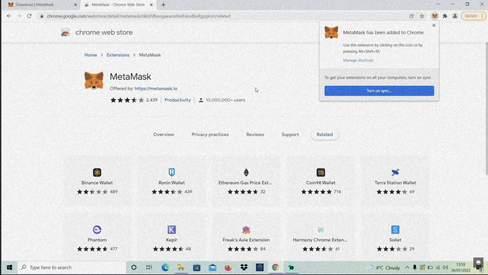

**Create a Metamask account**

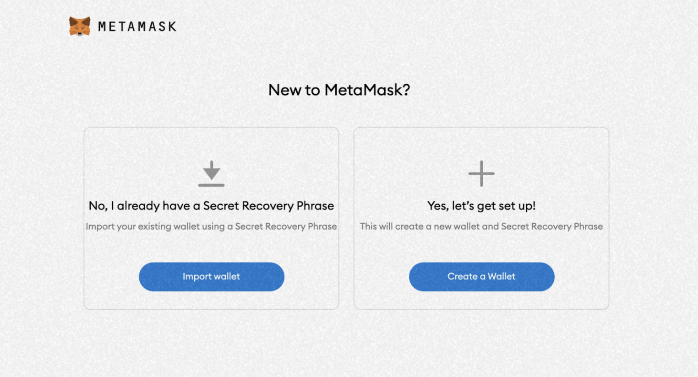

Assuming you are a new user, click the “**Create a Wallet**” button on the right to get started with a new wallet. 

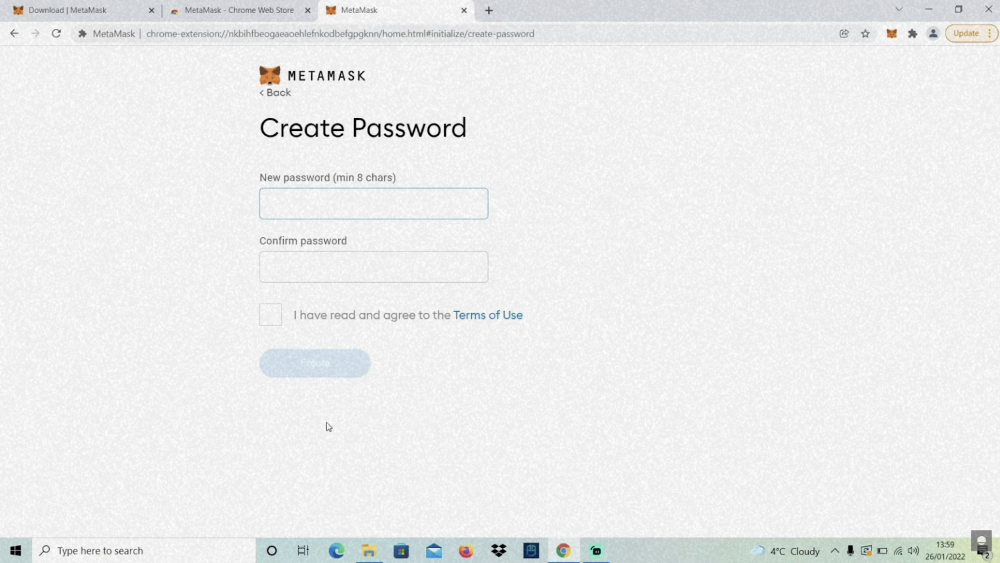

This is your password for access to your wallet on your local device. As with all online accounts, you should ensure that you are using a strong password. On the next page, you’ll be given a set of 12 words that act as your **private key**. 

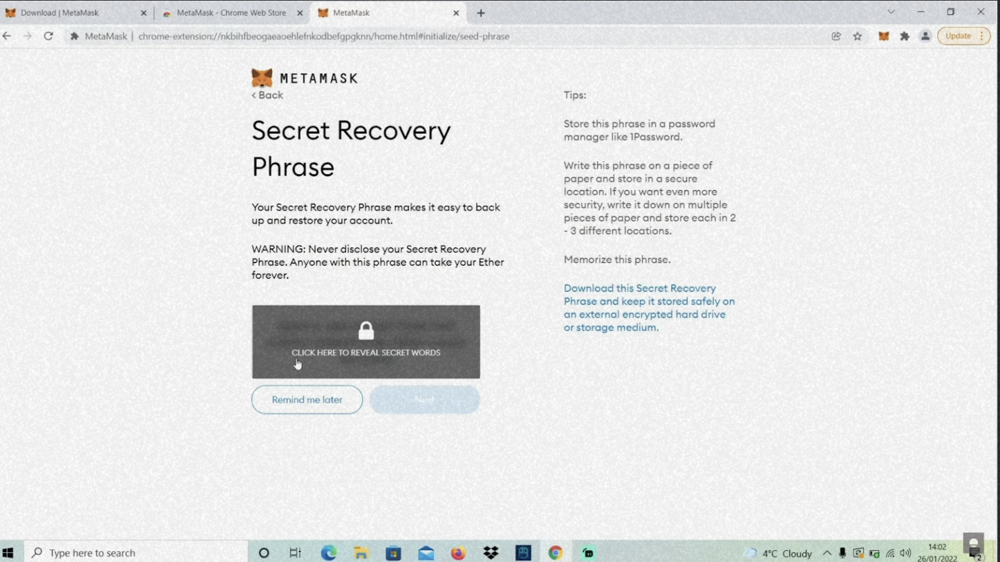

You can think of these words as your master key to all your digital assets. If you have lost or forgotten your password, you can use this set of 12 words to restore your wallet on any device. However, if anyone were to gain access to these 12 words, they could do the same.

This passphrase is very important, so be sure to keep it safe. Once you have written them down, you can click the “Next” button. Then, just to make sure that you have written them down, MetaMask asks you to confirm your secret recovery phrase by selecting the words in the order they were originally given. You must write down your 12 words in the correct order. 

Once you’ve entered those words, you can click “Continue.” Then, you’re done! It’s that easy. 

### Configure a BSC Wallet (Mainnet) for your TFT

 MetaMask supports various wallet networks, including Ethereum, Binance Smart Chain (BSC), and more. By adding the BSC network, you can seamlessly manage and transact with BSC-based assets like TFT tokens directly within your MetaMask wallet.
 
 To configure a BSC wallet on MetaMask, you can add the BSC network by specifying the network details such as the chain ID, RPC URL, and symbol. 

### Switch Network from ETH to BSC (Auto Add)

You might notice straight away that we’re still dealing with an Ethereum wallet. But we want to have a Wallet on BSC Network. To add a new network, click it to access a drop-down menu and hit the "**Add Network**” tab to proceed to the next step. 

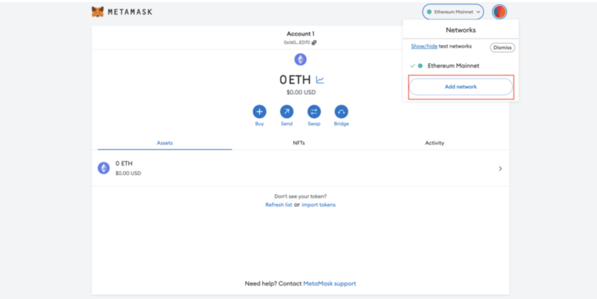

You can add BNB Smart Chain from the list of popular networks by clicking "Add", and approving the request once it pops up. 

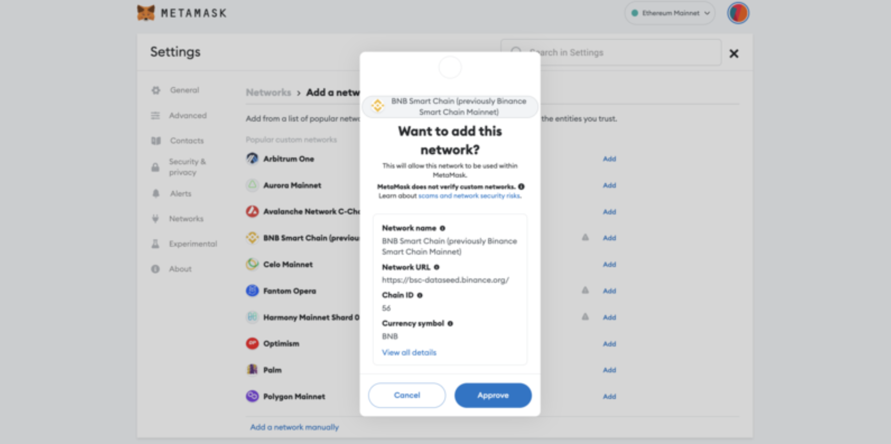

After it's added. you will realize that your mainnet network has turned into “**Smart Chain**.” If you wish to change back to the Ethereum network, simply press on the “Smart Chain” menu on the top. 

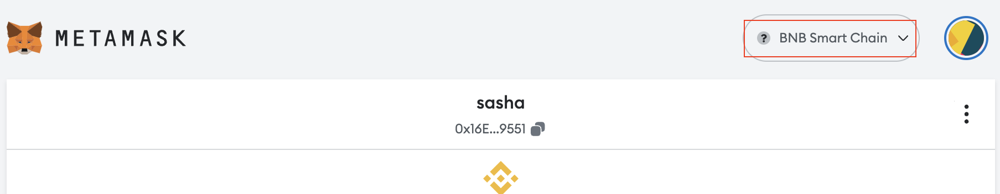


### Add TFT Asset to BSC Wallet (Mainnet)

Now that you have successfully created a BSC Wallet, we will need to add TFT onto your BSC Wallet. 

To add, go to your 'assets' page and click on '**Import Tokens**' at the bottom of the page.

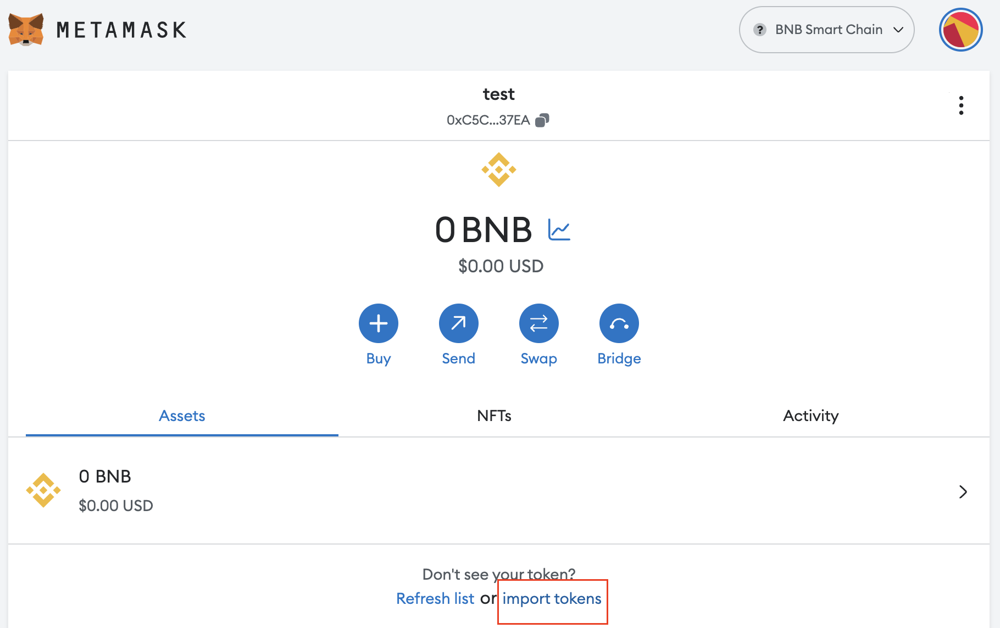

You can add TFT onto your wallet by either automatically adding it by typing '**TFT ON BSC (TFT)**' on '**search**' page,

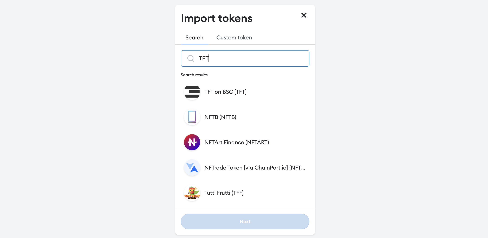

or by going to '**custom token**' page and entering TFT details manually. Make sure you enter the right details below to add TFT to your wallet successfully:

- **Token Contract Address**: ```0x8f0fb159380176d324542b3a7933f0c2fd0c2bbf```

Metamask will add the rest of the details, once added, click 'Add custom token'. 

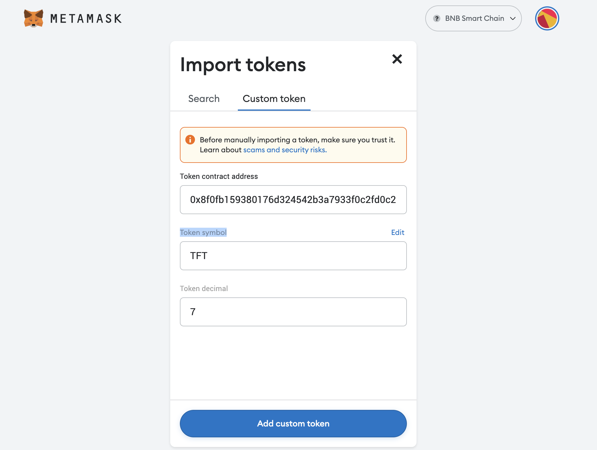

After the click, you will be asked by Metamask to confirm the token import. Click '**Import Tokens**'.


Congratulations, you have successfully added TFT to your BSC Wallet on Metamask.

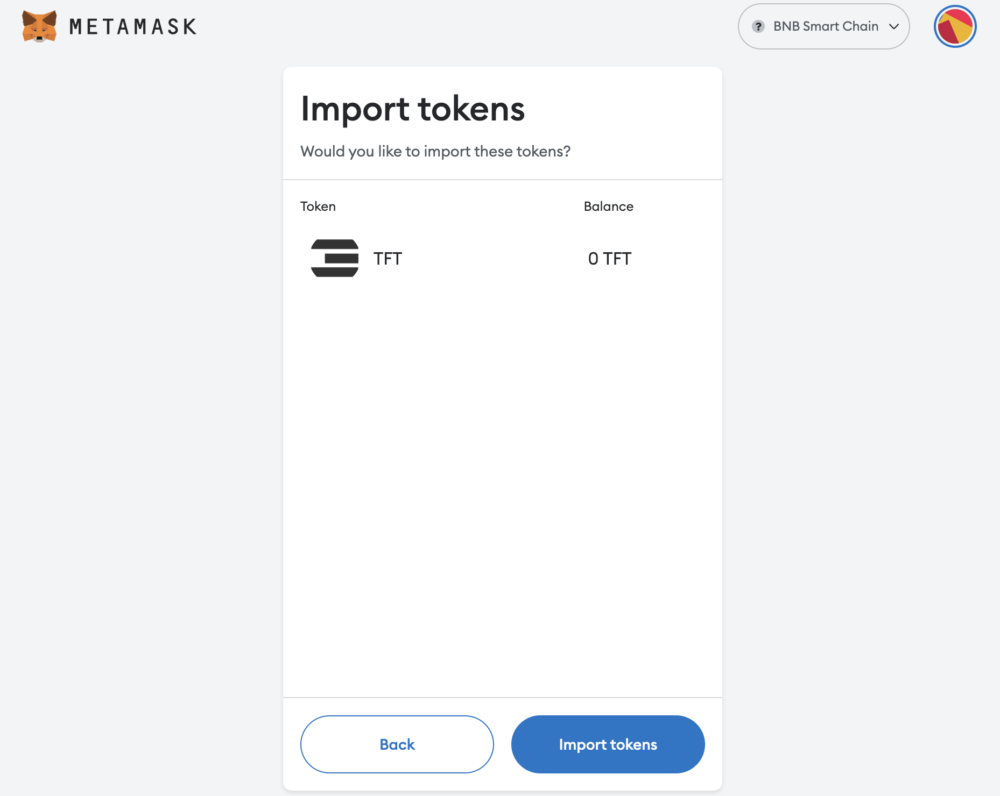

You should be seeing TFT listed on your Wallet homepage's 'Assets' section. Now that we've successfully listed TFT, we can go ahead and do TFT transactions via Metamask.

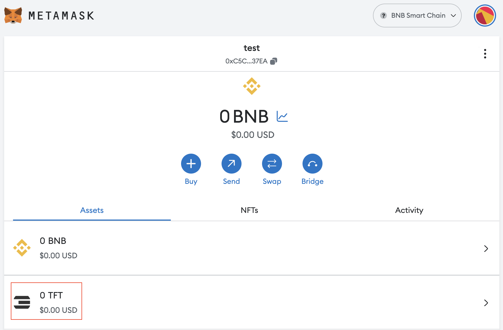

## Important Notice

To deposit TFT tokens to your MetaMask BSC wallet, **you can only initiate a transfer or swap from any other wallet or exchange platform that operates on the Binance Smart Chain (BSC) network.** Ensure that the platform you are using is on BSC to avoid the risk of losing tokens.

For example, you cannot transfer TFT tokens directly from the TFConnect app to MetaMask, because TFT tokens on TFT Connect operate on the Stellar network, while TFT on MetaMask lives on Binance Smart Chain (BSC) Network. 

But don't worry! You can still swap your Stellar TFT into BSC TFT and vice versa by bridging them using our [TFT BSC Bridge](https://bridge.bsc.threefold.io/). See tutorial [here](/src/farmers/threefold_token/buy_sell_tft/tfchain_stellar_bridge.md).

You can also buy TFTs on BSC-supported exchangers like [Pancake Swap](https://pancakeswap.finance/). See tutorial [here](../buytft/pancakeswap.md)

