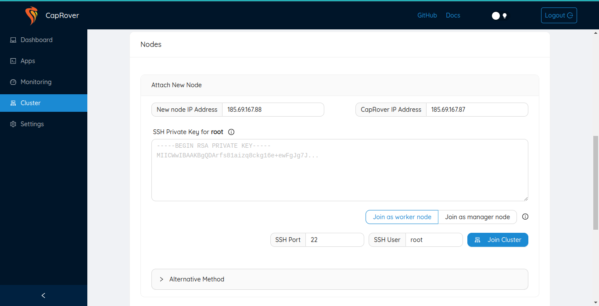

# Manage Caprover

## Step 1: Enable https

You need to specify your email address.

> Now force https.

## Step 2: Add a default docker registry

You'll have to add a default docker registry so other CapRover nodes in the cluster can download images from, and it can be self-hosted (managed by CapRover itself), to add it, go to `Cluster` -> `Docker Registry Configuration`.

You can check [official documentation](https://caprover.com/docs/app-scaling-and-cluster.html#setup-docker-registry) to know more about Docker registry options.

## Step 3: Deploy an app

just go to apps & follow the instructions, there is much more info on caprover website.

## Step 4: Enable monitoring

You should now see

## Step 5: Lets add nodes to caprover

- Go to the Cluster 

- Enable Add Self hosted registry or Add remote registry.

- Here appears the leader node

Now you can attach new nodes as workers 

- Add IP address of worker node you deployed from playground

- Add SSH Private Key for root

- Join cluster as worker node

- You can also apply the alternative method if you want

## Step 6: Change your password

- Go to `Settings` and change your password. This is important for your own security.
