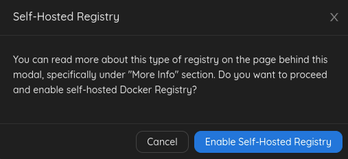
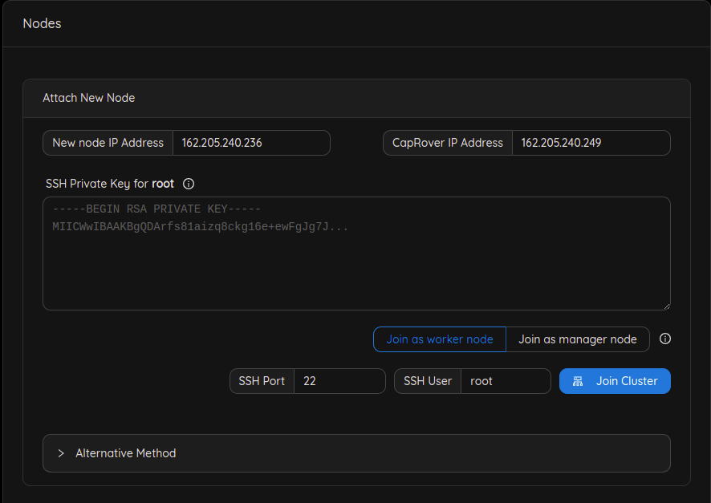

# Add a new worker node

## Step 1: Add a default docker registry

You'll have to add a default docker registry so other CapRover nodes in the cluster can download images from, and it can be self-hosted (managed by CapRover itself), to add it, go to `Cluster` -> `Docker Registry Configuration`.

- Click `Add Self-Hosted Registry` button, then click `Enable Self-Hosted Registry`

You can check [official documentation](https://caprover.com/docs/app-scaling-and-cluster.html#setup-docker-registry) to know more about Docker registry options.

## Step 2: Attach a new node to the cluster

- Add the public IPv4 address that has been returned from the worker deployment in the `New node IP Address` field.
- Add your `SSH private key` (you can use this command `cat ~/.ssh/id_rsa` to get your private key).
- Click `Join cluster` button.
