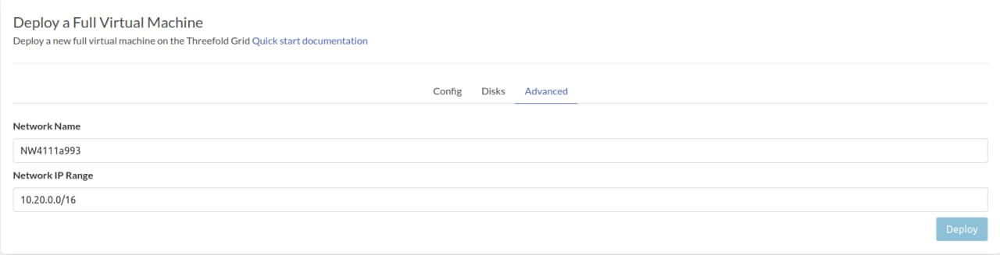

> Note: TFGrid GPU Support is only available on Dev Test for the moment.

<h1> Full Virtual Machine </h1>

<h2> Table of Contents </h2>

- [Introduction](#introduction)
- [Process](#process)
- [New Released Features](#new-released-features)
  - [GPU Support](#gpu-support)
- [Differences Between Full and Micro VMs](#differences-between-full-and-micro-vms)
- [Manually Mounting Additional Disks](#manually-mounting-additional-disks)
  - [Check All Disks Attached to the VM](#check-all-disks-attached-to-the-vm)
  - [Additional Disks](#additional-disks)
  - [Create the Mount Directory](#create-the-mount-directory)
  - [New File System](#new-file-system)
  - [Mount Drive](#mount-drive)

***

## Introduction

Deploy a new full virtual machine on the Threefold Grid

- Make sure you have an activated [profile](./weblets_profile_manager.md)
- Click on the **Full Virtual Machine** tab
***
## Process


- `Fill in the instance name` it's used to reference the VM in the future.
- `Public IPv4` flag gives the full VM a Public IPv4
- `Public IPv6` flag gives the full VM a Public IPv6
- `Planetary Network` to connect the full VM to Planetary network
- `Selecting a Node with GPU` when selecting a node with GPU resources, please make sure that you have a rented node. To rent a node and gain access to GPU capabilities, you can use our dashboard.
- Choose the node to deploy on which can be
- `Manual` where you specify the node id yourself
- `Automatic` Suggests nodes list based on search criteria e.g `country`, `farm`, capacity..
***
## New Released Features

### GPU Support

Currently the playground is the easiest way to deploy a VM, a new option GPU is added to the filters


That means it will limit the criteria of the search to the nodes you rented that has GPU, once it finds nodes it will also show a list of the available GPUs to use in the VM


You can attach one or more disks to the Full Virtual Machine by clicking on the Disks tab and the plus `+` sign and specify the following parameters

- Disk name
- Disk size
- Mount point



- `Network Name`: It's used for Wireguard's private network.
- `Network IP Range`: It's a private subnet for Wireguard's network. You could use the auto-generated one or replace it with a **private** subnet.

In the bottom of the page you can see a list of all of the virual machines you deployed. you can click on `Show details` for more details


***
## Differences Between Full and Micro VMs

- Full VM contains a default disk attached to it which is not the case in the Micro VM where you needed to make sure to attach a disk to it or the VM will fail
- The default disk is mounted on / so if you want to attach any additional disks, you have to choose a different mounting point
- Only cloud init flists can be deployed on Full VM. You can check official Threefold flists [here](https://hub.grid.tf/tf-official-vms)
- In Full VM, you need to mount the additional disks manually after the VM is deployed
***
## Manually Mounting Additional Disks

- You can follow the following commands to add your disk manually:

### Check All Disks Attached to the VM

```bash
fdisk -l
```

### Additional Disks

The additional disk won't be mounted and you won't find it listed.

```bash
df -h
```

### Create the Mount Directory

To create the mount directory, write the following like:

```bash
sudo mkdir /hdd6T
```

### New File System

```bash
sudo mkfs.ext4 /dev/vdb
```

### Mount Drive

```bash
sudo mount /dev/vdb /hdd6T/
```


