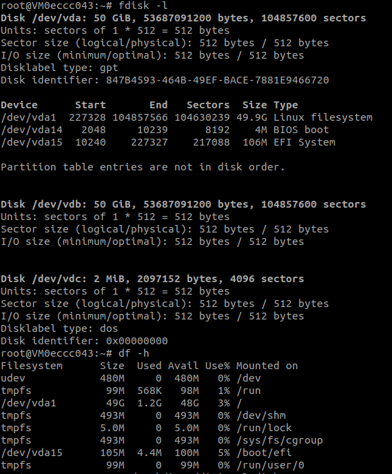

# Full Virtual Machine

Deploy a new full virtual machine on the Threefold Grid

- Make sure you have an activated [profile](./weblets_profile_manager.md)
- Click on the **Full Virtual Machine** tab

**Process:**


- Fill in the instance name: it's used to reference the VM in the future.
- `Public IPv4` flag gives the full VM a Public IPv4
- `Public IPv6` flag gives the full VM a Public IPv6
- `Planetary Network` to connect the full VM to Planetary network
- Choose the node to deploy on which can be
- Manual: where you specify the node id yourself
- Automatic: Suggests nodes list based on search criteria e.g `country`, `farm`, capacity..


You can attach one or more disks to the Full Virtual Machine by clicking on the Disks tab and the plus `+` sign and specify the following parameters

- Disk name
- Disk size
- Mount point


- `Network Name`: It's used for Wireguard's private network.
- `Network IP Range`: It's a private subnet for Wireguard's network. You could use the auto-generated one or replace it with a **private** subnet.

In the bottom of the page you can see a list of all of the virual machines you deployed. you can click on `Show details` for more details


## Difference Between Full Virtual Machine and Micro Virtual Machine

- Full VM contains a default disk attached to it which is not the case in the Micro VM where you needed to make sure to attach a disk to it or the VM will fail
- The default disk is mounted on / so if you want to attach any additional disks, you have to choose a different mounting point
- Only cloud init flists can be deployed on Full VM. You can check official Threefold flists [here](https://hub.grid.tf/tf-official-vms)
- In Full VM, you need to mount the additional disks manually after the VM is deployed

## Manually Mounting Additional Disk

- You can follow the following commands to add your disk manually:

### Check all disks attached to the VM

```bash
fdisk -l
```

### The additional disk won't be mounted and you won't find it listed

```bash
df -h
```

### Create mount dir

```bash
sudo mkdir /hdd6T
```

### New file system

```bash
sudo mkfs.ext4 /dev/vdb
```

### Mount drive

```bash
sudo mount /dev/vdb /hdd6T/
```


