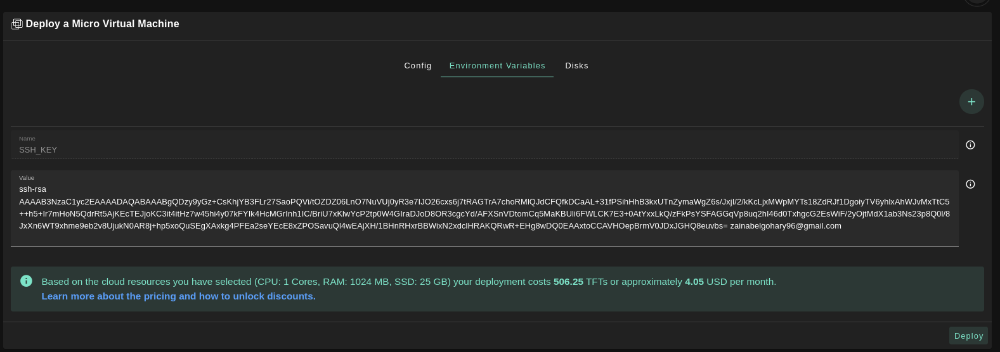

# NixOS MicroVM

__NixOS MicroVM__ refers to a minimalistic virtual machine environment based on the NixOS Linux distribution.
The NixOS MicroVM leverages these principles to create a highly customizable and reproducible virtual machine environment. It allows users to define the entire system configuration, including packages, services, and dependencies, in a declarative manner using the Nix language. This ensures that the MicroVM is consistent, easily reproducible, and can be version-controlled.

## Deploy a NixOS MicroVM

On this section we will learn how to make reproducible, declarative and reliable systems by deploying NixOS MicroVM weblet in TFPlayground.

Go to TFplayground website, based on the deployment network you prefer:
  -  https://play.dev.grid.tf for Devnet.
  -  https://play.qa.grid.tf for QAnet.
  -  https://play.test.grid.tf for Testnet.
  -  https://play.grid.tf for Mainnet.

- Make sure you have an activated a [weblet profile](./weblets_profile_manager.md)

- Click on the **Micro Virtual Machine** tab to start your NixOS MicroVM Deployment

**Deployment Process** :

- Enter the required fields as described in the following images
  

- In Environment variables tab you can and the default configurations for nix for example

```
{ pkgs ? import <nixpkgs> { } }:
let pythonEnv = pkgs.python3.withPackages(ps: [ ]); in pkgs.mkShell { packages = [ pythonEnv ]; }
```

this will be written to `/root/default.nix` where is the place that you can change the nix shell configuration there


- In Disks tab, you should mount a large enough disk for nix to store it's files, used for `nix-store`
  
