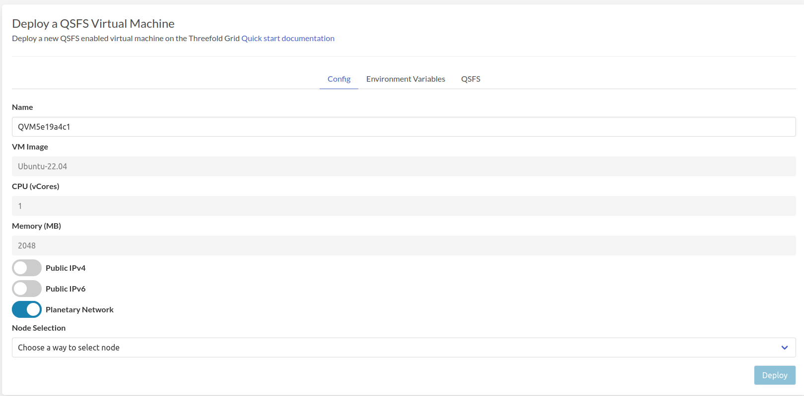
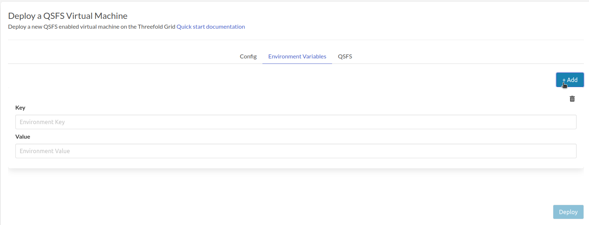
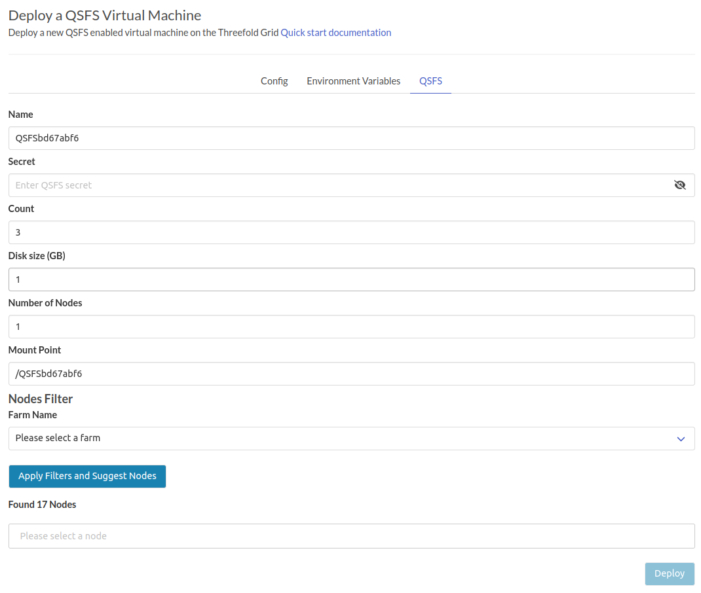
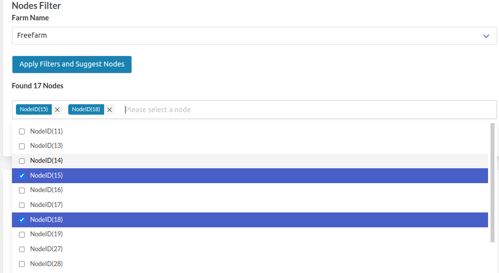

# QSFS Virtual Machine

Deploy a new virtual machine with QSFS on the Threefold Grid

- Make sure you have an activated [profile](./weblets_profile_manager.md)
- Click on the **QFSF Virtual Machine** tab

## Process

- Fill in the instance name: it's used to reference the QVM in the future.
- For now the QVM comes with
  - `Ubuntu-22.04 image`
  - `1 CPU`
  - `2 GB RAM`
- `Public IPv4` flag gives the QSFS virtual machine a Public IPv4
- `Public IPv6` flag gives the QSFS virtual machine a Public IPv6
- `Planetary Network` to connect the QSFS Virtual Machine to Planetary network
- Choose the node to deploy on which can be
  - Manual: where you specify the node id yourself
  - Automatic: Suggests nodes list based on search criteria e.g `country`, `farm`, capacity..

Clicking on _Environment Variables_ and then _Add_ button allows you to define environment variables to pass to the QSFS virtual machine.
> Note the Public SSH key in the profile is automatically used as variable `SSH_KEY` passed to all Virtual Machines, so you have to activate the SSH key on the [profile](weblets_profile_manager) 

### QSFS Disk

Clicking on _QSFS_ allows you to define QSFS configuration.
> For more information about QSFS, please consult [Quantum Safe Filesystem](https://library.threefold.me/info/manual/#/technology/threefold__qsfs)

- `Name`: QSFS disk Name: It’s used in links to the QSFS virtual machine
- `Secret`: It's used in some encryption processes.
- `Count`: the count of ZDBs: _minimum_ is three ZDBs, it actually added to 4 ZDBs that are used in the cache
- `Number of Nodes`: a number of nodes that the ZDBs will distribute on.
- `mountpoint`: where it will be mounted on its VM by default it will be the same as the QSFS name

- Choose the nodes to deploy on which will be `Automatic`
  - It suggests nodes list based on search criteria e.g `farm`, capacity..
  - After clicking on `Apply Filters and Suggest Nodes` there is an indicator for how many nodes founded available.
  - Clicking on the `Please select a node` field, will drop down a list of the nodes, choose the nodes to meet the number of nodes selected in the `Number of Nodes` field.
