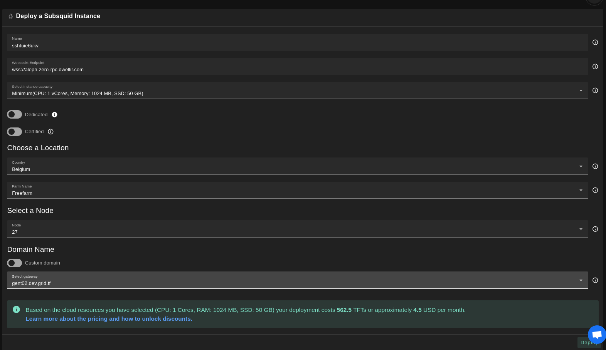

# Subsquid

[Subsquid](https://www.subsquid.io/) indexer is a piece of software that reads all the blocks from a Substrate based blockchain, decodes and stores them for processing in a later stage.

- Make sure you have an activated [profile](./weblets_profile_manager.md)
- Click on the **Subsquid** tab

## Process

- Enter an instance name.

- Enter an endpoint for a supported substrate chain. You can find the list of endpoints of supported cahins [here](https://github.com/polkadot-js/apps/blob/master/packages/apps-config/src/endpoints/production.ts).

- `Public IPv4` flag gives the virtual machine a Public IPv4

- Select a capacity package:
  - **Small**: { cpu: 1, memory: 2 , diskSize: 50 }
  - **Medium**: { cpu: 2, memory: 4, diskSize: 100 }
  - **Large**: { cpu: 4, memory: 16, diskSize: 250 }
  - Or choose a **Custom** plan
- Choose a gateway node to deploy your Subsquid instance on.

- Choose a node to deploy your Subsquid instance on.

  - Either use the **Capacity Filter** which simply lets you pick a *Farm* and *Country*, after clicking on *Apply filters and suggest nodes* then it lists available nodes with these preferences and you pick.

  - Or use **Manual** and type a specific node number to deploy on.

After that is done you can see a list of all of your deployed instances

Click on ***Visit*** to go to the homepage of your Subsquid indexer instance!

