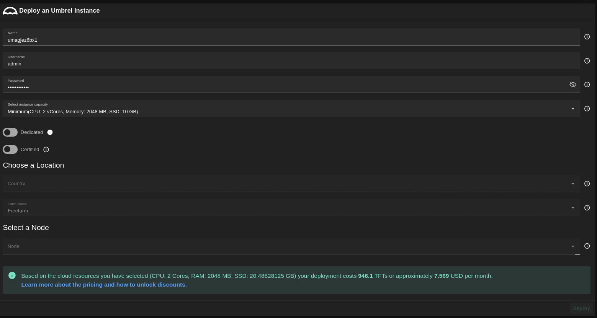
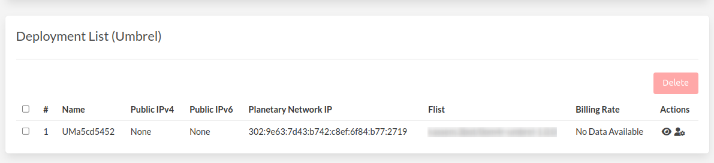
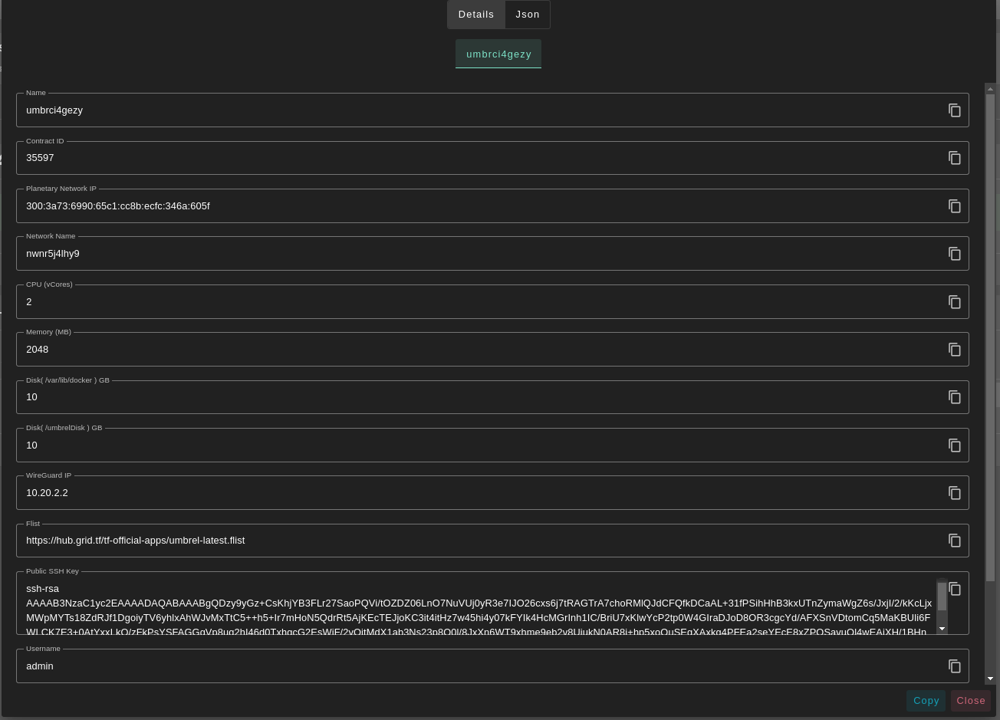
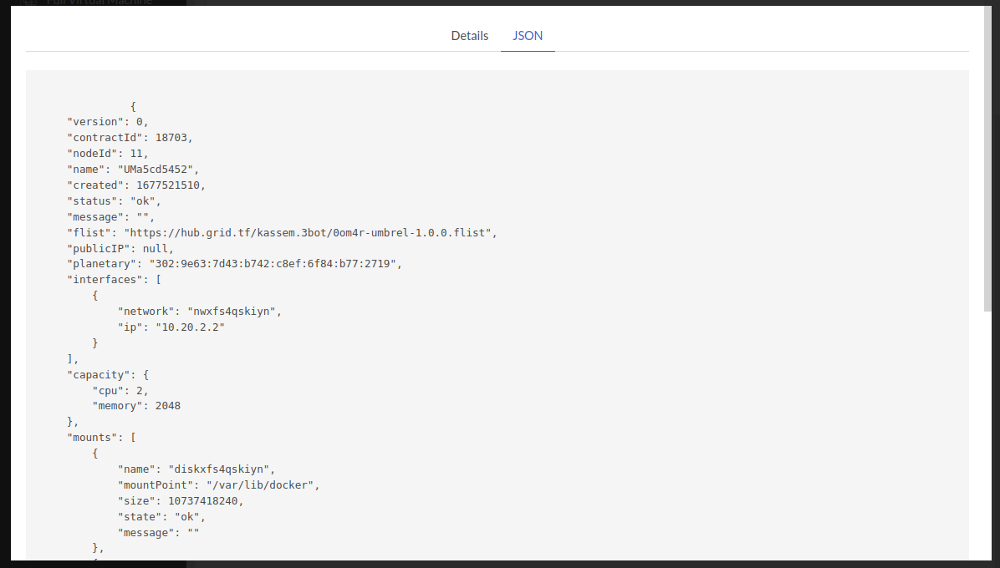
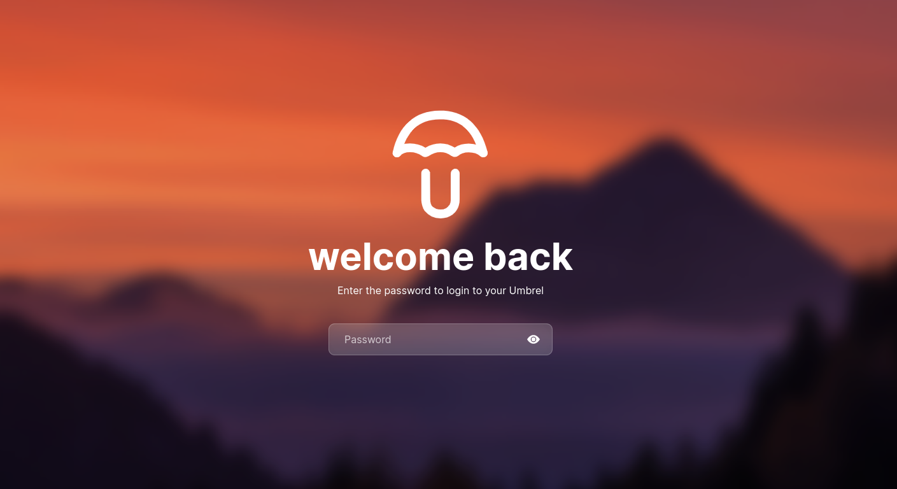

# Umbrel
[Umbrel](https://umbrel.com/) is an OS for running a personal server in your home. Self-host open source apps like Nextcloud, Bitcoin node, and more.

- Make sure you have an activated [profile](./weblets_profile_manager.md)
- Click on the **Umbrel** tab
  
**Process** :

- Enter an instance name.
- Enter a Username
  - will be used to create Umbrel dashboard account.
- Enter a Password
  - Will be used to login to the Umbrel dashboard.
  - Must be 12 characters or more.
- `Public IPv4` flag gives the Umbrel machine a Public IPv4
  - Select a capacity package:
  - **Minimum**: { cpu: 2, memory: 2048 , diskSize: 10 }
  - **Standard**: { cpu: 2, memory: 4096 , diskSize: 50 }
  - **Recommended**: { cpu: 4, memory: 4096 , diskSize: 100 }
  - Or choose a **Custom** plan
- Choose a node to deploy your Umbrel instance on.

  - Either use the **Capacity Filter** which simply lets you pick a *Farm* and *Country*, after clicking on *Apply filters and suggest nodes* then it lists available nodes with these preferences and you pick.

  - Or use **Manual** and type a specific node number to deploy on.

**After Deploying**:

You can see a list of all of your deployed instances

- you can click on `Show details` for more details about the Umbrel deployment.
    
    and for more detailed information switch to `JSON` tap.
    
- Click on ***Admin Panel*** to go to the dashboard of your Umbrel instance!
  - Enter the ***Password*** that you provided in `config` section to login into Umbrel dashboard.
  > Forget the credentials? You can find them with `Show details` button.

> **Warning**: Due to the nature of the grid, shutdown, and restart your umbrel from the dashboard **MAY** make some unwanted behaviors.
