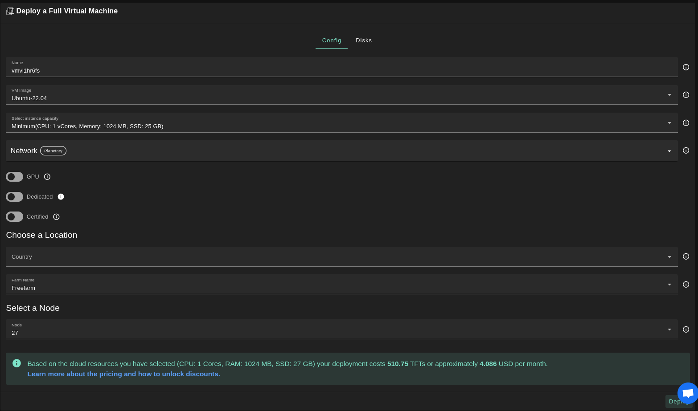
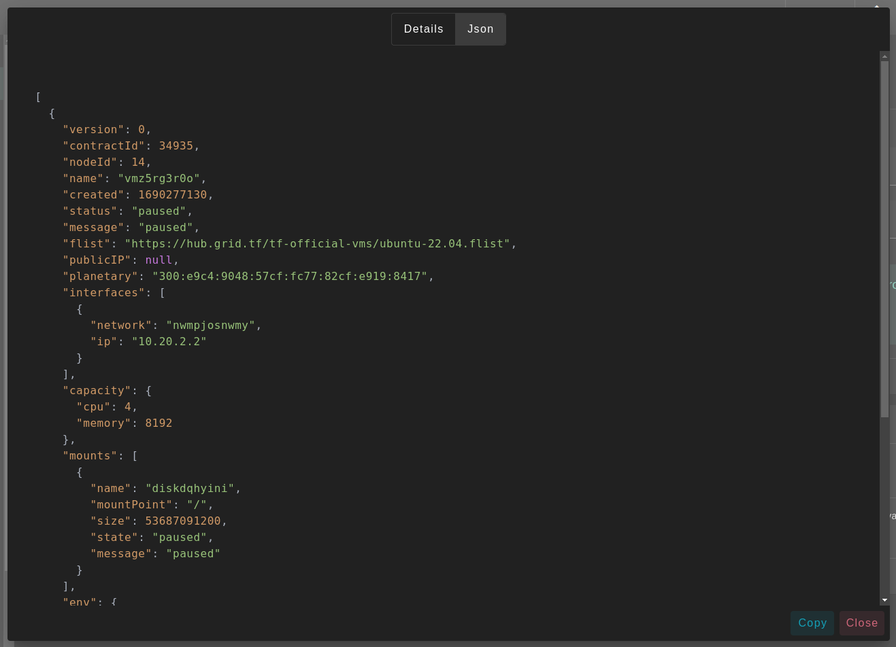

# Virtual Machine

<iframe title="How to Deploy a Full VM on the ThreeFold Playground" width="560" height="315" src="https://www.youtube-nocookie.com/embed/MDSIBkcYdqg" frameborder="0" allowfullscreen="" sandbox="allow-same-origin allow-scripts allow-popups"></iframe>

Deploy a new virtual machine on the Threefold Grid

- Make sure you have an activated [profile](./weblets_profile_manager.md) 
- Click on the **Virtual Machine** tab

__Process__ : 

- Fill in the instance name: it's used to reference the VM in the future.
- Choose the image from the drop down (e.g Alpine, Ubuntu) or you can click on `Other` and manually specify the flist URL and the entrypoint.
- `Public IPv4` flag gives the virtual machine a Public IPv4
- `Public IPv6` flag gives the virtual machine a Public IPv6
- `Planetary Network` to connect the Virtual Machine to Planetary network
- Choose the node to deploy on which can be
   - Manual: where you specify the node id yourself
   - Automatic: Suggests nodes list based on search criteria e.g `country`, `farm`, capacity..
  

Clicking on enviornment allows you to define environment variables to pass to the virtual machine. 
> Note the Public SSH key in the profile is automatically used as variable `SSH_KEY` passed to all Virtual Machines 

You can attach one or more disks to the Virtual Machine by clicking on the Disks tab and the plus `+` sign and specify the following parameters
   - Disk name 
   - Disk size
   - Mount point

in the bottom of the page you can see a list of all of the virual machines you deployed. you can click on `Show details` for more details

You can also go to JSON tab for full details

__Difference Between Full Virtual Machine and Micro Virtual Machine__ : 
   - A Micro Virtual Machine is meant to host microservice. and the user should enter the entrypoint.
   - In a Micro Virtual Machine the user has no control over ther kernel used to run the machine.
   - In a Micro Virtual Machine the network setup will be created for the user. And the vm's init process can assume that it will be fully set up (according to the config the user provided) by the time it is started. 
   - In the Micro Virtual Machine mountpoints will also be setup for the user. The environment variables passed will be available inside the the vm.
   - In full Vm, the users run their own operating system, but the image must be
      - EFI bootable
      - Cloud-init enabled.
   - A Full Virtal Machine contains a default disk attached, as the boot image will be copied to this disk.
   - In a Full Virtal Machine The default disk is mounted on / so if you want to attach any additional disks, you have to choose a different mounting point.
   - In a Full Virtual Machine a /image.raw file is used as "boot disk". This /image.raw is copied to the first attached volume of the vm. Cloud-init will take care of resizing the filesystem on the image to take the full disk size allocated in the deployment.