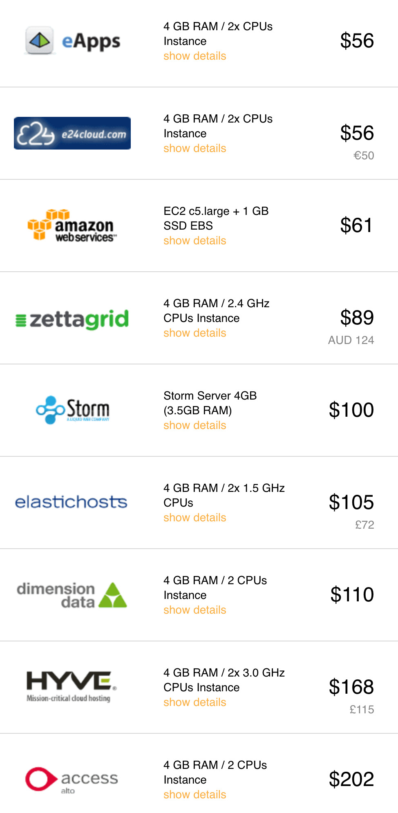

<h1>Price comparison Cloudorado</h1>

<h2> Table of Contents </h2>

- [Introduction](#introduction)
- [Compute](#compute)
  - [Compute Conclusion](#compute-conclusion)
- [Storage](#storage)
  - [Storage Conclusion](#storage-conclusion)

***

## Introduction

We compare cloud pricing with Cloudorado. Note that the information here can be subject to change and might not reflect current market prices.

## Compute

A ThreeFold Compute Unit is (CU)

- 4 GB memory
- 2 virtual CPU cores

A good site to compare is Cloudorado: https://www.cloudorado.com/

| Compute                           | Compute                           |
| --------------------------------- | --------------------------------- |
|  |  |

### Compute Conclusion

> Our price can easily be < 10 USD for 1 compute unit (CU)  
> In market, this is between 36 and 202 USD

## Storage

A ThreeFold Storage Unit is (SU)

- 1 TB of storage

Again, a good site to compare is Cloudorado: https://www.cloudorado.com/

### Storage Conclusion

> Our price can easily be < 8 USD for 1 storage unit (CU)  
> In market, this is between 19 and 154 USD

<!-- TODO: Update with current market and add generated_on -->