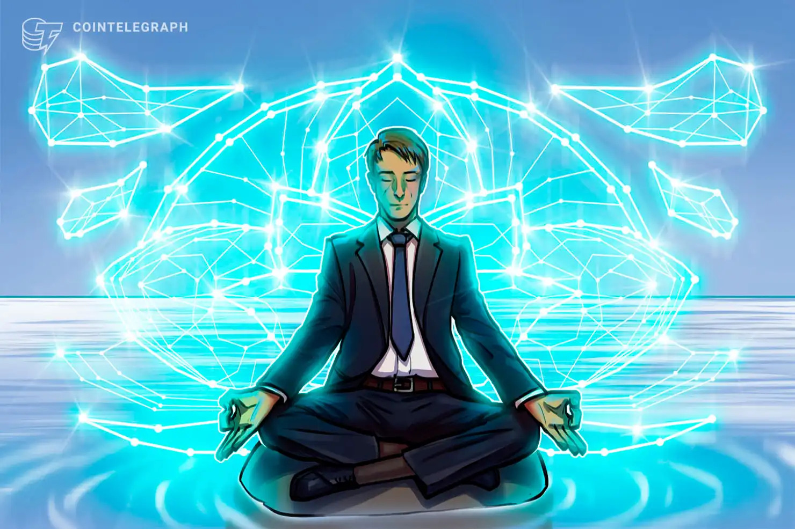

- Decentralized = Online, global, uncensorable.
- Autonomous = Self-governing.
- Organization = Coordination & collaboration around shared objectives.

DAOs are an effective and safe way to work with like-minded folks around the globe.

Think of them like an internet-native business that's collectively owned and managed by its members. They have built-in treasuries that no one has the authority to access without the approval of the group. Decisions are governed by proposals and voting to ensure everyone in the organization has a voice.

This opens up so many new opportunities for global collaboration and coordination.

DAOs operate using smart contracts, which are essentially chunks of code that automatically execute whenever a set of criteria are met. These smart contracts establish the DAO’s rules. Those with a stake in a DAO then get voting rights and may influence how the organization operates by deciding on or creating new governance proposals.

| DAO                                                                                                                     | A traditional organization                                                                              |
| ----------------------------------------------------------------------------------------------------------------------- | ------------------------------------------------------------------------------------------------------- |
| Usually flat, and fully democratized.                                                                                   | Usually hierarchical.                                                                                   |
| Voting required by members for any changes to be implemented.                                                           | Depending on structure, changes can be demanded from a sole party, or voting may be offered.            |
| Votes tallied, and outcome implemented automatically without trusted intermediary.                                      | If voting is allowed, votes are tallied internally, and the outcome of voting must be handled manually. |
| Services offered are handled automatically in a decentralized manner (for example distribution of philanthropic funds). | Requires human handling, or centrally controlled automation, prone to manipulation.                     |
| All activity is transparent and fully public.                                                                           | Requires human handling, or centrally controlled automation, prone to manipulation.                     |

*Info from https://ethereum.org/en/dao/, picture from https://cointelegraph.com/ethereum-for-beginners*

Decentralized autonomous organization (DAO), is an organization represented by rules encoded as a computer program that is transparent, controlled by the organization members and not influenced by a central government. A DAO's financial and voting transaction record and program rules are maintained on a blockchain.

Decentralized autonomous organizations are typified by the use of blockchain technology to provide a secure digital ledger to track financial and other community interactions across the internet, hardened against forgery by trusted timestamping and dissemination of a distributed database. This approach eliminates the need to involve a mutually acceptable trusted third party in a transaction, simplifying the transaction. The costs of a blockchain-enabled transaction and of the associated data reporting may be substantially offset by the elimination of both the trusted third party and of the need for repetitive recording of contract exchanges in different records. For example, the blockchain data could, in principle and if regulatory structures permit it, replace public documents such as deeds and titles. In theory, a blockchain approach allows multiple cloud computing users to enter a loosely coupled peer-to-peer smart contract collaboration.

