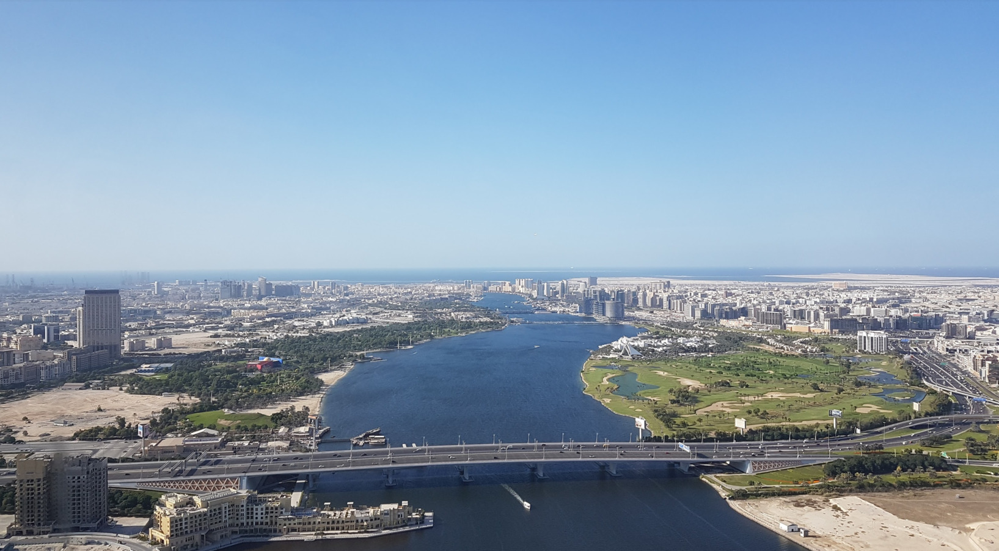
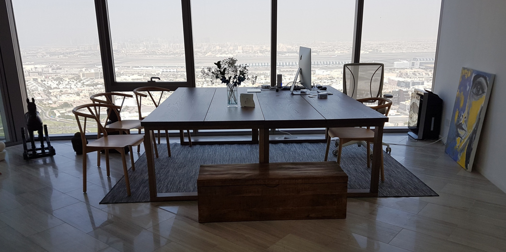
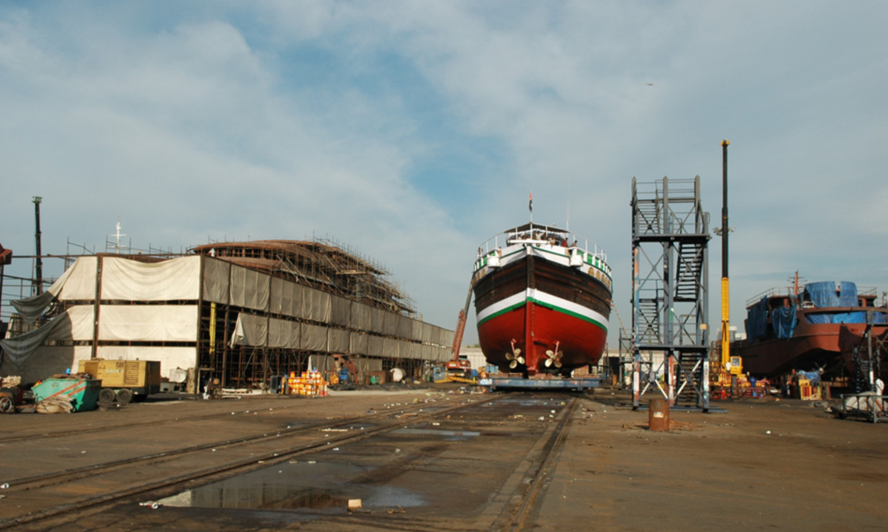
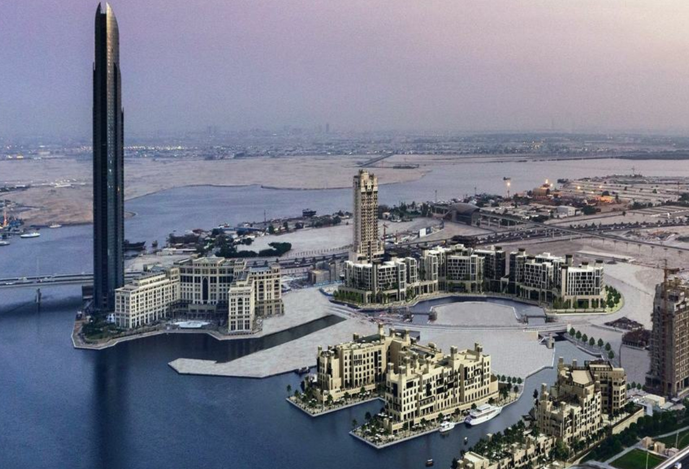
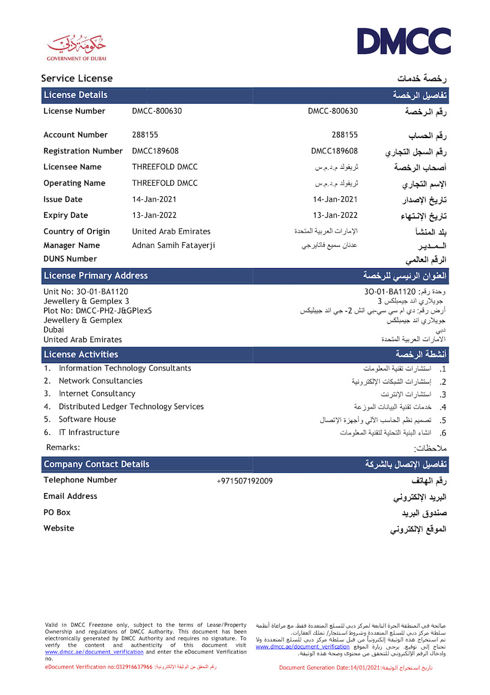

<h1> ThreeFold Dubai </h1>

<h2>Table of Contents </h2>

- [Introduction](#introduction)
- [Responsibilities](#responsibilities)
- [NEW 2023](#new-2023)
- [Some memories from 2015+](#some-memories-from-2015)
- [Structure: Oct 2021 - Dec 2022](#structure-oct-2021---dec-2022)
- [Official License](#official-license)

***

## Introduction

ThreeFold Dubai is the original team of ThreeFold operated from Dubai and Belgium. We started in 2016.

## Responsibilities

- Promote ThreeFold Grid and the ThreeFold Token
- Work with [ThreeFold Tech](./threefold_tech.md) for the creation and maintenance of the technology.
- Legal: signing party with all T&C (terms and conditions) with all future farmers
- Work with many people and companies around the world to grow the threefold ecosystem
- Look for partners who are willing to grow the threefold ecosystem

## NEW 2023

ThreeFold Dubai = ThreeFold DMCC and will launch a commercial business on top of the TFGrid.

See more info in [this google doc](https://docs.google.com/document/d/10Ieu1D00vZdVNP9nQESk4WMszAM5vqi8XoWzSBy3xPU/edit)

## Some memories from 2015+

At one point in time we had our office on the 74th floor of a building close to the Dubai International Airport. It was a cool spot with a great view, but we also realized the importance of being located closer to the ground. We only stayed there for just a little more than 1 year.

Our main office was and still is in Al Jadaf which is, interestingly enough, a boat shipyard. This is where a lot of the ideas and work has been done to make ThreeFold possible.

The tower on the left in the photo above is where our office was. The place behind (to the right) is called Al Jadaf. We decided to do something different compared to most. No office in a fancy office building. Instead we have our office next to the water in a very old shipyard. Very unique, and it much more cost effective as well. (-:

Still today there are more than 100 servers located there in our testlab, and the ThreeFold Dubai was run from there.

## Structure: Oct 2021 - Dec 2022

- ThreeFold Dubai is our operational HQ from where all Foundation activities are coordinated.
- ThreeFold Dubai was mainly funded from TFTech (during 2019-2022), this will now change in 2023
- ThreeFold Dubai sometimes uses ThreeFold Labs IT which is a Dubai onshore company for when we need onshore activities like visa's for our people, workpermits, invoicing, ... ThreeFold Labs IT is just a services company to deal with some of these practical elements.

Adnan Fatayerji is the managing director and shareholder, in the future the shares of ThreeFold Dubai will be 100% owned by The OurWorld Venture Creator

## Official License

Please see below the ThreeFold DMCC license:

