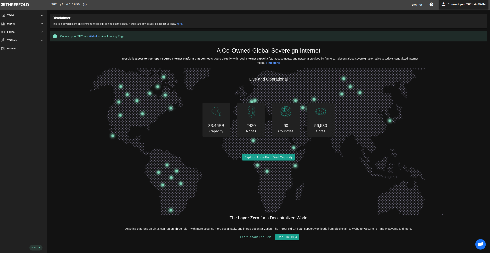
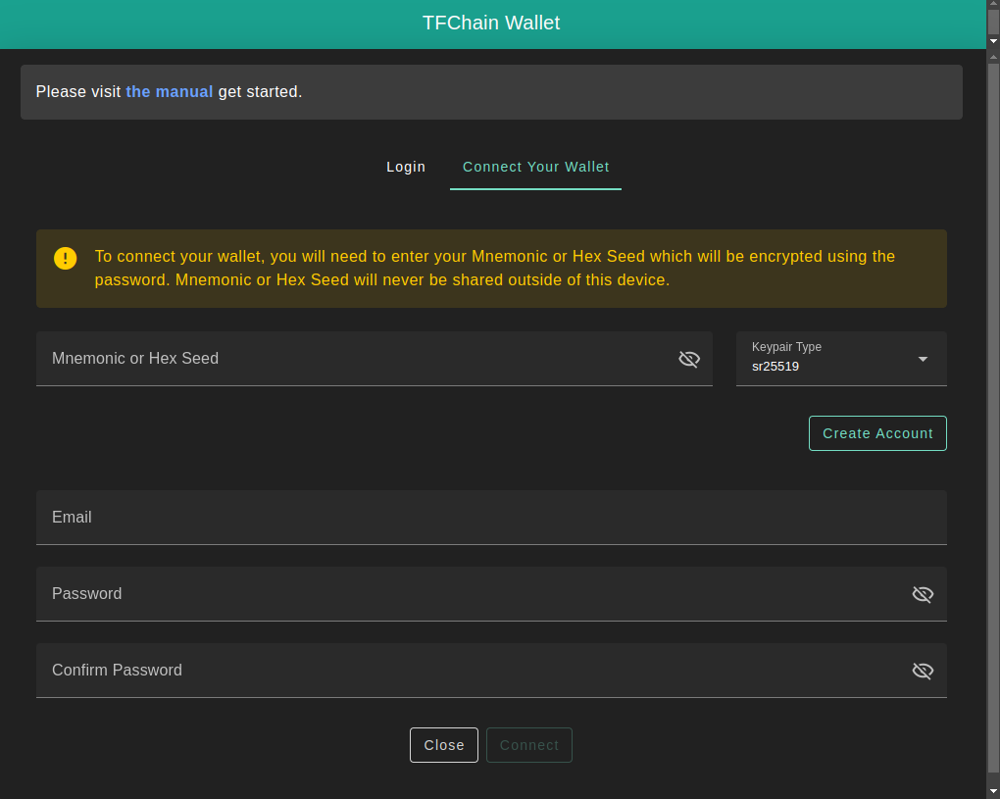
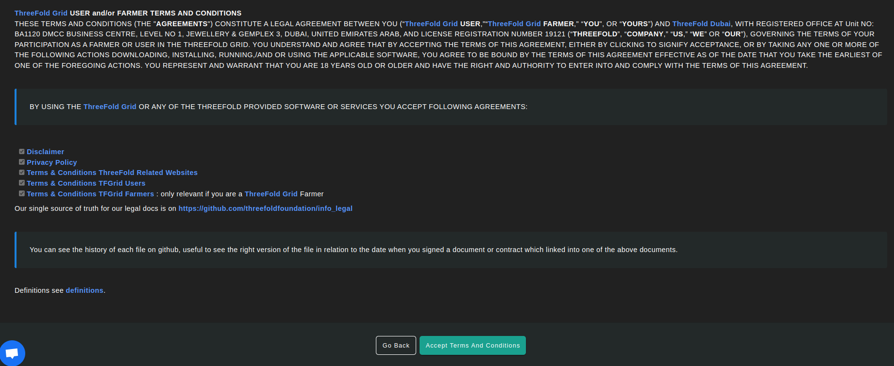
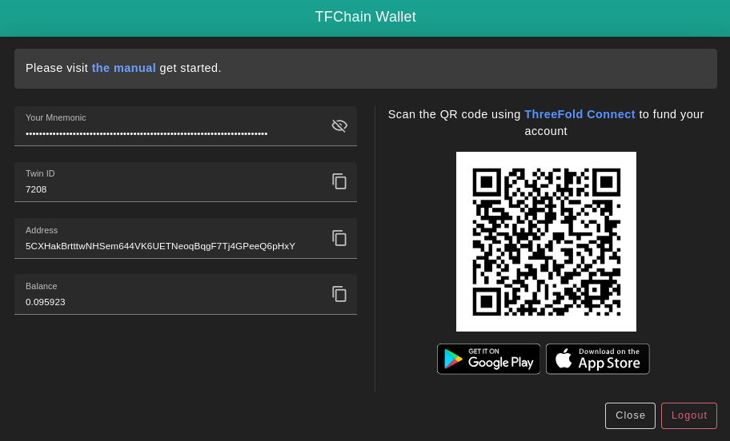
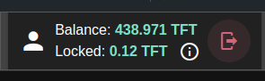

To interact with TFChain, users can connect their TFChain wallet to the wallet connector available on the ThreeFold Dashboard.

You can create a new wallet or import an existing wallet.

## Access the Dashboard

Access the ThreeFold Dashboard to deploy a VM:

- [https://dashboard.grid.tf](https://dashboard.grid.tf)

## Import a Wallet

You can import an existing wallet by entering in `Mnemonics` the associated seed phrase or HEX secret of the existing wallet.

- To import a wallet or a farm created on the TF Connect app, use the TFChain HEX secret.
  - From the menu, open **Wallet** -> **Wallet name** -> **Info symbol (i)**, and then reveal and copy the **TFChain Secret**.

When you import a new wallet, you can decide a new password and email address, i.e. you only need the mnemonics to import an existing wallet on the dashboard.

You will be asked to accept ThreeFold's Terms and Conditions:

Once you've set your credentials, clicked on **Connect** and accepted the terms and conditions, your profile will be activated. 

Upon activation, you will find your **Twin ID**, **Address** and wallet current **balance** generated under your **Mnemonics**. 

Your current and locked balances will also be available at the top right corner of the dashboard. Here's an example of the balances you can find for your wallet. Some TFT is locked during utilization as the TFGrid bills you for your workloads and traffic.

## KYC

You will need to complete the KYC process to deploy on the ThreeFold Grid. The KYC process is simple and should take a few minutes.