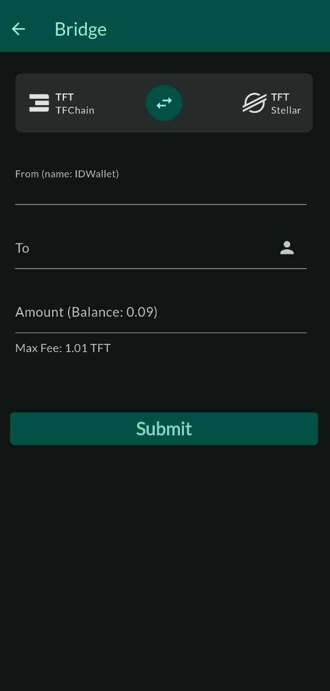

You can bridge TFT between TFChain and Stellar chain.

To bridge TFT, follow the steps below:

- On ThreeFold Connect, go to `Wallet`
- Set the direction of the bridge
  - TFChain to Stellar
  - Stellar to TFChain
- **To**: Enter the address of the receiver
  - Optional: Click on the icon on the right to set a wallet or favorite address 
- **Amount**: Enter the amount to send
- Click `Submit` to submit the bridge transfer
- Click `Confirm` to finalize the transaction
