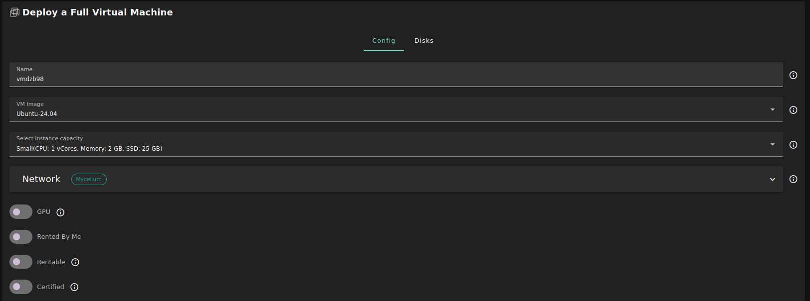
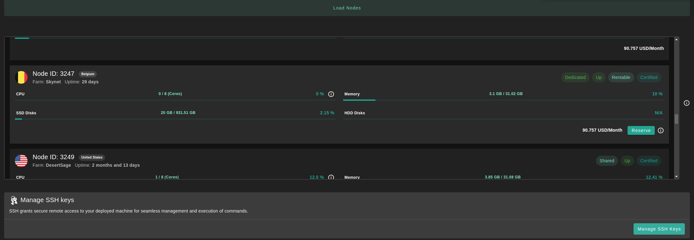
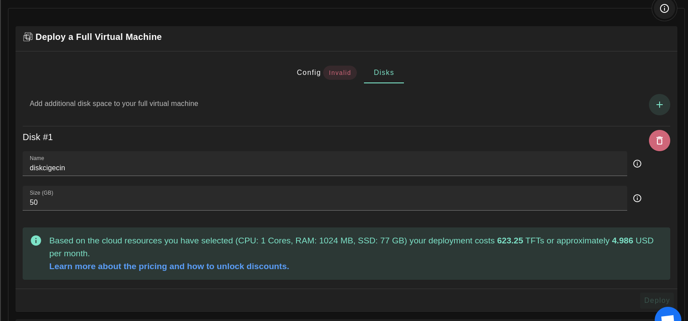
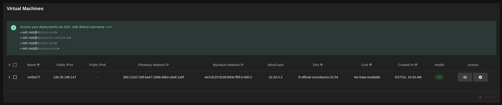
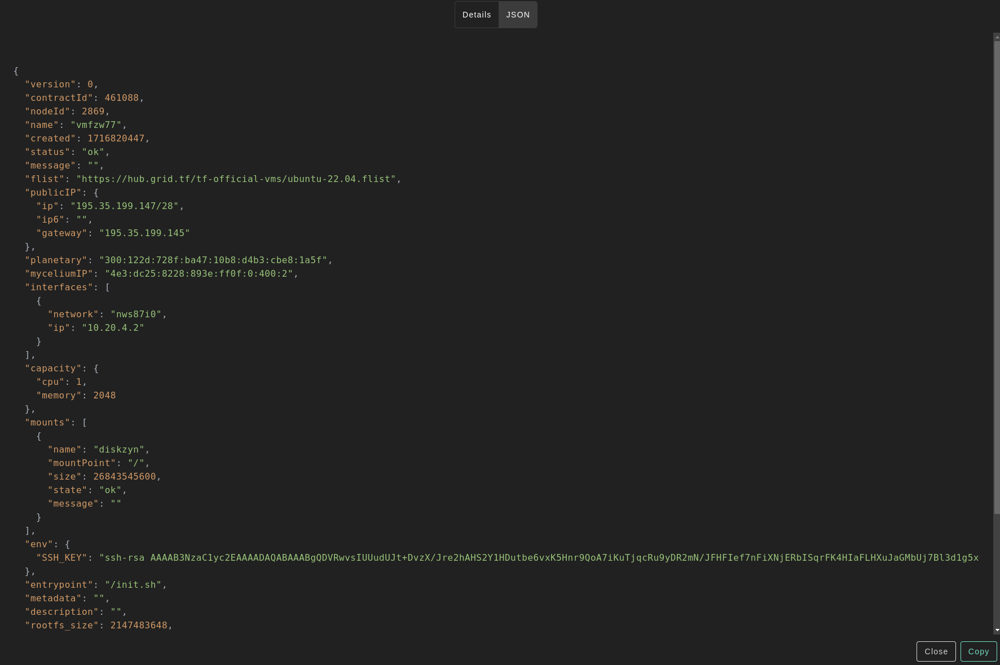

We present the steps to deploy a full VM on the TFGrid.

> Make sure that you set up properly SSH keys before deploying a VM. For more information, read the [previous section](ssh).

## Deployment

Deploy a new full virtual machine on the Threefold Grid

- Make sure you have a wallet
- From the sidebar click on **Applications**
- Click on **Full Virtual Machine**

**Process:**

- Fill in the instance name: it's used to reference the Full VM in the future.
- Choose the image from the drop down (e.g Alpine, Ubuntu) or you can click on `Other` and manually specify the flist URL and the entrypoint.
- Select a capacity package:
  - **Small**: \{cpu: 1, memory: 2, diskSize: 25 \}
  - **Medium**: \{cpu: 2, memory: 4, diskSize: 50 \}
  - **Large**: \{cpu: 4, memory: 16, diskSize: 100\}
  - Or choose a **Custom** plan
- Choose the network
  - `Public IPv4` flag gives the virtual machine a Public IPv4
  - `Public IPv6` flag gives the virtual machine a Public IPv6
  - `Planetary Network` to connect the Virtual Machine to Planetary network
  - `Mycelium` to enable Mycelium on the virtual machine
  - `Wireguard Access` to add a wireguard access to the Virtual Machine
- `GPU` flag to add GPU to the Virtual machine
- `Rented By Me` flag to retrieve nodes currently reserved by you
- `Rentable` flag to retrieve nodes that can be reserved as dedicated node
- `Certified` flag to retrieve only certified nodes 
- Choose the location of the node
  - `Country`
  - `Farm Name`
- Choose the node to deploy the Full Virtual Machine on

  

- If you have more than one SSH keys set, you can click on `Manage SSH keys` to select which one to use for this deployment.

You can attach one or more disks to the Virtual Machine by clicking on the Disks tab and the plus `+` sign and specify the following parameters

- Disk name
- Disk size

At the bottom of the page, you can see a list of all of the virtual machines you deployed. You can click on `Show details` for more details:

You can also go to JSON tab for full details:

