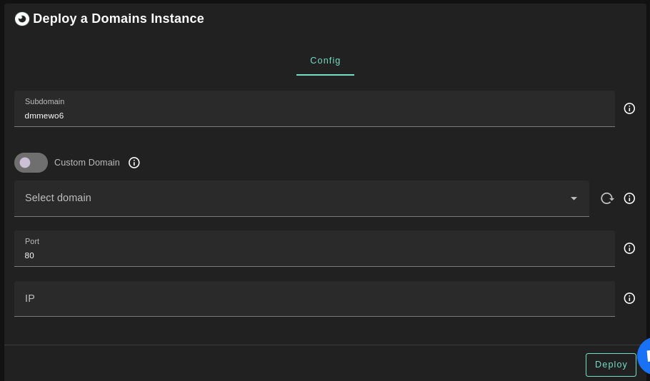
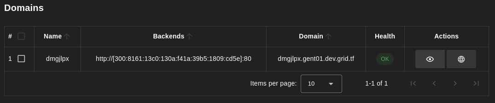

The Domains solution allows users to securely expose servers hosted on local machines or VMs to the public internet. Users are required to specify the machine's IP, which can be a Mycelium IP, an Yggdrasil IP, or a public IP (IPv4 or IPv6).

## Prerequisites

- Make sure you have a wallet
- From the sidebar click on **Applications**
- Click on **Domains**

## Deployment

- Enter a subdomain to be added to your domain
- The `Custom Domain` flag allows the user to use a custom domain
- Choose a gateway node to deploy your static website
- Enter the port used to access the machine
- Enter the machine's IP
  - It can be a Mycelium IP, an Yggdrasil IP, or a public IP (IPv4 or IPv6)

Once this is done, you can see a list of all of your deployed instances:

Click on the button **Visit** under **Actions** to go to your exposed website!
