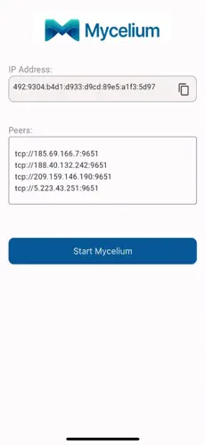
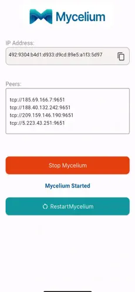
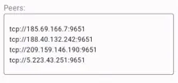
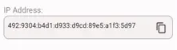

## Start Mycelium

To start Mycelium, simply open the app and click on `Start`.



> Note for Windows Users: The Mycelium app must be run as an administrator to function properly. Right-click on the application icon and select "Run as administrator" to ensure proper network connectivity.

## Stop or Restart Mycelium

To stop or restart Mycelium, click on the appropriate button.



## Add Peers

You can add different Mycelium peers in the `Peers` window.

Simply add peers and then either start or restart the app.



For example, if you want to add the node with the IPv4 address `5.78.122.16` with the tcp port `9651`, simply add the following line then start or restart the app.

```
tcp://5.78.122.16:9651
```

## Mycelium Address

When you use the Mycelium app, you are assigned a unique Mycelium address.

To copy the Mycelium address, click on the button on the right of the address.



## Deploy on the Grid with Mycelium

Once you've installed Mycelium, you can deploy on the ThreeFold Grid and connect to your workload using Mycelium.

As a starter, you can explore the ThreeFold Grid and deploy apps on the [ThreeFold Dashboard](https://manual.grid.tf/documentation/dashboard/dashboard.html) using Mycelium to connect.